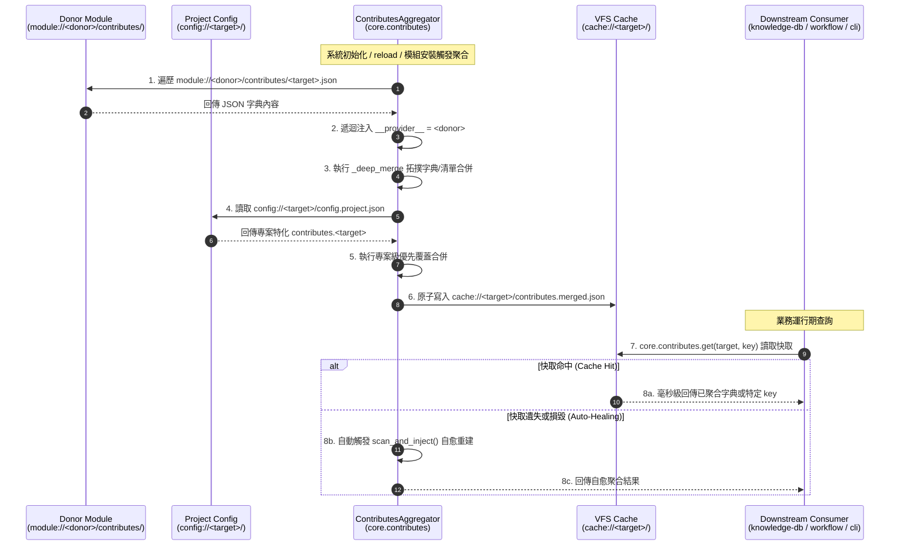

# 架構設計說明書 (Architecture Design)

> 功能名稱：Core Contributes 系統檔案結構升級 (Core Contributes File Structure Upgrade)  
> 建立日期：2026-08-28  
> 所屬主計畫：`plans://2026_08_28_1754_module_toolchain_optimization/` (sub_01)  
> 狀態：Confirmed  
> 模板版本：v1.2  


---

## 1. 模組架構分層與職責邊界 (Layered Architecture)

```text
+---------------------------------------------------------------------------------------+
| 空間 ① 源碼與安裝宣告層 (Donor Modules: module://<donor>/)                             |
|  - source/<donor>/manifest.json             (純淨模組元數據：name, version, entry)       |
|  - source/<donor>/contributes/<target>.json (唯一官方標準：依 Target 1:1 分拆擴充宣告)    |
+---------------------------------------------------------------------------------------+
                                           │
                                           ▼ (依賴注入與雙階聚合)
+---------------------------------------------------------------------------------------+
| 空間 ② 聚合與快取中樞層 (Core Engine: core.contributes)                                 |
|  - ContributesAggregator.scan_and_inject()                                            |
|    ├─ 階層 ① (模組貢獻)：掃描 module://<donor>/contributes/<target>.json ➔ 注入 __provider__|
|    └─ 階層 ② (專案特化)：掃描 config://<target>/config.project.json ➔ 疊加覆蓋優先權     |
|  - 物化儲存至 VFS Cache: cache://<target>/contributes.merged.json                     |
+---------------------------------------------------------------------------------------+
                                           │
                                           ▼ (唯一統一查詢通道)
+---------------------------------------------------------------------------------------+
| 空間 ③ 統一查詢 SDK 與消費端 (Consumers: 100% 收斂至 core.contributes.get)            |
|  - core.contributes.get(target_module, key=None, default=None)                        |
|  - core.contributes.get_for_current_module(key=None, default=None)                    |
|  ├─ core/providers.py       : 自 contributes.get("core", "commands") 產生 CLI Guild    |
|  ├─ core/engine.py          : 自 contributes.get("core", "commands") 彙整 CLI Help    |
|  ├─ knowledge_db/space.py   : 自 contributes.get("knowledge-db") 載入 spaces/thesaurus|
|  └─ agents_workflow/compiler: 自 contributes.get("agents-workflow") 載入 exports/tokens|
+---------------------------------------------------------------------------------------+
```

---

## 2. 核心資料流與循序圖 (Data Flow & Sequence Diagram)



---

## 3. 受影響檔案與新建檔案清單 (Impacted & New Files Inventory)

| 檔案路徑 | 類型 | 職責與變更說明 |
| :--- | :---: | :--- |
| `source/core/contributes/core.json` | **New** | 移轉 `core` 自宣告之 `uri_schemes` (8組) 與 `commands` (8組) |
| `source/core/contributes/agents-workflow.json` | **New** | 移轉 `core` 向 `agents-workflow` 宣告之 `AGENTS_CLI_GUILD` insert |
| `source/dev/contributes/core.json` | **New** | 移轉 `dev` 宣告之 `uri_schemes` (3組) 與 `commands` (10組) |
| `source/dev/contributes/agents-workflow.json` | **New** | 移轉 `dev` 向 `agents-workflow` 宣告之 `WORKFLOW_SOP_STANDARDS` insert |
| `source/knowledge-db/contributes/core.json` | **New** | 移轉 `knowledge-db` 宣告之 `knowledge.storage` URI scheme 與 6 大 commands |
| `source/agents-workflow/contributes/core.json` | **New** | 移轉 `agents-workflow` 宣告之 `workflow.*` URI schemes 與 7 大 commands |
| `source/agents-workflow/contributes/agents-workflow.json` | **New** | 移轉 `agents-workflow` 宣告之 `export`, `token`, `insert`, `release_target` |
| `source/core/core/contributes.py` | **Modify** | 重構 `ContributesAggregator`：僅掃描 `contributes/<target>.json` + `config://`，廢除 Manifest/根目錄散落舊路徑 |
| `source/core/core/providers.py` | **Modify** | 移除手寫 `listdir("module://")` 與 `module.source://` 穿透代碼，改調用 `core.contributes.get("core", "commands")` |
| `source/core/core/engine.py` | **Modify** | `act_get_installed_commands_summary` 改用 `core.contributes.get("core", "commands")` |
| `source/core/manifest.json` | **Modify** | 剝除 `"contributes"` 區塊，恢復純粹輕量元數據 |
| `source/dev/manifest.json` | **Modify** | 剝除 `"contributes"` 區塊，恢復純粹輕量元數據 |
| `source/knowledge-db/manifest.json` | **Modify** | 剝除 `"contributes"` 區塊，恢復純粹輕量元數據 |
| `source/agents-workflow/manifest.json` | **Modify** | 剝除 `"contributes"` 區塊（554 行 ➔ < 15 行），恢復純粹輕量元數據 |
| `source/knowledge-db/knowledge_db/space.py` | **Modify** | 廢除 `_load_contributes` 內部手寫掃描與 `origin` 自定義，統一調用 `core.contributes.get("knowledge-db")` |
| `source/agents-workflow/agents_workflow/compiler.py` | **Modify** | 廢除 `get_contributes_data` 內部手寫掃描與 `module.source://` 探針，統一調用 `core.contributes.get("agents-workflow")` |
| `source/core/tests/test_contributes.py` | **Modify** | 升級測試案例：驗證新目錄結構掃描、`__provider__` 注入與 `config://` 專案覆蓋 |

---

## 4. 架構決策記錄 (Architecture Decision Records)

- **[sub_01:P02:DR-01] 單一官方目錄結構標準**: 確立 `source/<module>/contributes/<target>.json` 為唯一路徑，徹底廢棄 Manifest 內嵌與根目錄散落檔案，終結目錄污染與 Manifest 膨脹。
- **[sub_01:P02:DR-02] 雙階拓撲與專案級覆蓋優先權**: 聚合流程分為「階層 ① 模組貢獻」與「階層 ② 專案特化」，專案 `config.project.json` / `config.local.json` 具備最高覆蓋優先權。
- **[sub_01:P02:DR-03] SDK 自動自愈與 100% 消費端收斂**: `core.contributes.get()` 作為全生態系唯一數據源，內建 Auto-Healing 快取重建；全模組消費端徹底廢除手寫遍歷代碼。
- **[sub_01:P02:DR-04] 空間隔離邊界恪守與穿透代碼清算**: 模組與編譯器嚴格拘束於 `module://` 運行空間，徹底清理任何 `module.source://` 歷史穿透代碼。
