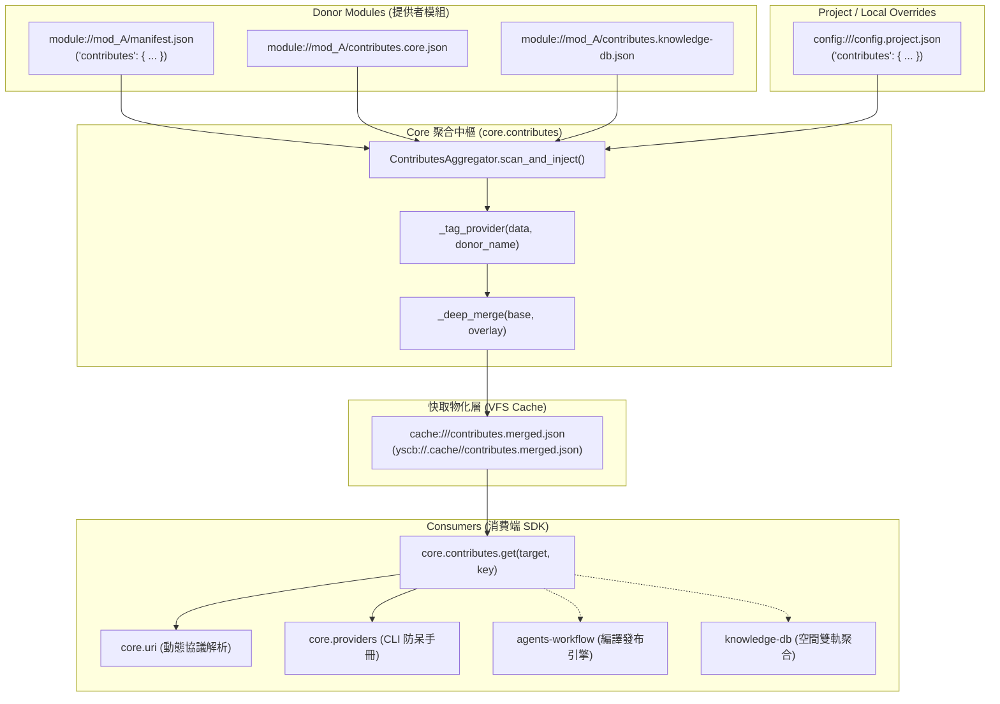

# 技術調研報告：Core Contributes 系統架構與檔案結構升級

> 調研主題：Core Contributes 系統現況架構、資料流與檔案結構升級方案論證  
> 建立日期：2026-08-28  
> 所屬主計畫：`plans://2026_08_28_1754_module_toolchain_optimization/` (sub_01)  
> 調研狀態：`Concluded`  
> 模板版本：v1.0  

---

## 1. 調研背景與核心動機 (Executive Summary & Motivation)

在 YS-Codebase 工具庫生態系中，`contributes`（擴充貢獻機制）是模組間解耦、依賴注入與能力宣告的核心中樞。
隨著生態系自最初的 `core`、`dev` 擴展至 `agents-workflow`、`knowledge-db`，各模組所宣告的擴充點（如 URI Schemes、CLI Commands、Workflows/Templates Export、Token Anchors、Spaces、Thesaurus 等）日益豐富。

然而，現行 `contributes` 在**檔案組織結構**與**消費端載入實現**上逐漸顯露歷史包袱與架構痛點：
1. **模組根目錄散落**：若模組向多個目標貢獻，容易在根目錄產生多個 `contributes.<target>.json`，造成目錄混亂。
2. **Manifest 嚴重膨脹**：將全部貢獻內嵌於 `manifest.json` 導致檔案超過數百行（如 `agents-workflow/manifest.json` 達 554 行、21KB）。
3. **消費端邏輯分散重複**：部分下游模組（`knowledge-db/space.py`、`agents-workflow/compiler.py`、`core/providers.py`）存在手動寫 `for mod in listdir("module://")` 讀檔解析的重複輪子，未統一透過 `core.contributes` SDK。

本報告針對現有架構進行全盤代碼級調研，並提出清晰、階層化且 100% 向下相容的系統檔案結構升級方案。

---

## 2. 現行 Contributes 系統架構全景與資料流 (Current Architecture)

### 2.1 系統資料流架構圖



### 2.2 現有 4 大模組之 Contributes 宣告清冊

| 模組名稱 | 貢獻目標 (Target) | 貢獻擴充鍵值 (Keys) | 宣告方式現況 | 備註 |
| :--- | :--- | :--- | :--- | :--- |
| **`core`** | `core` | `uri_schemes` (8組), `commands` (8組) | `manifest.json` 內嵌 | 系統核心基礎協議與生命週期指令 |
| **`dev`** | `core`<br/>`agents-workflow` | `uri_schemes` (3組), `commands` (10組)<br/>`insert` (注入工程規範) | `manifest.json` 內嵌 | 開發者工具與工作流注入 |
| **`knowledge-db`** | `core` | `uri_schemes` (1組), `commands` (6組) | `manifest.json` 內嵌 | 提供 `knowledge.storage://` 與檢索指令 |
| **`agents-workflow`** | `core`<br/>`agents-workflow` | `uri_schemes` (3組), `commands` (7組)<br/>`export`, `token`, `insert`, `release_target` | `manifest.json` 內嵌 | 包含大量工作流、標準與模板導出宣告 |

---

## 3. 消費端未調用與現存痛點之根因深析 (Root Cause Analysis)

針對「現有 `core.contributes.get` SDK 是否功能不足，或下游純粹未調用」之核心疑問，深度剖析如下：

### 3.1 核心根因：下游消費端遺留之穿透壞味道 (Antipattern) 與未調用習慣

1. **`module.source://` 探知為歷史穿透壞味道 (Antipattern)**：
   - 專案公理：**三層空間邊界（源碼 ➔ 測試 ➔ 運行）** 嚴格要求運行端與模組內部**絕對禁止探知 `module.source://`**。
   - 運行時與沙盒測試皆已具備標準的 `install @build` 與沙盒自動部署機制，所有可用模組皆 100% 存在於 `module://`。
   - `compiler.py` 與 `providers.py` 過去遺留的 `module.source://` 探針是歷史過渡期的**空間穿透壞味道**，本次升級必須**徹底清除**。
2. **`core.contributes` 核心能力完整，純為下游未調用**：
   - `ContributesAggregator` 僅掃描 `module://` 與 `config://` 的設計**完全正確且符合架構邊界**。
   - 下游模組（`knowledge-db`, `agents-workflow`, `providers.py`）手寫檔案遍歷，純粹是因為過去未全面遷移至 `core.contributes.get()` SDK。
3. **標記命名統一 (`__provider__`)**：
   - 統一以 `core.contributes` 注入的 `__provider__` 作為 donor 識別碼，廢除 `knowledge-db` 自定義的 `origin`。

---

## 4. 純淨升級架構方案（無歷史包袱，恪守三層空間邊界）

因本系統尚未大規模外部投入，開發者已明確指示**「不進行舊版本相容，直接升級為最佳純淨架構」**。

### 4.1 純淨檔案結構標準 (Pure Directory Standard)

```text
source/<module>/
├── manifest.json              (純粹輕量元數據：name, version, description, entry, dependencies)
└── contributes/               (【唯一官方標準】目錄化 1:1 隔離)
    ├── core.json              (向 core 貢獻 uri_schemes, commands)
    ├── agents-workflow.json   (向 agents-workflow 貢獻 export, token, insert, release_target)
    └── knowledge-db.json      (向 knowledge-db 貢獻 spaces, thesaurus)
```

> **清算與清理項目 (Breaking Refactor & Antipattern Purge)**：
> - ❌ 徹底廢除 `manifest.json` 內部的 `"contributes"` 欄位（Manifest 瘦身 80% 以上，不再臃腫）。
> - ❌ 徹底廢除模組根目錄散落的 `contributes.<target>.json`。
> - ❌ 徹底清除 `compiler.py` 與 `providers.py` 內部探知 `module.source://` 的穿透代碼。
> - ❌ 徹底移除各模組內部手寫的 `listdir("module://")` 掃描代碼，100% 收斂為調用 `core.contributes.get()`。

### 4.2 Core Contributes 引擎與消費端職責確立

1. **純淨空間邊界**：
   - `ContributesAggregator` 嚴格僅掃描 `module://<donor>/contributes/<target>.json`（及專案級 `config://<target>/config.project.json`）。
2. **消費端 100% 透過 SDK 收斂**：
   - `core/providers.py` ➔ 直接調用 `core.contributes.get("core", "commands")`。
   - `knowledge-db/space.py` ➔ 直接調用 `core.contributes.get("knowledge-db", "spaces")`。
   - `agents-workflow/compiler.py` ➔ 直接調用 `core.contributes.get("agents-workflow")`。
   - `core/engine.py` ➔ `act_get_installed_commands_summary` 改用 `core.contributes.get("core", "commands")`。


---

## 5. 推薦架構落地細節 (Recommended Implementation Details)

### 5.1 聚合引擎 `ContributesAggregator` 掃描流程升級

```python
# 核心偽代碼示例
def _discover_donor_contributions(self, donor_root_uri: str, target: str) -> Dict[str, Any]:
    result = {}
    
    # 1. 來源 A: manifest.json
    mf_uri = f"{donor_root_uri}/manifest.json"
    if uri.exists(mf_uri):
        mf_data = uri.read_json(mf_uri)
        if isinstance(mf_data, dict):
            c_target = mf_data.get("contributes", {}).get(target, {})
            if isinstance(c_target, dict):
                self._deep_merge(result, c_target)
                
    # 2. 來源 B: contributes.<target>.json (Legacy Flat)
    legacy_file = f"{donor_root_uri}/contributes.{target}.json"
    if uri.exists(legacy_file):
        data = uri.read_json(legacy_file)
        if isinstance(data, dict):
            self._deep_merge(result, data)
            
    # 3. 來源 C: contributes.json (Unified File)
    unified_file = f"{donor_root_uri}/contributes.json"
    if uri.exists(unified_file):
        u_data = uri.read_json(unified_file)
        if isinstance(u_data, dict) and target in u_data:
            self._deep_merge(result, u_data[target])
            
    # 4. 來源 D: contributes/<target>.json (Directory-First, 新標準)
    dir_file = f"{donor_root_uri}/contributes/{target}.json"
    if uri.exists(dir_file):
        d_data = uri.read_json(dir_file)
        if isinstance(d_data, dict):
            self._deep_merge(result, d_data)
            
    return result
```

### 5.2 消費端 SDK 全域收斂原則
- 廢除 `knowledge-db` 與 `agents-workflow` 內部的硬編碼重複掃描。
- 統一透過 `core.contributes.get(target_module, key=None)` 取得已快取/自愈之資料。
- 保證在測試環境、沙盒環境、宿主運行端行為 100% 一致。

---

## 6. 調研結論與後續落地建議 (Conclusion & Next Steps)

1. **結論**：
   - 現有 `contributes` 機制之底層模型（`__provider__` 標記、`_deep_merge`、`cache://<mod>/contributes.merged.json` 快取）高度健全且具備良好擴展性。
   - 主要痛點在於**檔案組織形式散落**與**缺少目錄化結構支援**。
2. **落地建議**：
   - 採行**方案 C**（階層式多軌掃描），在 `core.contributes` 擴充支援 `contributes/<target>.json` 與 `contributes.json`。
   - 將 `core`、`dev`、`knowledge-db`、`agents-workflow` 之大型 contributes 逐步遷移至 `contributes/<target>.json` 結構，實現 Manifest 大幅瘦身。
   - 本調研成果將回填至 `sub_01` 的 `P00_semantic_requirements.md`，推進後續 Phase 1~4 規格與架構設計。
