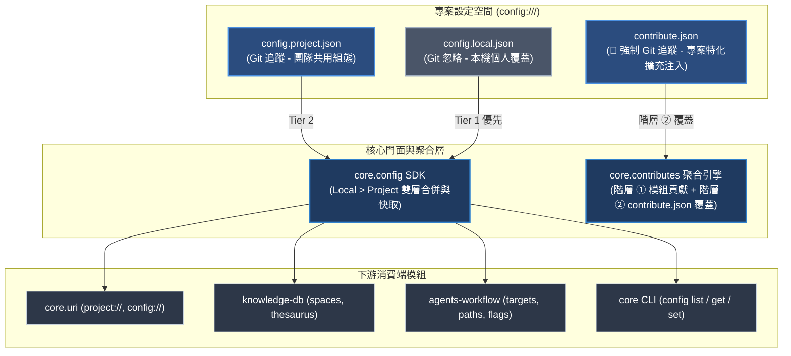
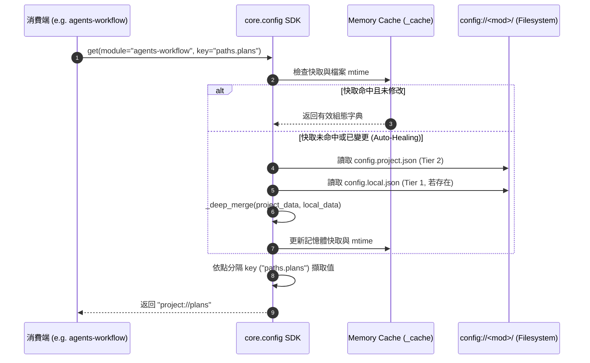

# 架構設計說明書 (Architecture Plan)

> 功能名稱：Config 系統架構升級、Contribute 專案特化規範與工具鏈建立 (Config & Project Contribute System)  
> 建立日期：2026-08-28  
> 所屬主計畫：`plans://2026_08_28_1754_module_toolchain_optimization/` (sub_02)  
> 狀態：Confirmed  
> 模板版本：v1.3  

---

## 1. 系統架構邊界與三層拓撲 (Architecture Boundaries & Precedence)

---

## 2. 雙層 Config 存取與快取自愈資料流 (Dataflow)

---

## 3. 受影響模組與檔案盤點 (Impacted Components)

| 模組 | 檔案路徑 | 變更類型 | 變更說明 |
| :--- | :--- | :---: | :--- |
| **`core`** | `source/core/core/config.py` | **NEW** | 建立 `core.config` SDK（`get`, `get_all`, `set`, `reload`, `list_modules`） |
| **`core`** | `source/core/core/contributes.py` | **MODIFY** | 階層 ② 專案特化改為專門讀取 `config://<target>/contribute.json`，阻斷 local 級 |
| **`core`** | `source/core/core/engine.py` | **MODIFY** | `act_deploy_configs_from_modules()` 改為掃描 `configurable/` 目錄並淨化 |
| **`core`** | `source/core/core/uri.py` | **MODIFY** | `_get_project_dir()` 與 `resolve()` 收斂調用 `core.config.get()` |
| **`core`** | `source/core/scripts/cli.py` | **MODIFY** | 實作 `config list`、`config get`、`config set` CLI 指令路由 |
| **`core`** | `source/core/contributes/core.json` | **MODIFY** | 註冊 `commands.config` 說明與防呆條款 |
| **`core`** | `source/core/configurable/config.project.json` | **NEW** | 遷移 `config.project.json` 至 `configurable/` |
| **`knowledge-db`** | `source/knowledge-db/configurable/config.project.json` | **NEW** | 遷移 `config.project.json` 至 `configurable/` |
| **`knowledge-db`** | `source/knowledge-db/knowledge_db/space.py` | **MODIFY** | 改由 `core.config.get("knowledge-db")` 讀取，拔除手寫檔案解析 |
| **`agents-workflow`** | `source/agents-workflow/configurable/config.project.json` | **NEW** | 遷移 `config.project.json` 至 `configurable/` |
| **`agents-workflow`** | `source/agents-workflow/agents_workflow/targets.py` | **MODIFY** | 改由 `core.config.get()` / `core.config.set()` 讀寫 targets |
| **`agents-workflow`** | `source/agents-workflow/agents_workflow/publisher.py` | **MODIFY** | 改由 `core.config.get()` 讀取 `enable_agents_md` 等開關 |
| **`agents-workflow`** | `source/agents-workflow/agents_workflow/initializer.py` | **MODIFY** | 改由 `core.config.set()` 寫入初始化路徑 |
| **測試套件** | `source/core/tests/test_config.py` | **NEW** | 覆蓋 ConfigManager 讀寫、雙層合併、自愈與型別防禦測試 |

---

## 4. 架構決策記錄 (Architecture Decision Records)

- **[sub_02:P02:DR-01] 記憶體快取與 mtime 雙指針自愈機制**：`ConfigManager` 快取紀錄各設定檔之 `(project_mtime, local_mtime)`。查詢時若檢測到磁碟檔案時間戳改變，自動觸發重載，達成高頻讀取零 I/O 與即時熱自愈兼顧。
- **[sub_02:P02:DR-02] 點分隔鍵值安全存取與深層寫入 (`_get_by_dot_path` / `_set_by_dot_path`)**：支援傳入 `paths.plans` 或 `spaces.project_main.include`，自動遍歷或創建深層字典結構。
- **[sub_02:P02:DR-03] 專案特化 `contribute.json` 剛性防呆 (No Local Allowed)**：若檢測到 `config://<mod>/contribute.local.json`，聚合引擎強制忽略並記錄警告日誌，確保所有影響代碼產物的注入皆受 Git 追蹤。
- **[sub_02:P02:DR-04] 原子寫入與格式化排版**：`set()` 寫入設定檔時使用暫存檔替換原子寫入，並固定使用 `indent=2, ensure_ascii=False` 格式化輸出。
