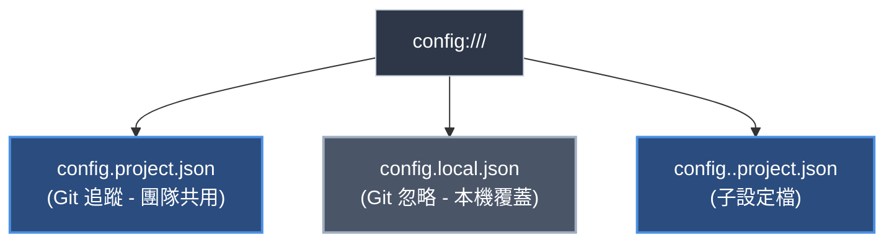
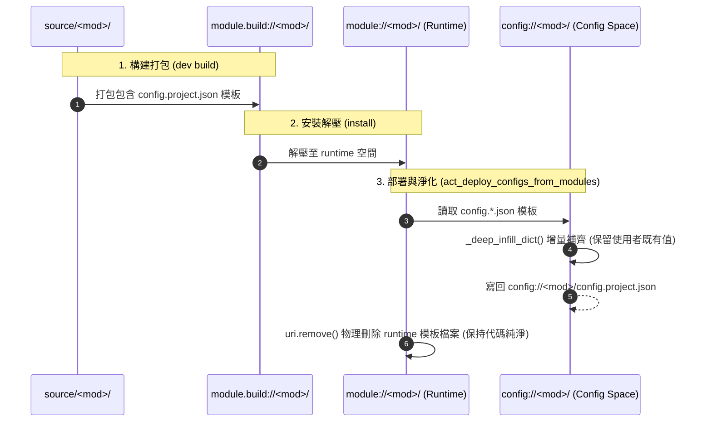
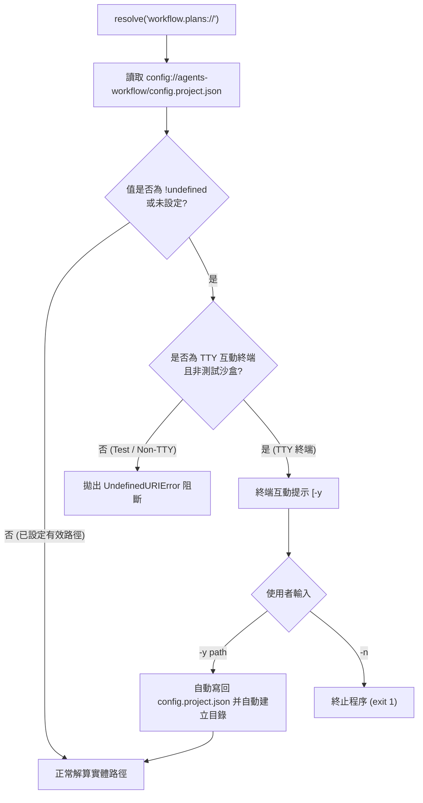

# Config 系統架構與機制深度調研報告 (R01)

> 調研主題：YS-Codebase 全生態系 Config 系統架構現況、運作機制與痛點調研  
> 建立日期：2026-08-28  
> 所屬主計畫：`plans://2026_08_28_1754_module_toolchain_optimization/` (sub_02)  
> 調研狀態：Completed  
> 模板版本：v1.3  

---

## 1. 調研背景與核心目標 (Background & Objectives)

在 YS-Codebase 生態系中，**Config 系統** 承擔著「專案級特化配置」、「本機個人環境覆蓋」、「未決設定 JIT 熱自愈」以及「語意 URI 協議綁定」等關鍵職責。
隨著 `sub_01` 成功將 Contributes 系統收斂為唯一的目錄化標準 (`source/<mod>/contributes/<target>.json`) 並建立統一的 `core.contributes.get()` SDK，本調研針對全系統 Config 的檔案結構、部署種子機制、三層覆蓋優先權、消費端讀寫模式與現存痛點進行全面盤點，為後續 Config 系統升級與工具鏈優化奠定堅實基礎。

---

## 2. 現行 Config 架構與運行機制 (Current Architecture & Dataflow)

### 2.1 三位一體空間定位 (Three-Tier Storage Topology)
依據 YSCB 模組資料治理原則，Config 空間定義如下：

| 檔案名稱 | Git 版本控制 | 語意定位 | 優先權 |
| :--- | :---: | :--- | :---: |
| **`config.local.json`** | ❌ Git 忽略 | 開發者本機個人特化環境（例：本地私有路徑、除錯開關） | **最高 (Tier 1)** |
| **`config.project.json`** | ✅ Git 追蹤 | 專案團隊共用組態（例：`project_root`、`paths.plans`、`release_targets`） | **次高 (Tier 2)** |
| **`contributes/<target>.json`** | ✅ 模組內建 | 模組原廠宣告之預設值（Contributed Defaults） | **基礎 (Tier 3)** |

---

### 2.2 模組安裝與設定種子注入流水線 (Seeding Pipeline)

當執行 `python yscb.py install <mod>` 時，`core.engine.PackageManager` 執行以下三階段處理：

- **`_deep_infill_dict` 演算法**：僅增補目標 JSON 中不存在的鍵值，若使用者或專案已設定則予以保留，不強行覆蓋。
- **模板淨化機制**：模板寫入 `config://` 後，立即從 `module://<mod>/` 物理移除，確保運行端純淨無配置冗餘。

---

### 2.3 `!undefined` 佔位符與 JIT 終端熱自愈 (Hot-Reconciliation)

在 `source/core/core/uri.py` 中，當解算 `project://` 或 `type: "config"` 的語意協議（如 `workflow.plans` 綁定 `paths.plans`）時：

---

## 3. 現存核心模組 Config 現況盤點

目前全系統 4 大核心模組之 Config 現狀如下：

| 模組名稱 | 模板位置 (源碼端) | 包含欄位與語意 | 消費端讀取方式 |
| :--- | :--- | :--- | :--- |
| **`core`** | `source/core/config.project.json` | `project_root: "!undefined"` | `core.uri._get_project_dir()` 手寫讀取 |
| **`agents-workflow`** | `source/agents-workflow/config.project.json` | `paths: {plans, archived, docs}` `release_targets: []` `enable_agents_md: true` `enable_project_changelog: true` | `targets.py`、`publisher.py`、`initializer.py` 多處手寫讀寫 |
| **`knowledge-db`** | `source/knowledge-db/config.project.json` | `spaces: {project_main: {...}}` `thesaurus: [...]` | `space.py` 手寫讀取 `config.project.json` + `config.local.json` |
| **`dev`** | *(無獨立 config)* | *(由 core 空間協議與 hook 注入)* | - |

---

## 4. 現存痛點與架構壞味道剖析 (Pain Points & Smells)

### 🚨 痛點 1：缺乏統一的 Config 存取 SDK (No Unified Config SDK)
- **現狀**：各模組讀取 Config 全部「各寫各的」：
  - `knowledge-db/space.py` 自行寫檔案開啟、JSON 解析、手動合併 `config.local.json` 與 `config.project.json`。
  - `agents-workflow/targets.py`、`publisher.py`、`initializer.py` 重複寫 3 份路徑解算與 fallback。
  - `core.uri` 在 `resolve()` 內部手寫遍歷 `cand_configs`。
- **壞味道**：重複代碼高達 5 處以上，且沒有快取機制，每次調用都重複執行 File I/O 與 JSON 解析。
- **改進方向**：比照 `core.contributes.get()`，建立標準的 `core.config.get(module, key, default=None)` 與 `core.config.get_all(module)`，底層自動完成 `config.local.json` 覆蓋 `config.project.json` 的深層合併與快取。

---

### 🚨 痛點 2：源碼端模板位置散落於根目錄 (Scattered Root Templates)
- **現狀**：`config.project.json` 直接散落平鋪在 `source/<module>/` 根目錄，與 `manifest.json`, `contributes/`, `scripts/` 平級。
- **壞味道**：模組根目錄雜亂，且無法一目了然區分「模組源碼」與「模組發行之配置模板」。
- **改進方向**：探討是否將模板規範收斂至標準位置（例如保持根目錄或建立目錄標準）。

---

### 🚨 痛點 3：`_deep_infill_dict` 對 List 陣列型態無法自訂合併行為
- **現狀**：`_deep_infill_dict` 遇到字典會遞迴合併，但遇到 List 陣列時（如 `release_targets: []` 或 `thesaurus: [...]`）若目標已有值就直接略過。
- **壞味道**：若模組升級新增了預設同義詞或預設 Target，無法以追加去重（Append Unique）或聯集方式自動更新。

---

### 🚨 痛點 4：缺少 Config 專屬 CLI 指令工具鏈 (No Config CLI)
- **現狀**：開發者若要檢視或微調設定，必須手動尋找並編輯 `ys_codebase/config/<module>/config.project.json`，或僅能在觸發 `!undefined` 時被動互動。
- **壞味道**：缺乏 `python yscb.py config list`、`python yscb.py config get <mod>.<key>`、`python yscb.py config set <mod>.<key> <value>` 等標準輔助工具。

---

## 5. 結論與後續升級建議 (Recommendations)

建議於 `sub_02` 中按以下主軸規劃升級：
1. **建立 `core.config` 統一 SDK**：提供 `get(module, key, default)`、`set(module, key, value, local=False)`、`list_all(module)`，原生封裝 Local > Project 雙層覆蓋與自愈快取。
2. **重構各模組消費端**：將 `knowledge-db`、`agents-workflow`、`core.uri` 中手寫讀取 `config.project.json` 的代碼 100% 收斂至 `core.config` SDK。
3. **擴充 `config` CLI 指令**：在 `core` 模組提供乾淨的 `config <list|get|set|reset>` 指令，提升開發者體驗。
