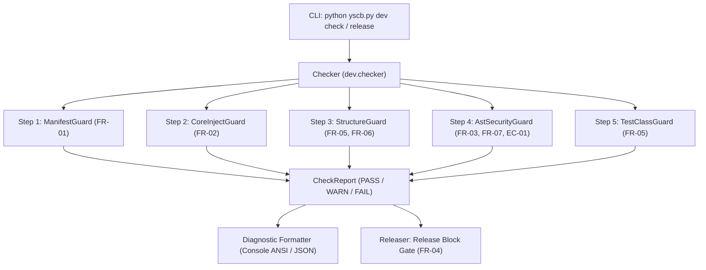
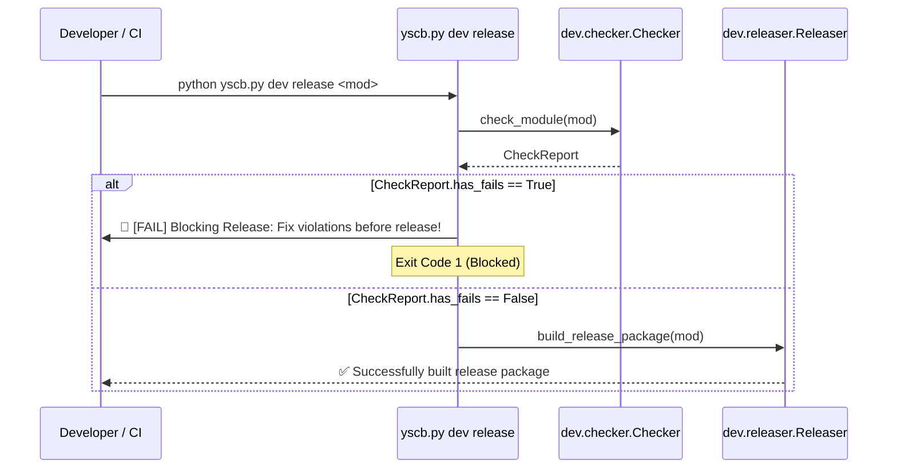

# 架構設計說明書 (Architecture Plan)

> 功能名稱：Dev 模組狀態檢核工具升級 (Dev Module Check & Diagnostics Upgrade)  
> 建立日期：2026-08-28  
> 所屬主計畫：`plans://2026_08_28_1754_module_toolchain_optimization/` (sub_03)  
> 狀態：Confirmed  
> 模板版本：v1.3  

---

## 1. 系統架構與資料結構 (Architecture & Data Structures)



### 1.1 資料結構定義

```python
from enum import Enum
from dataclasses import dataclass
from typing import List, Optional, Dict, Any

class CheckSeverity(Enum):
    PASS = "PASS"
    WARN = "WARN"
    FAIL = "FAIL"

@dataclass
class CheckIssue:
    severity: CheckSeverity
    category: str        # "MANIFEST", "CONTRIBUTES", "PROBING", "STRUCTURE", "ANTIPATTERN", "SYNTAX"
    message: str
    file_path: Optional[str] = None
    line_number: Optional[int] = None

@dataclass
class CheckReport:
    module: str
    status: CheckSeverity
    issues: List[CheckIssue]
    
    @property
    def has_fails(self) -> bool:
        return any(i.severity == CheckSeverity.FAIL for i in self.issues)

    @property
    def has_warns(self) -> bool:
        return any(i.severity == CheckSeverity.WARN for i in self.issues)
```

---

## 2. 5 步流水線檢核流程 (5-Step Check Pipeline)

1. **Step 1: `_check_manifest` (ManifestGuard)**
   - 驗證 `manifest.json` 必填欄位 (`name`, `version`, `entry`, `dependencies`)。
   - 驗證 `version` 符合 SemVer 格式 (`X.Y.Z` / `X.Y.Z.build`)。
   - 驗證 `name` 與模組目錄名一致。
   - 驗證 `dependencies` 包含 `core`（`core` 本體除外，違者 `[FAIL]`）。

2. **Step 2: `_check_core_injection` (CoreInjectGuard)**
   - 檢查是否存在 `contributes/core.json`（若無 `[WARN]`）。
   - 若存在，檢查是否具備 `commands` 或 `uri_schemes` 宣告（若無 `[WARN]`）。

3. **Step 3: `_check_file_structure` (StructureGuard)**
   - 驗證 `scripts/cli.py` 存在 (`[FAIL]`)。
   - 檢查根目錄是否散落 `config.*.json` 模板；若有組態模板必須置於 `configurable/` (`[FAIL]`)。
   - 檢查是否殘留 `.tmp`、`.bak`、`.DS_Store` 檔案 (`[WARN]`)。
   - 檢查是否具備 `contributes.format.md` (`[WARN]`)。

4. **Step 4: `_check_source_files` (AstSecurityGuard)**
   - 走訪模組目錄下所有 `.py` 檔案（排除 `__pycache__`）。
   - 執行 `ast.parse`（語法錯誤 `[FAIL]`）。
   - **空間穿透檢測**：非 `dev` 模組中出現 `module.source://` 或 `source/` 探測字串 (`[FAIL]`)。
   - **反模式靶向攔截**：非 `core` 模組業務代碼（排除 `tests/`）中出現 `"config.project.json"`、`"config.local.json"` 或 `"contributes.merged.json"` (`[FAIL]`)。

5. **Step 5: `_check_test_classes` (TestClassGuard)**
   - 走訪 `tests/test_*.py`，AST 分析所有以 `Test` 開頭之 Class。
   - 強制繼承 `YSCBTestCase`（直接繼承 `unittest.TestCase` 者 `[FAIL]`）。

---

## 3. Release 剛性守門與 Build 容錯設計 (FR-04)



- **`dev release`**：檢測到 `has_fails == True` 時立即終止，輸出詳細違規檔案與行號，剛性阻斷發布。
- **`dev build`**：檢測到 `has_fails == True` 時印出警告/錯誤，但繼續生成本機測試包，保障調試效率。

---

## 4. 模組影響矩陣 (Impact Matrix)

| 模組路徑 | 變更類型 | 變更說明 |
| :--- | :---: | :--- |
| `source/dev/dev/checker.py` | 重構升級 | 實作 5 步檢核流水線、AST 靶向反模式分析與 `CheckReport` 資料結構 |
| `source/dev/dev/releaser.py` | 整合升級 | 在 `release_module()` 加入 `Checker.check_module()` 剛性守門阻斷 |
| `source/dev/scripts/cli.py` | 介面升級 | 升級 `cmd_check` 終端彩色診斷輸出與 `--json` 支援 |
| `source/dev/tests/test_checker.py` | 新增/更新 | 覆蓋所有檢查維度與分級的單元測試 |
