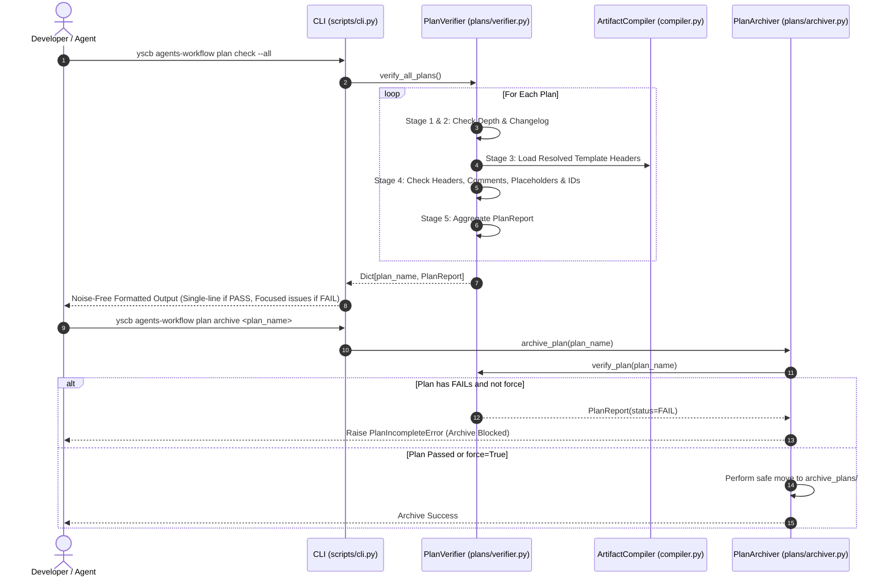

# 架構設計說明書 (Architecture Design)

> 功能名稱：Agents-Workflow Plan 核查工具鏈升級 (Plan Check & Verification Toolchain Upgrade)  
> 建立日期：2026-08-28  
> 所屬主計畫：`plans://2026_08_28_1754_module_toolchain_optimization/` (sub_04)  
> 狀態：Confirmed  
> 模板版本：v1.2  

---

## 1. 模組架構分層與職責邊界 (Layered Architecture)

本設計將 `PlanVerifier` 升級為現代化、資料驅動的計畫合規診斷引擎，核心由 5 步流水線 (5-Stage Plan Verification Pipeline)、動態模板標題解析器 (Dynamic Template Parser)、Noise-Free 終端排版引擎與歸檔守門阻斷器 (Archive Gate) 組成。

```text
[CLI Layer]         agents-workflow plan check / verify / archive
                          │
                          ▼
[Verification Layer] PlanVerifier (5-Stage Pipeline)
                          ├── Stage 1: Structure & Depth Guard (<= 2 levels, changelog/umbrella)
                          ├── Stage 2: Changelog Integrity Guard (Markdown table & entries)
                          ├── Stage 3: Dynamic Template Resolver (load resolved_contents/templates)
                          ├── Stage 4: Markdown File & ID Guard (Header, No HTML comments, No placeholders)
                          └── Stage 5: Severity Aggregator (PASS / WARN / FAIL)
                          │
                          ▼
[Output & Gate]     Noise-Free Formatter / JSON Export / PlanArchiver Gate
```

---

## 2. 核心資料流與循序圖 (Data Flow & Sequence Diagram)



---

## 3. 受影響檔案與新建檔案清單 (Impacted & New Files Inventory)

| 檔案路徑 | 類型 | 職責與變更說明 |
| :--- | :---: | :--- |
| `source/agents-workflow/agents_workflow/plans/verifier.py` | Modify | 實作 5 步流水線、動態模板解析與結構化 PlanReport |
| `source/agents-workflow/agents_workflow/plans/archiver.py` | Modify | 整合 PlanVerifier 剛性歸檔守門阻斷 |
| `source/agents-workflow/agents_workflow/plans/__init__.py` | Modify | 匯出 PlanSeverity, PlanIssue, PlanReport |
| `source/agents-workflow/scripts/cli.py` | Modify | 升級 `cmd_plan` 支援 Noise-Free 排版與 `--json` |
| `source/agents-workflow/tests/test_plans_toolchain.py` | Modify | 單元與整合測試套件 |

---

## 4. 架構決策記錄 (Architecture Decision Records)

- **[sub_04:P02:DR-01] 5 步流水線解耦**：將目錄結構、changelog、動態模板標題解析、Markdown 內容檢核與嚴重度聚合拆分為 5 步獨立邏輯。
- **[sub_04:P02:DR-02] 剛性守門阻斷模式**：在 `PlanArchiver` 內掛載 `PlanVerifier`，阻斷任何包含 `[FAIL]` 的計畫未經授權進入歷史庫。
- **[sub_04:P02:DR-03] 噪聲抑制排版**：全數 Pass 時單行收斂，有問題時隱藏 Pass 檔案，降低視覺負擔。
