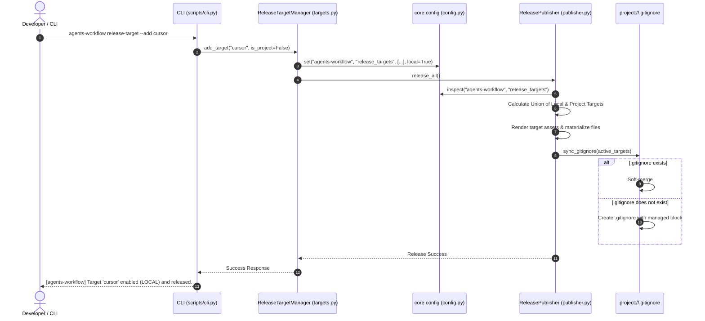

# 架構設計說明書 (Architecture Design)

> 功能名稱：Agents-Workflow Release 預設 Local 模式、Gitignore 軟合併同步與 Core Config 來源層級探測 (Release Local Mode, Gitignore Sync & Core Config Origin Inspection)  
> 建立日期：2026-08-28  
> 所屬主計畫：`plans://2026_08_28_1754_module_toolchain_optimization/` (sub_05)  
> 狀態：Confirmed  
> 模板版本：v1.2  

---

## 1. 模組架構分層與職責邊界 (Layered Architecture)

本架構橫跨 `core` 微內核組態系統與 `agents-workflow` 發布工具鏈，進行高內聚、低耦合的分層架構設計：

```text
[Layer 1: Microkernel Config SDK (core.config)]
    ├── ConfigManager.get_raw(module, key, local, default) -> 單層原始未合併讀取
    └── ConfigManager.inspect(module, key)                 -> 來源層級 (local/project/both) 與覆蓋狀態診斷
          │
          ▼
[Layer 2: Target Lifecycle Governance (agents_workflow.targets)]
    ├── ReleaseTargetManager.add_target(name, is_project=False)    -> 預設寫入 config.local.json
    ├── ReleaseTargetManager.remove_target(name, is_project=False) -> 預設操作 config.local.json
    └── ReleaseTargetManager.list_targets()                        -> 透過 core.config 標註 [LOCAL] / [PROJECT]
          │
          ▼
[Layer 3: 4-Step Release Engine (agents_workflow.publisher)]
    ├── ReleasePublisher._get_active_targets()    -> 自動取得 Local 與 Project 之聯集 Targets
    └── ReleasePublisher.sync_gitignore()         -> project://.gitignore 區塊非破壞性軟合併
          │
          ▼
[Layer 4: CLI Interface (scripts/cli.py)]
    ├── agents-workflow release-target --add <t> [--proj]
    ├── agents-workflow release-target --remove <t> [--proj]
    └── agents-workflow release-target --list (來源分級彩色排版)
```

---

## 2. 核心資料流與循序圖 (Data Flow & Sequence Diagram)



---

## 3. 受影響檔案與新建檔案清單 (Impacted & New Files Inventory)

| 檔案路徑 | 類型 | 職責與變更說明 |
| :--- | :---: | :--- |
| `source/core/core/config.py` | Modify | 增補 `get_raw()` 與 `inspect()` API，匯出至頂層 Facade |
| `source/agents-workflow/agents_workflow/targets.py` | Modify | 升級 `ReleaseTargetManager` 預設 Local 模式、`--proj` 支援與多層清單診斷 |
| `source/agents-workflow/agents_workflow/publisher.py` | Modify | 支援複合來源 Targets 聯集發布，並於交易中執行 `.gitignore` 軟合併 |
| `source/agents-workflow/scripts/cli.py` | Modify | 升級 `cmd_release_target` 支援 `--proj` 與多層狀態彩色終端排版 |
| `source/core/tests/test_config.py` | Modify | 增補 `get_raw` 與 `inspect` 單元測試 |
| `source/agents-workflow/tests/test_targets.py` | Modify | 增補 Local 預設、`--proj` 切換與 `.gitignore` 軟合併單元測試 |

---

## 4. 架構決策記錄 (Architecture Decision Records)

- **[sub_05:P02:DR-01] Microkernel Config 來源探測解耦**：`ConfigManager` 保持高內聚，透過 `_read_json_file` 直接讀取單層檔案實現 `get_raw`，並以純字典運算比對實作 `inspect`，不額外開立暫存檔或破壞快取。
- **[sub_05:P02:DR-02] Gitignore 專屬標記錨點設計**：
  - 定義剛性錨點：`# === YSCB AGENTS_WORKFLOW IGNORE BEGIN ===` 與 `# === YSCB AGENTS_WORKFLOW IGNORE END ===`。
  - 使用 Regex 取代區塊，區塊外部內容保持 Byte 級原樣保留。
- **[sub_05:P02:DR-03] Target 聯集發布 (Union Release)**：發布時取 Local 與 Project 聯集，確保不同層級啟用的 Targets 在該機台上皆能正確物化；移除時則精準作用於目標層級。
