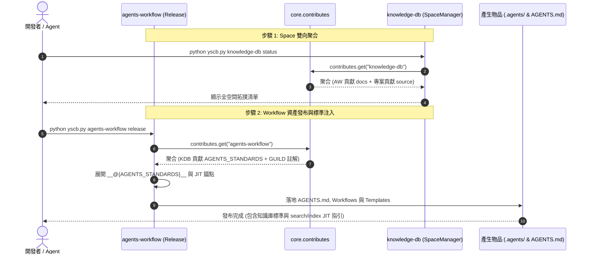

# 架構設計說明書 (Architecture Design)

> 功能名稱：Knowledge-DB 與 Agents-Workflow 雙向 Contributes 聯動與 Space 解耦 (Knowledge-DB & Agents-Workflow Bidirectional Contributes & Space Decoupling)  
> 建立日期：2026-08-28  
> 所屬主計畫：`plans://2026_08_28_1754_module_toolchain_optimization/` (sub_06)  
> 狀態：Confirmed  
> 模板版本：v1.2  

---

## 1. 模組架構分層與職責邊界 (Layered Architecture)

```text
+-----------------------------------------------------------------------------------+
|                           宿主專案層 (Host Project Tier)                           |
|  - config/knowledge-db/contribute.json: 專案特化宣告 source 源碼空間                 |
+-----------------------------------------------------------------------------------+
                                         │
                                         ▼
+-----------------------------------------------------------------------------------+
|                        雙向 Contributes 宣告層 (Contributes Tier)                   |
|  - source/agents-workflow/contributes/knowledge-db.json: 宣告 spaces.docs 空間     |
|  - source/knowledge-db/contributes/agents-workflow.json: 宣告 insert 錨點注入        |
+-----------------------------------------------------------------------------------+
                                         │
                                         ▼
+-----------------------------------------------------------------------------------+
|                        靜態資產與標準規範層 (Assets Tier)                           |
|  - source/knowledge-db/assets/: 平鋪標準行為規範與 SOP JIT 指引資產                  |
|    * KnowledgeAgentsStandards.md (檢索優先紀律、Docstring 防護)                     |
|    * phase00_guild.md / research_guild.md (調研/需求階段引導 search)                |
|    * phase07_guild.md (結案階段引導 index 更新)                                    |
|  - source/agents-workflow/assets/standards/AgentsStandards.md: 補齊擴充錨點        |
+-----------------------------------------------------------------------------------+
                                         │
                                         ▼
+-----------------------------------------------------------------------------------+
|                        編譯發布與運行消費層 (Release & Runtime Tier)                |
|  - ArtifactCompiler / ReleasePublisher: 發布時自動聚合多模組 Contributes 並注入規範  |
|  - SpaceManager / KnowledgeEngine: 載入多模組空間並提供精準檢索與索引服務           |
+-----------------------------------------------------------------------------------+
```

---

## 2. 核心資料流與循序圖 (Data Flow & Sequence Diagram)

### 2.1 雙向 Contributes 聚合與發布資料流



---

## 3. 受影響檔案與新建檔案清單 (Impacted & New Files Inventory)

| 檔案路徑 | 類型 | 職責與變更說明 |
| :--- | :---: | :--- |
| `source/knowledge-db/configurable/contribute.json` | Modify | 清空預設 `spaces: {}` 與 `thesaurus: []`，解除模組內部硬編碼假設 |
| `source/agents-workflow/contributes/knowledge-db.json` | New | 宣告 `spaces.docs` 空間，指向 `workflow.docs://` |
| `config/knowledge-db/contribute.json` | New | 本專案特化宣告 `spaces.source` 空間，指向 `project://source`, `project://ys_codebase` |
| `source/agents-workflow/assets/standards/AgentsStandards.md` | Modify | 於文件底部補齊 `__@{AGENTS_STANDARDS}__` 擴充錨點 |
| `source/agents-workflow/contributes/agents-workflow.json` | Modify | 於 `token` 陣列宣告 `token: "AGENTS_STANDARDS"` |
| `source/knowledge-db/contributes/agents-workflow.json` | New | 宣告 `insert` 映射，注入行為準則與 JIT GUILD 指引 |
| `source/knowledge-db/assets/KnowledgeAgentsStandards.md` | New | 知識檢索優先紀律 (Knowledge-First Axiom) 與 Docstring 防護鐵律 |
| `source/knowledge-db/assets/phase00_guild.md` | New | Phase 0 JIT 註解：引導調用 `knowledge-db search` 檢索既有符號 |
| `source/knowledge-db/assets/research_guild.md` | New | Research JIT 註解：引導調研前定向檢索專案知識庫 |
| `source/knowledge-db/assets/phase07_guild.md` | New | Phase 7 JIT 註解：結案時引導調用 `knowledge-db index` 即刻更新索引庫 |

---

## 4. 架構決策記錄 (Architecture Decision Records)

- **[P02:DR-01] 空間宣告職責分離**：`knowledge-db` 預設空間保持為空字典，由管轄文檔的 `agents-workflow` 宣告 `docs` 空間，由具體專案宣告 `source` 空間，達成 100% 模組解耦。
- **[P02:DR-02] 資產結構極簡平鋪**：`source/knowledge-db/assets/` 旗下檔案平鋪放置，不分多層子目錄，消除深層 URI 解析複雜度。
- **[P02:DR-03] 零業務代碼入侵**：全流程 100% 依賴 `core.contributes` 既有宣告式機制與 Markdown 文字插值，保障零 Python 業務邏輯飄移。
