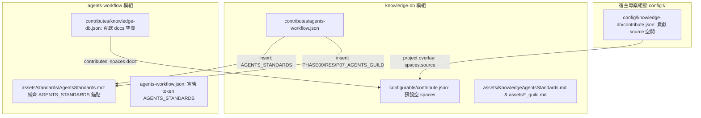

# 技術調研報告：Knowledge-DB 與 Agents-Workflow 雙向 Contributes 聯動與 Space 解耦調研

> 調研主題：knowledge-db <-> agents-workflow 雙向 Contributes 體系與 Space 解耦分析 (Bidirectional Contributes & Flat Assets Architecture)  
> 建立日期：2026-08-28  
> 所屬主計畫：`plans://2026_08_28_1754_module_toolchain_optimization/` (sub_06)  
> 調研狀態：Concluded  
> 模板版本：v1.0  

---

## 1. 調研背景與目標 (Background & Objectives)

### 1.1 核心目標
本調研旨在落實 `knowledge-db` 與 `agents-workflow` 之間的**雙向 Contributes 宣告式協同**，徹底解耦預設空間硬編碼，達成微內核零假設與模組自治：
1. **Space 空間解耦與來源職責分離**：
   - 清空 `knowledge-db/configurable/contribute.json` 預設空間，消除模組內部硬編碼路徑假設。
   - 由 `agents-workflow` 透過 `contributes/knowledge-db.json` 宣告貢獻 `docs` 空間（指向 `workflow.docs://`）。
   - 由宿主專案透過 `config/knowledge-db/contribute.json` 宣告專案特化之 `source` 源碼空間。
2. **`knowledge-db` 對 `agents-workflow` 之 Contributes 注入 (平鋪資產結構)**：
   - 於 `AgentsStandards.md` 底部補齊 `AGENTS_STANDARDS` 擴充錨點。
   - 由 `knowledge-db/contributes/agents-workflow.json` 注入行為準則（知識檢索優先紀律、Docstring 結構防護）。
   - 注入 SOP AGENT GUILD JIT 註解（調研引導 `search` 查找、結案引導 `index` 更新索引）。
   - 靜態資產全數平鋪存放於 `source/knowledge-db/assets/`，不分過多子層級。

---

## 2. 雙向 Contributes 拓撲與資料流設計



---

## 3. 核心實施細節分析 (Implementation Details)

### 3.1 項目 A：預設 Space 清空與解耦
- **檔案**：`source/knowledge-db/configurable/contribute.json`
- **變更後**：
  ```json
  {
    "spaces": {},
    "thesaurus": []
  }
  ```

---

### 3.2 項目 B：`agents-workflow` 貢獻 `docs` 空間
- **檔案**：`source/agents-workflow/contributes/knowledge-db.json`（新增）
- **宣告內容**：
  ```json
  {
    "spaces": {
      "docs": {
        "description": "專案知識庫與設計文檔空間 (由 agents-workflow 貢獻)",
        "include": [
          "workflow.docs://"
        ],
        "exclude": [
          "**/__pycache__/**",
          "**/.git/**"
        ]
      }
    }
  }
  ```

---

### 3.3 項目 C：宿主專案宣告 `source` 空間
- **檔案**：`config/knowledge-db/contribute.json`（專案特化組態）
- **宣告內容**：
  ```json
  {
    "spaces": {
      "source": {
        "description": "YS-Codebase 核心源碼空間",
        "include": [
          "project://source",
          "project://ys_codebase"
        ],
        "exclude": [
          "**/__pycache__/**",
          "**/.git/**",
          "**/build/**",
          "**/release/**",
          "**/tests/**"
        ]
      }
    },
    "thesaurus": []
  }
  ```

---

### 3.4 項目 D：`agents-workflow` 補齊 `AGENTS_STANDARDS` 錨點
- **檔案**：
  1. `source/agents-workflow/assets/standards/AgentsStandards.md`：底部追加 `__@{AGENTS_STANDARDS}__`。
  2. `source/agents-workflow/contributes/agents-workflow.json`：宣告 `token: "AGENTS_STANDARDS"`。

---

### 3.5 項目 E：`knowledge-db` 對 `agents-workflow` 之 Contributes 與平鋪資產
- **檔案**：`source/knowledge-db/contributes/agents-workflow.json`
- **資產檔案（平鋪於 `source/knowledge-db/assets/`）**：
  1. `source/knowledge-db/assets/KnowledgeAgentsStandards.md`
     - **知識檢索優先紀律 (Knowledge-First Axiom)**：探索專案優先調用 `python yscb.py knowledge-db search <query>` 或查閱 `workflow.docs://`，嚴禁盲目大範圍 grep 或逐檔翻找。
     - **Docstring 與符號結構防護鐵律**：維持標準註解結構，防損毀 AST 解析提取 `UnifiedSymbol`。
  2. `source/knowledge-db/assets/phase00_guild.md` & `research_guild.md`
     - 調研與需求階段引導使用 `knowledge-db search` 定向查找既有符號與文檔。
  3. `source/knowledge-db/assets/phase07_guild.md`
     - 結案交付後引導調用 `python yscb.py knowledge-db index`（或 `scan`）即刻更新倒排索引庫。

---

## 4. 調研結論與驗收標準

1. **零多餘假設**：排除空間邊界計算負擔，資產全面平鋪至 `assets/` 目錄。
2. **驗收標準**：
   - `python yscb.py knowledge-db status` 顯示來自 `module:agents-workflow` 的 `docs` 空間與來自專案的 `source` 空間。
   - `agents-workflow release` 後，生成的 `AGENTS.md` 與 P00/P07 模板包含知識庫行為準則與 JIT 指引。
