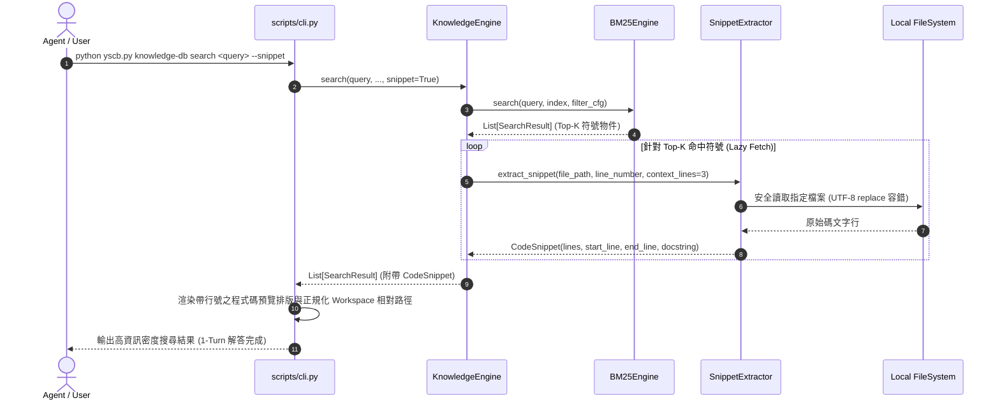

# 架構設計說明書 (Architecture Design)

> 功能名稱：knowledge_db_search_snippet_optimization  
> 建立日期：2026-08-29  
> 所屬主計畫：無  
> 狀態：Confirmed  
> 模板版本：v1.2  

---

## 1. 模組架構分層與職責邊界 (Layered Architecture)

```text
+-----------------------------------------------------------------------------------+
|                           CLI Router (scripts/cli.py)                             |
|  - 解析 --snippet / -s / --preview / --detail / --json                            |
|  - 調度 SnippetFormatter 渲染終端排版 (包含行號、Docstring 高亮與程式碼區塊)         |
+-----------------------------------------------------------------------------------+
                                         │
                                         ▼
+-----------------------------------------------------------------------------------+
|                       KnowledgeEngine (knowledge_db/engine.py)                    |
|  - 統一門面 SDK：search(query, ..., snippet=False, context_lines=3)                |
|  - 提供 Workspace 路徑正規化能力 (resolve_workspace_rel_path)                    |
+-----------------------------------------------------------------------------------+
                                         │
                                         ▼
+-----------------------------------------------------------------------------------+
|               Snippet & Retrieval Engine (knowledge_db/retrieval.py)              |
|  - BM25Engine：多空間多欄位加權檢索 (零 I/O 倒排索引計算)                             |
|  - SnippetExtractor：延遲讀取命中檔案行區塊、安全邊界截斷、行號排版與編碼容錯     |
+-----------------------------------------------------------------------------------+
                                         │
                                         ▼
+-----------------------------------------------------------------------------------+
|               Agents-Workflow Contributes & Assets (contributes / assets)         |
|  - KnowledgeAgentsStandards.md：注入 --snippet 語法指引                           |
|  - phase00_guild.md / research_guild.md / core.json：工作流 JIT 註解引導          |
+-----------------------------------------------------------------------------------+
```

---

## 2. 核心資料流與循序圖 (Data Flow & Sequence Diagram)



---

## 3. 受影響檔案與新建檔案清單 (Impacted & New Files Inventory)

| 檔案路徑 | 類型 | 職責與變更說明 |
| :--- | :---: | :--- |
| `source/knowledge-db/knowledge_db/retrieval.py` | Modify | 新增 `CodeSnippet` 資料結構與 `SnippetExtractor` 提取器，支援行號截斷與編碼容錯。 |
| `source/knowledge-db/knowledge_db/engine.py` | Modify | `KnowledgeEngine.search` 支援 `snippet: bool` 與路徑正規化。 |
| `source/knowledge-db/scripts/cli.py` | Modify | 擴充 `--snippet` / `-s` / `--preview` CLI 參數解析與代碼區塊排版輸出。 |
| `source/knowledge-db/assets/KnowledgeAgentsStandards.md` | Modify | 注入 `--snippet` 語法規範與推薦指令。 |
| `source/knowledge-db/assets/phase00_guild.md` | Modify | 更新 Phase 0 JIT 提示推薦 `--snippet`。 |
| `source/knowledge-db/assets/research_guild.md` | Modify | 更新 Research JIT 提示推薦 `--snippet`。 |
| `source/knowledge-db/contributes/core.json` | Modify | 更新 `search` 指令之 pros 說明，包含代碼預覽。 |
| `source/knowledge-db/tests/test_retrieval.py` | Modify | 新增 `SnippetExtractor` 與 `CodeSnippet` 單元與邊界測試。 |
| `source/knowledge-db/tests/test_cli.py` | Modify | 新增 `--snippet` CLI 參數與排版測試。 |

---

## 4. 架構決策記錄 (Architecture Decision Records)

- **[P02:DR-01] 延遲按需讀取 (Lazy Snippet Extraction)**：
  Snippet 提取必須置於 BM25 評分與 Top-K 截斷之後執行，未指定 `--snippet` 時磁碟 I/O 增量為 0，確保未啟用時依然享有 $< 10\text{ ms}$ 的極致檢索效能。
- **[P02:DR-02] 軟截斷與編碼防禦 (Graceful Error Handling)**：
  採用 `errors="replace"` 安全開啟檔案，並設置最大輸出行數上限（預設 12 行），遇到檔案缺失或非文字檔時優雅降級為提示字串，嚴禁拋出例外。
- **[P02:DR-03] Workspace 相對路徑統一正規化**：
  在 `KnowledgeEngine` 中提供路徑解算，自動比對 `os.getcwd()` 與專案根目錄，輸出對 IDE 點擊最友善的標準相對路徑。
