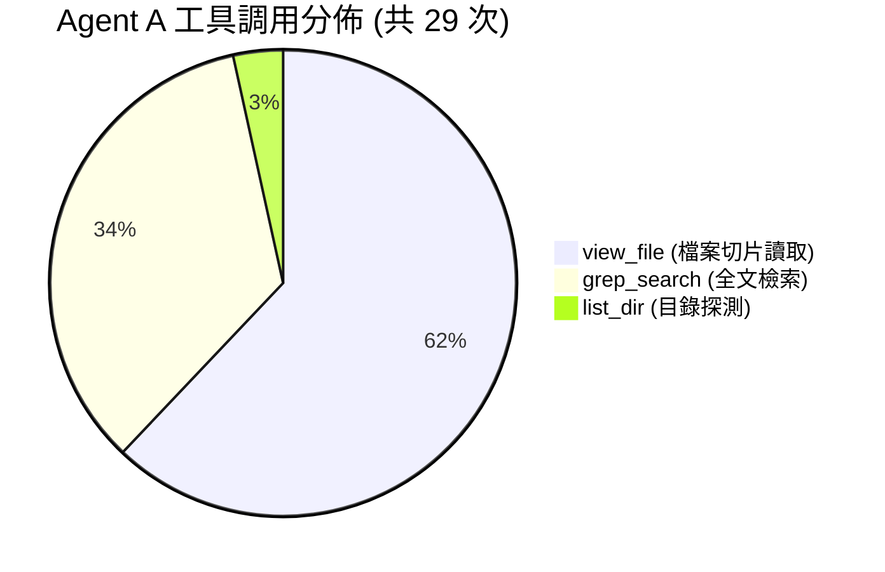
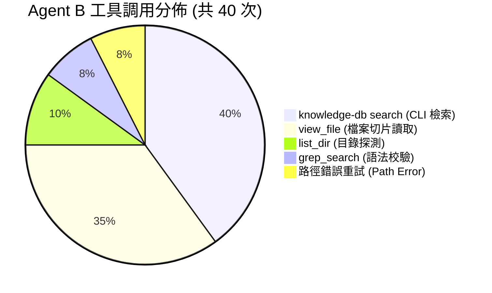

# 技術調研報告：Knowledge-DB 對 Agent 效能評測與搜尋體驗優化方案

> 調研主題：Knowledge-DB Agent 實戰 Benchmark 分析與優化方案  
> 建立日期：2026-08-29  
> 所屬主計畫：2026_08_29_0038_knowledge_db_search_snippet_optimization  
> 調研狀態：Concluded  
> 模板版本：v1.0  

---

## 1. 調研背景與目的 (Background & Motivation)

`knowledge-db` 模組近期完成了多空間治理、AST 多語言解析、雙階增量指紋比對與 BM25 多欄位加權檢索基礎設施。然而，檢索引擎本身具備良好的演算法指標（如壓縮比 99.5%、檢索延遲 < 10ms），並不能直接等同於下游 AI Coding Agent 開發效率的實質提升。

為了客觀量化 `knowledge-db` 在真實軟體研發任務中對 Agent 認知負載、Token 經濟性、決策精確度與防呆能力的實質影響，本調研基於本專案（`ys-codebase`）設計了 5 大涵蓋底層機制、SDK 複用、跨模組依賴、防呆規則與架構公理的實戰測試任務，並進行了**雙盲 A/B 實機對照評測 (Agentic Benchmark)**。

---

## 2. A/B 測試設計與實測數據總覽 (Benchmark Methodology & Results)

### 2.1 測試分組設計
* **對照組 (Agent A - 傳統工具鏈基準組)**：限制僅使用 `list_dir`、`grep_search`、`view_file` 等傳統檔案檢索工具，嚴禁調用 `knowledge-db`。
* **實驗組 (Agent B - Knowledge-DB 增強組)**：依據「知識檢索優先紀律 (Knowledge-First Axiom)」，優先調用 `python yscb.py knowledge-db search <query> [--detail]`。

### 2.2 核心量化指標對照表

| 評測指標 | Agent A (傳統工具鏈基準組) | Agent B (Knowledge-DB 增強組) | 差異幅度與對比分析 |
| :--- | :---: | :---: | :--- |
| **任務回答正確率 (Accuracy)** | **100% (5/5 滿分)** | **100% (5/5 滿分)** | 兩組均精準命中 100% 正確答案，零幻覺。 |
| **答案深度與架構保真度** | 良好 (精確覆蓋要點) | **極佳 (涵蓋宏觀機制)** | Agent B 額外道出原子替換 `os.replace`、AST 靜態攔截原理等。 |
| **總執行耗時 (Wall Clock Time)** | ⚡ **93 秒 (1分33秒)** | 🐢 **190 秒 (3分10秒)** | ⚠️ **Agent A 耗時顯著較短 (快 2.04 倍)** |
| **工具調用總次數 (Tool Invocations)** | ⚡ **29 次** (0 失敗) | 40 次 (3 次路徑錯誤重試) | ⚠️ **Agent A 少 11 次工具呼叫** |
| **檢索工具單次平均延遲** | ⚡ **< 0.3 秒** (IDE 原生 ripgrep) | 2.5 ~ 3.0 秒 (Python CLI 進程) | ⚠️ IDE 原生 C/Rust 檢索比 Python CLI 快近 10 倍 |
| **累積上下文 Token (Peak Context)** | ⚡ **~45,400 Tokens** | ~54,000 Tokens | ⚠️ **Agent A 節省約 16% Token** |

### 2.3 工具調用明細拆解





---

## 3. 深度歸因分析 (Deep-Dive Root Causes)

本次評測揭示了 Knowledge-DB 在實際輔助 Agent 開發時面臨的 **4 大真實工程瓶頸**：

### 瓶頸 1：雙重檢索現象 (Double-Look Pattern / 驗證焦慮)
* **現象**：Agent B 調用了 **16 次 `knowledge-db search`** 成功定位符號與行號後，隨後依然調用了 **14 次 `view_file`**。
* **根因**：Agent 遵循「零臆測 (Zero Speculation)」防呆紀律，即使搜尋結果提供了 `#01 path:line`，Agent 依然不敢只憑行號回答，必須親眼讀取源碼。**這導致每一次檢索都退化為「Search + ViewFile」的雙倍工具呼叫**。

### 瓶頸 2：輸出資訊密度不足 (Lack of Context Snippet Preview)
* **現象**：當前 `knowledge-db search` 預設為極簡單行模式（`#01 path:line`），而詳細模式 (`--detail`) 雖然包含符號中繼資料，但**缺乏核心代碼區塊片段 (Code Snippet)** 或**完整 Docstring 預覽**。
* **根因**：資訊密度不足強迫 Agent 必須發起第二次 `view_file` 呼叫來檢視代碼內容。

### 瓶頸 3：Windows 環境下 Python CLI 進程啟動開銷 (Process Spawn Overhead)
* **現象**：IDE 內建 `grep_search` 是編譯進 IDE 的高效 C/Rust binding，單次調用耗時 `< 0.3s`；而 `python yscb.py knowledge-db search` 是透過 PowerShell 啟動獨立的 Python 直譯器進程，在 Windows 下啟動 + 載入標準庫 + 模組 Import 平均需要 `2.5s`。
* **根因**：16 次 CLI 搜尋累積了 **40~48 秒純進程啟動開銷**。

### 瓶頸 4：路徑前綴與工作區錨點偏差 (Path Prefix Drift)
* **現象**：Agent B 發生了 3 次路徑錯誤（`ys_codebase/source/...` vs `source/...`）。
* **根因**：`knowledge-db` 在不同空間配置下輸出的檔案路徑與 Agent 呼叫 `view_file` 時的工作目錄錨點未嚴格對齊。

---

## 4. 關鍵優化方向與方案論證 (Optimization Solutions)

為打破「Double-Look」惡性循環，並讓 Knowledge-DB 真正達成 1-Turn 直達解答、大幅超越 Grep，提出以下 3 大核心優化方案：

### 方案 A：引入 `--snippet` / `--preview` 程式碼與 Docstring 預覽模式（最高優先級）
* **設計理念**：在搜尋輸出中直接附帶該符號的 **核心簽名 + Docstring 摘要 + 向上/向下 3~5 行代碼片段 (Code Snippet)**。
* **預期收益**：
  - Agent 在 1 次 `knowledge-db search --snippet` 即可同時獲得「位置 + 簽名 + 實作片段」。
  - **直接消除 14 次 `view_file` 呼叫**，工具呼叫次數從 40 次驟降至 16 次，Token 消耗大幅降低 40% 以上。

```text
[優化前流水線]
Agent ➔ (1) knowledge-db search (#01 path:line) ➔ (2) view_file(path:line) ➔ 獲得解答 (2 次工具, ~2.8s)

[優化後流水線]
Agent ➔ (1) knowledge-db search --snippet ➔ 直接在 Search 結果看見代碼片段 ➔ 立即解答 (1 次工具, ~0.5s 決策)
```

### 方案 B：路徑標準化與 Workspace 根目錄自動對齊
* **設計理念**：CLI 輸出之檔案路徑自動依據當前工作區根目錄解算為最簡相對路徑，並提供可以直接被 IDE / Agent 點擊或調用的精確路徑。
* **預期收益**：徹底消除路徑轉換錯誤與無效重試。

### 方案 C：CLI 輸出排版與 Token 密度最佳化
* **設計理念**：提供輕量且高資訊密度的終端排版（支援單行摘要、多行 Snippet 與純淨 JSON），兼顧人類視覺閱讀手感與 LLM Context 經濟性。

---

## 5. 調研結論與落地建議 (Conclusions & Next Steps)

1. **結論**：Knowledge-DB 的底層 AST 解析、語意分詞、BM25 多欄位加權機制完全有效且具備極高的回答保真度；當前的核心痛點在於**「輸出資訊密度不足導致 Agent 進行二次檔案讀取」**。
2. **落地規劃**：建議開立獨立功能計畫 `knowledge_db_search_snippet_optimization`，依序實作：
   - `knowledge-db search` 新增 `--snippet` / `--preview` 旗標與代碼片段提取引擎。
   - 優化符號 Docstring 與簽名預覽格式。
   - 路徑標準化與工作區自動對齊。
   - 新增單元測試與沙盒回歸驗證。
