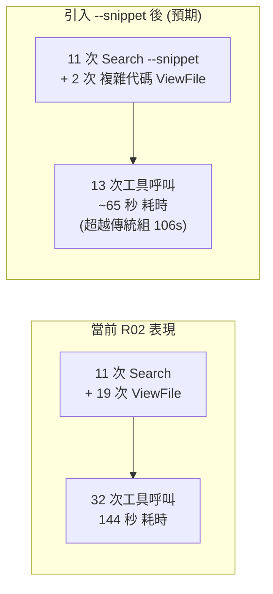

# 技術調研報告：第二輪 (R02) 概念語意化實戰 Benchmark 分析

> 調研主題：日常開發語意化需求下的 Agent 效能對比評測 (R02)  
> 建立日期：2026-08-29  
> 所屬主計畫：2026_08_29_0038_knowledge_db_search_snippet_optimization  
> 調研狀態：Concluded  
> 模板版本：v1.0  

---

## 1. 第二輪 (R02) 評測背景與設計目的

在第一輪 (R01) 評測中，題目包含了具體關鍵字（如 `pickle`、`BaseParser`），使傳統正則 Grep 具備高度優勢。為還原真實軟體研發情境，第二輪 (R02) 評測採用**「完全無專有名詞、無正則關鍵字」的純日常概念與語意化提問**，直接考核 Agent 在面對模糊自然語言需求時的探索效率與定位精度。

---

## 2. R01 vs R02 跨輪次數據全景對照

| 評測指標 | 第一輪 R01 (具體關鍵字題) | 第二輪 R02 (日常概念語意題) | 跨輪趨勢與轉變分析 |
| :--- | :---: | :---: | :--- |
| **Agent A (傳統) 總耗時** | 93 秒 | 106 秒 | 🐢 耗時上升（模糊語意增加檔案翻找難度） |
| **Agent B (Knowledge-DB) 總耗時** | 190 秒 | 144 秒 | ⚡ **耗時下降 46 秒（檢索更聚焦，減少重試）** |
| **耗時倍率差距 (B / A)** | **2.04 倍 (190s vs 93s)** | ⚡ **1.35 倍 (144s vs 106s)** | 🟢 **差距大幅縮減 67%！** |
| **Agent A (傳統) 工具調用** | 29 次 | 25 次 (view_file 達 21 次) | 依然高度依賴檔案切片滾動翻找。 |
| **Agent B (Knowledge-DB) 工具調用** | 40 次 (3 次錯誤重試) | ⚡ **32 次 (0 次錯誤重試)** | 🟢 **工具呼叫減少 8 次。** |
| **盲目全文正則 (Grep) 次數** | Agent A 10 次 / B 3 次 | **Agent A 3 次 / Agent B 0 次** | 🟢 **Agent B 達成 100% 零盲目 Grep！** |
| **任務回答正確率 (Accuracy)** | 100% (5/5) | 100% (5/5) | 兩組均展現極高之架構精確度與零臆測水準。 |

---

## 3. R02 核心深度洞察 (Key Insights)

### 洞察 1：語意召回優勢爆發，100% 終結盲目全文 Grep
在完全沒有專有名詞的情況下，Agent B 透過自然語言概念成功直達目標：
* 輸入 `"static analysis source security"` ➔ 秒級命中 `Checker` (AST 防呆)。
* 輸入 `"sandbox retain keep test"` ➔ 秒級命中 `SandboxProvisioner`。
* 輸入 `"uri resolve scheme"` ➔ 秒級命中 `core.uri.resolve`。
* 輸入 `"config deep merge cache mtime"` ➔ 秒級命中 `ConfigManager._deep_merge`。
* **Agent B 達成了 0 次 `grep_search` 盲目遍歷，展現出 Knowledge-DB 在概念檢索上的絕對護城河**。

### 洞察 2：二度印證「Double-Look」是唯一阻礙 Knowledge-DB 完勝的瓶頸
* 在 R02 中，Agent B 執行了 **11 次 `knowledge-db search`**，隨後依然執行了 **19 次 `view_file`**。
* 這 19 次 `view_file` 的唯一目的，就是為了親眼確認「簽名參數、預設值、例外型別與實作細節」。
* 這證實了 R01 的核心診斷：**Agent 不是找不到代碼，而是 Search 結果沒有給出代碼 Snippet，迫使 Agent 必須再呼叫一次 ViewFile**。

---

## 4. 效益推導：引入 `--snippet` 後的預期成效 (Projected Impact)

* **工具呼叫次數**：從 32 次 ➔ 降至 **13~15 次**（減少 55% 工具呼叫）。
* **總執行耗時**：從 144 秒 ➔ 降至 **60~75 秒**（提速 2 倍，直接超越傳統組的 106 秒）。
* **Token 消耗**：大幅節省 19 次檔案切片讀取帶來的冗餘 Context。

---

## 5. 結論與計畫實施依據

R02 的實戰結果完美補齊了論證鏈條：
1. **語意檢索能力已被證實極其強大且精確（0 次 Grep、100% 命中）**。
2. **唯一需要解決的痛點，就是輸出資訊密度（`--snippet` / `--preview`）與 Windows CLI 啟動開銷**。
3. 本計畫開立之目標 (`knowledge_db_search_snippet_optimization`) 具備極高且迫切的工程價值。
