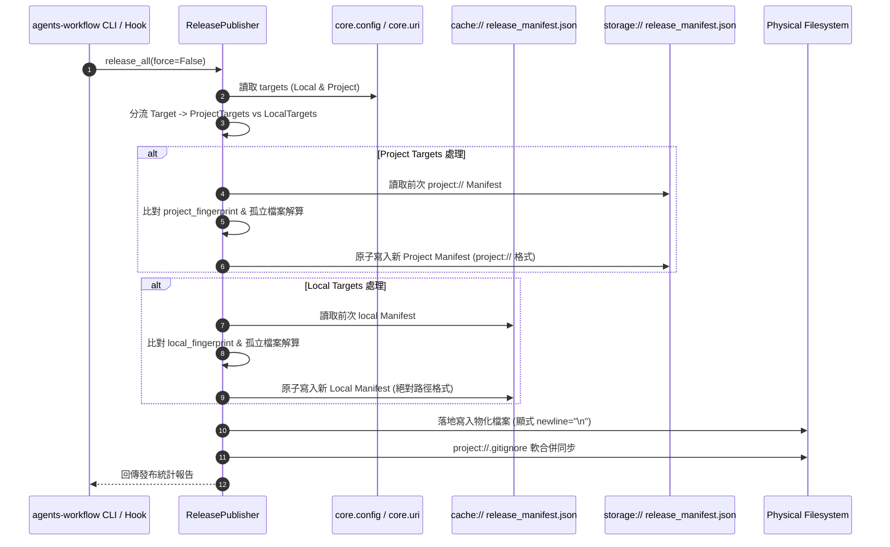

# 架構設計說明書 (Architecture Design)

> 功能名稱：agents_workflow_manifest_cache_placement  
> 建立日期：2026-08-29  
> 所屬主計畫：無  
> 狀態：Confirmed  
> 模板版本：v1.2  

---

## 1. 模組架構分層與職責邊界 (Layered Architecture)

```text
+-----------------------------------------------------------------------------+
|                          agents_workflow.publisher                          |
|                                                                             |
|   +---------------------------------------------------------------------+   |
|   |                           ReleasePublisher                          |   |
|   +---------------------------------------------------------------------+   |
|         |                                                           |       |
|         v (Project Targets Tier 2)                                  v       |
|   +-------------------------------+           +-------------------------+   |
|   |    Project Manifest Channel   |           |  Local Manifest Channel |   |
|   |  storage://.../manifest.json  |           | cache://.../manifest.json|  |
|   |  路徑格式: project://協議     |           | 路徑格式: 實體絕對路徑   |   |
|   |  Git 追蹤: ✅ 追蹤            |           | Git 追蹤: 🚫 忽略       |   |
|   +-------------------------------+           +-------------------------+   |
|         |                                                           |       |
+---------|-----------------------------------------------------------|-------+
          v                                                           v
+-------------------------------+               +-----------------------------+
| 專案發布產物 (AGENTS.md 等)   |               | 本機私有產物 (cline 等)     |
+-------------------------------+               +-----------------------------+
```

---

## 2. 核心資料流與循序圖 (Data Flow & Sequence Diagram)



---

## 3. 受影響檔案與新建檔案清單 (Impacted & New Files Inventory)

| 檔案路徑 | 類型 | 職責與變更說明 |
| :--- | :---: | :--- |
| `.gitattributes` | New | 專案根目錄 Git 換行符號歸一化設定檔 (`* text=auto eol=lf`) |
| `ys_codebase/source/agents-workflow/agents_workflow/publisher.py` | Modify | 實作雙軌 Manifest 讀寫、`project://` 路徑轉換、舊 Manifest 容錯與 `newline="\n"` 寫檔 |
| `ys_codebase/source/agents-workflow/agents_workflow/targets.py` | Modify | 支援獲取 Project targets 與 Local targets 分類清冊 |
| `ys_codebase/storage/agents-workflow/release_manifest.json` | Modify | 既有發布清單正規化轉為 `project://` 格式 |
| `test/test_agents_workflow_manifest_placement.py` | New | 雙軌 Manifest 分流、路徑格式、孤立清理與 LF 歸一化驗證測試 |

---

## 4. 架構決策記錄 (Architecture Decision Records)

- **[P02:DR-01] 雙軌 Manifest 獨立指紋與生命週期**：
  Local Targets 與 Project Targets 分別維護各自的 fingerprint、active_targets 與 published_files。避免 Local target 的變更導致 Project storage manifest 產生不必要的寫入與 Git dirty diff。
- **[P02:DR-02] 路徑雙向轉換工具函式 (`to_project_uri` / `from_project_uri`)**：
  在 `publisher.py` 內建置高強韌之 `project://` 與絕對路徑轉換函式，並優先使用 `core.uri`，若 `core.uri` 不可用則安全使用 `proj_root` 相對路徑轉換。
- **[P02:DR-03] 檔案落地全面純 LF 規範**：
  發布輸出之所有 `.md`、`.json`、`AGENTS.md` 及 `.gitignore` 檔案寫入時顯式加入 `newline="\n"`，與根目錄 `.gitattributes` 形成雙層防線。
