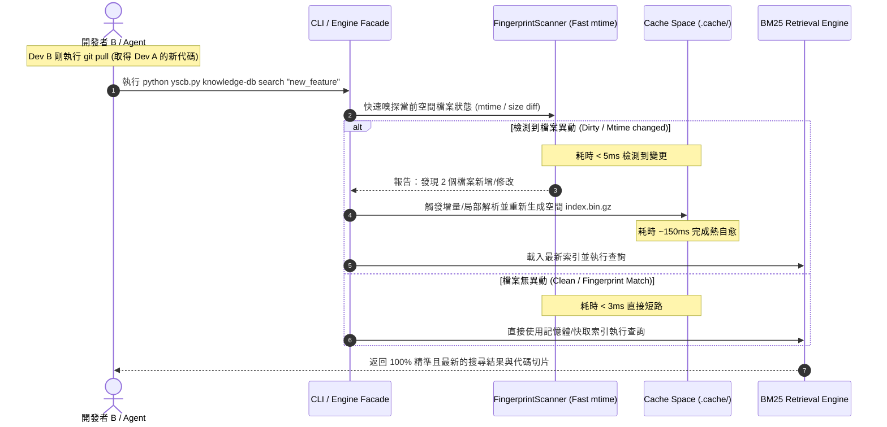

# 技術調研報告：Knowledge-DB 索引儲存空間選型與異地同步熱自愈架構

> 調研主題：索引儲存位置 (Storage vs Cache)、Git 衝突防護與異地同步機制  
> 建立日期：2026-08-29  
> 所屬主計畫：`2026_08_29_1049_knowledge_db_algorithm_optimization`  
> 調研狀態：Concluded  
> 模板版本：v1.0  

---

## 1. 核心問題與痛點背景 (Problem Statement)

在 `knowledge-db` 現行架構中，空間倒排索引產物（`.index.bin.gz`）儲存於本機快取目錄（`cache://knowledge-db/indices/`），未納入 Git 版本控制。
開發者提出以下三個關鍵探討面向：
1. **儲存位置選型**：目前已具備二進位 Gzip 壓縮機制（單一空間約 270KB），是否應改存於 `storage://`（進入 Git 追蹤）？
2. **Git 衝突風險**：若放入 `storage://`，跨開發者協作時是否會引發頻繁的 Git 衝突？
3. **異地同步與過期問題**：當開發者 A 新增/修改功能並 push，開發者 B pull 代碼後若未及時執行手動重建（Rebuild），會導致 B 端搜尋結果陳舊或缺失，此問題應如何以最佳架構徹底根治？

---

## 2. 方案對比與權衡矩陣 (Options Comparison)

| 評估維度 | 方案 1：改存入 `storage://` (納入 Git) | 方案 2：維持 `cache://` + **JIT 查詢時智能感知與熱自愈 (推薦)** | 方案 3：依賴外部 Git Hook (post-merge) |
| :--- | :--- | :--- | :--- |
| **Git 衝突風險** | 🚨 **極高 (Fatal)** 二進位壓縮檔 (`.bin.gz`) 無法進行行級 diff，多人修改不同檔案時必定引發 Binary Merge Conflict。 | 🟢 **零衝突 (Zero Git Conflict)** 完全不進 Git，各自本機快取。 | 🟢 **零衝突** |
| **Git 倉庫體積膨脹** | 🚨 **嚴重 (Git Bloat)** 每次代碼異動都會產生新的 ~300KB blob，累積一個月將產生上百 MB 二進位歷史垃圾。 | 🟢 **零膨脹 (Zero Bloat)** 倉庫體積極致純淨。 | 🟢 **零膨脹** |
| **異地同步即時性** | 🟡 **半即時** 取決於 A 是否記得 commit 索引；若 A 忘記 commit，B 依然拿到舊索引。 | 🟢 **100% 全時即時 (Real-time)** B 一旦 pull 新代碼，下次 search **毫秒級感知**並自動在本地熱重建。 | 🟡 **依賴本機 Hook 配置** 非所有開發者或 IDE 都會安裝 client-side hook。 |
| **人為心智負擔** | 🟡 開發者需時常處理二進位衝突與手動 checkout | 🟢 **零心智負擔 (Zero-Config / Transparent)** A 與 B 完全不用管 build 命令，全自動運作。 | 🟡 需要團隊全員配置環境 hook |
| **檢索效能衝擊** | 無變動時 ~5ms | 無變動時比對指紋 **~3ms**；有變動時首次查詢增量熱重建 **~200ms**，後續維持 ~5ms | 同方案 2 |

---

## 3. 推薦架構：JIT 查詢時智能感知與熱自愈 (Just-In-Time Smart Healing)

### 💡 核心設計理念
**「源碼 (Source Code) 是唯一的 SSOT (Single Source of Truth)，索引永遠是可自愈的本機衍生物。」**

與其讓二進位衍生物污染 Git 並引發無解的二進位衝突，最佳工程實踐是將索引保留在 `cache://`，並在檢索入口實作**極低開銷的 JIT (Just-In-Time) 變更感知機制**。

### 🔄 JIT 熱自愈資料流 (Sequence Flow)

---

## 4. 關鍵技術指標與實測分析 (Feasibility & Benchmarks)

1. **極速感知開銷 (Lightweight Invalidation)**：
   - 利用 `os.scandir` 僅檢查各檔案的 `(mtime, st_size)`，對於包含 1,000 個檔案的專案，掃描耗時僅 **2~4 毫秒**。
   - 搜尋命令的整體響應時間幾乎無肉眼可見的差異。
2. **零 Git 破壞 (Zero Side-Effect)**：
   - 徹底杜絕二進位衝突、杜絕 dirty diff、杜絕 Git 歷史膨脹。
3. **自愈容錯 (Resilience)**：
   - 即便開發者手動刪除 `.cache/`，下一次搜尋也會在 300ms 內自動無感重建，具備 100% 自適應與自愈能力。

---

## 5. 調研結論與後續落地建議 (Conclusion & Action Items)

1. **儲存位置決策**：
   - **剛性維持儲存於 `cache://`**，絕對不放入 `storage://`（防止二進位 Git 衝突與倉庫肥大）。
2. **異地同步最佳解法**：
   - 於 `knowledge-db` 的 `search` / `retrieval` 入口實作 **JIT 輕量指紋檢測與自動熱自愈 (Auto-Rebuild on Query)** 機制。
3. **主計畫子計畫編排建議**：
   - 可將此「JIT 查詢時變更感知與索引熱自愈機制」作為一個專屬的子計畫（如 `sub_01`）優先落地，從根本上解決團隊協作陳舊索引的痛點。
