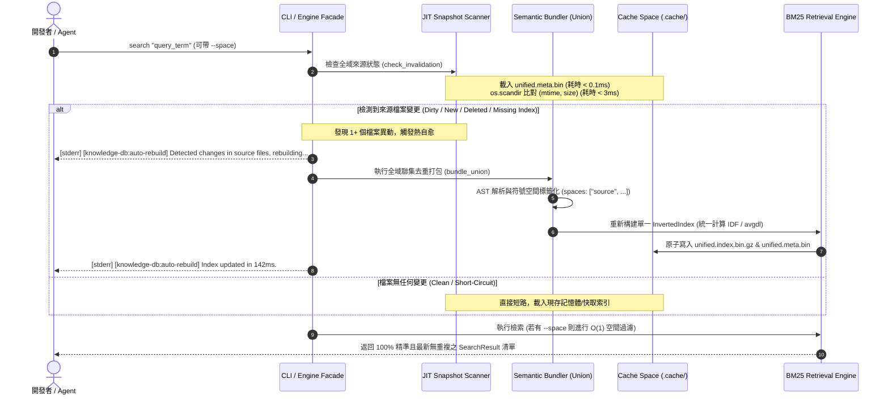

# 架構設計說明書 (Architecture Design)

> 功能名稱：sub_01_jit_invalidation_and_hot_healing  
> 建立日期：2026-08-29  
> 所屬主計畫：`2026_08_29_1049_knowledge_db_algorithm_optimization`  
> 狀態：Confirmed  
> 模板版本：v1.2  

---

## 1. 模組架構分層與職責邊界 (Layered Architecture)

```text
┌────────────────────────────────────────────────────────────────────────┐
│                        CLI / Python SDK (Facade)                       │
│      python yscb.py knowledge-db search <query> [--space] [--no-auto]  │
└───────────────────────────────────┬────────────────────────────────────┘
                                    │
                                    ▼
┌────────────────────────────────────────────────────────────────────────┐
│               KnowledgeEngine (Central Orchestrator)                   │
│   1. JIT Invalidation Gate (< 3ms) ➔ 2. Auto-Healing ➔ 3. BM25 Search  │
└───────────┬───────────────────────┬──────────────────────┬─────────────┘
            │                       │                      │
            ▼                       ▼                      ▼
┌──────────────────────┐ ┌──────────────────────┐ ┌──────────────────────┐
│  JIT Snapshot Engine │ │   Semantic Bundler   │ │     BM25 Engine      │
│  (FingerprintScanner)│ │   (Union De-duper)   │ │   (InvertedIndex)    │
├──────────────────────┤ ├──────────────────────┤ ├──────────────────────┤
│ • 輕量二進位快照     │ │ • 全域聯集去重掃描   │ │ • 單一全域倒排索引   │
│   (unified.meta.bin) │ │ • 單一實體檔案解析1次│ │   (unified.index.bin)│
│ • os.scandir mtime   │ │ • 符號標記多空間標籤 │ │ • BM25 正確 IDF/avgdl│
│ • < 0.1ms 反序列化   │ │   (spaces: List[str])│ │ • --space O(1) 篩選  │
└──────────────────────┘ └──────────────────────┘ └──────────────────────┘
            │                       │                      │
            └───────────────────────┼──────────────────────┘
                                    ▼
       ┌──────────────────────────────────────────────────────────┐
       │              VFS Cache Space (.cache/knowledge-db/)      │
       │   • indices/unified.meta.bin       (快照清冊, ~35KB)     │
       │   • indices/unified.index.bin.gz   (二進位索引, ~270KB)  │
       └──────────────────────────────────────────────────────────┘
```

---

## 2. 核心資料流與循序圖 (Data Flow & Sequence Diagram)



---

## 3. 受影響檔案與新建檔案清單 (Impacted & New Files Inventory)

| 檔案路徑 | 類型 | 職責與變更說明 |
| :--- | :---: | :--- |
| `ys_codebase/source/knowledge-db/knowledge_db/scanner.py` | Modify | 新增 `BinarySnapshotManager`（支援 `unified.meta.bin` 之 `YFP1` 二進位讀寫）與全域聯集 `mtime` 極速變更檢測方法 |
| `ys_codebase/source/knowledge-db/knowledge_db/bundler.py` | Modify | 實作 `bundle_union()` 支援全專案空間聯集去重解析，並將各檔案所屬之 `spaces` 標籤注入 `UnifiedSymbol` |
| `ys_codebase/source/knowledge-db/knowledge_db/retrieval.py` | Modify | `Posting` 與 `InvertedIndex` 全面適配多空間標籤，正規化 BM25 全域 `avgdl`/IDF 評分模型，支援單一全域索引 |
| `ys_codebase/source/knowledge-db/knowledge_db/engine.py` | Modify | 重構 `search()` 整合 JIT 熱自愈流水線、stderr 提示輸出與單一 `unified.index.bin.gz` 讀寫邏輯 |
| `ys_codebase/source/knowledge-db/scripts/cli.py` | Modify | CLI 搜尋指令新增 `--no-auto-rebuild` / `-n` 旗標與提示文字控制 |
| `ys_codebase/source/knowledge-db/tests/test_jit_hot_healing.py` | New | 撰寫 JIT 變更感知、二進位快照讀寫、全域去重、空間標籤篩選與熱自愈端到端單元測試 |

---

## 4. 架構決策記錄 (Architecture Decision Records)

- **[P02:DR-01]** **原生二進位快照格式 (`unified.meta.bin`)**：採用 Magic Header `b"YFP1"` + `struct` 二進位封裝，反序列化延遲壓低至 0.1ms 內，徹底消除 JSON 詞法解析開銷。
- **[P02:DR-02]** **全域聯集單一索引 (Unified Index)**：以實體檔案絕對路徑為唯一去重鍵，所有重疊檔案僅解析 1 次，產出單一 `unified.index.bin.gz`，消滅重複搜尋結果並校正 BM25 統計模型。
- **[P02:DR-03]** **非侵入式 Stderr 回饋**：背景熱自愈提示文字一律導向 `sys.stderr`，絕不污染 `stdout`，確保 `--json` 結構化輸出相容性。
- **[P02:DR-04]** **Test-First 測試前置**：同步建立 [`P06_test_plan.md`](./P06_test_plan.md) (Draft)，完整映射 FR-01~04 與 EC-01~04 測試案例。
