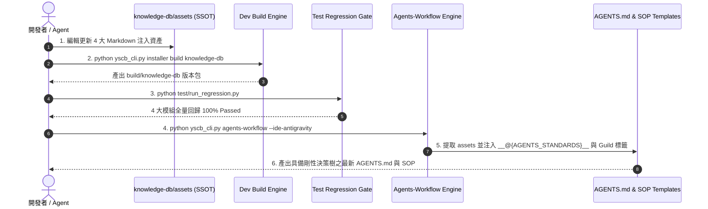

# 架構設計說明書 (Architecture Design)

> 功能名稱：`sub_02_agents_workflow_injection_optimization` (agents workflow 注入內容優化)  
> 建立日期：2026-08-29  
> 所屬主計畫：`2026_08_29_1049_knowledge_db_algorithm_optimization`  
> 狀態：Confirmed  
> 模板版本：v1.2  

---

## 1. 模組架構分層與職責邊界 (Layered Architecture)

```text
[空間 ① 源碼 SSOT: ys_codebase/source/knowledge-db/]
   ├── assets/KnowledgeAgentsStandards.md   <-- [FR-01, FR-02] 檢索決策樹與定向閱讀哲學注入
   ├── assets/phase00_guild.md              <-- [FR-03] Phase 0 JIT 定向檢索引導
   ├── assets/research_guild.md             <-- [FR-03] Research JIT 預檢指引
   ├── assets/phase07_guild.md              <-- [FR-04] Phase 7 JIT 智能熱自愈說明
   └── contributes/agents-workflow.json     <-- 宣告注入錨點與 Target 對齊
                     │
                     ▼ (Stage 2: build knowledge-db)
[空間 ① 構建發布庫: ys_codebase/build/knowledge-db/]
                     │
                     ▼ (Stage 3: regression gate 198/198 passed)
                     │
                     ▼ (Stage 4: dogfooding install & sync)
[空間 ③ 運行端與消費端: modules/ / .agents/ / AGENTS.md]
   ├── modules/knowledge-db/assets/...
   └── AGENTS.md (注入 KnowledgeAgentsStandards.md 決策樹區塊)
```

---

## 2. 核心資料流與循序圖 (Data Flow & Sequence Diagram)



---

## 3. 受影響檔案與新建檔案清單 (Impacted & New Files Inventory)

| 檔案路徑 | 類型 | 職責與變更說明 |
| :--- | :---: | :--- |
| `ys_codebase/source/knowledge-db/assets/KnowledgeAgentsStandards.md` | Modify | 注入剛性檢索決策樹（簽章/複合詞/語意分流）、定向閱讀哲學與 Docstring 防護 |
| `ys_codebase/source/knowledge-db/assets/phase00_guild.md` | Modify | 強化 Phase 0 定向檢索與 `-s` 參數指引 |
| `ys_codebase/source/knowledge-db/assets/research_guild.md` | Modify | 強化 Research 調研預檢指引與複合關鍵詞檢索建議 |
| `ys_codebase/source/knowledge-db/assets/phase07_guild.md` | Modify | 移除強制手動執行 `knowledge-db index`，改為 JIT 熱自愈說明 |

---

## 4. 架構決策記錄 (Architecture Decision Records)

- **[P02:DR-01] 採用 Dogfooding 四步閉環維護資產**：所有修改嚴格限定於 `source/knowledge-db/assets/`，透過 build ➔ regression ➔ sync 流水線無損更新根目錄 `AGENTS.md` 與 `.agents/` 產物。
