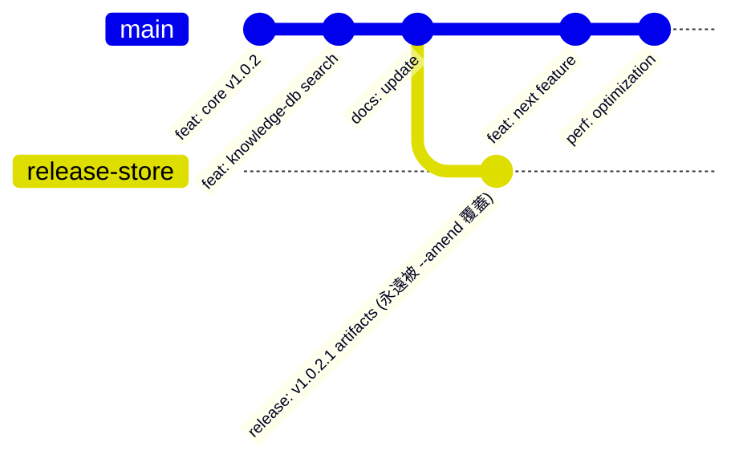

# 技術調研報告：發布產物二進位儲存與 Git 歷史瘦身優化 (R01)

> 調研主題：發布產物二進位儲存與 Git 歷史瘦身優化  
> 建立日期：2026-08-29  
> 所屬主計畫：無 (獨立計畫 `2026_08_29_1224_release_binary_storage_optimization`)  
> 調研狀態：Concluded  
> 模板版本：v1.0  

---

## 1. 調研背景與問題陳述 (Background & Problem Statement)

### 1.1 痛點現象
在專案演進至第 100 個 Commit 時，開發者發現 `.git/` 資料夾體積增長異常偏快（未壓縮物件庫約 **4.4 MB**，壓縮後 Packfile 達 **3.03 MiB**）。相較於其他規模更大但純代碼的專案，本專案在極短提交歷史下佔用了不相稱的磁碟空間。

### 1.2 實測數據量化分析

透過 `git rev-list --objects --all` 與 `git cat-file --batch-check` 對全庫物件進行深入剖析：

```
路徑分類 (Git 歷史累積)                         未壓縮總體積       Blob 數量
-----------------------------------------    -------------    ----------
ys_codebase/modules (運行端歷史副本)           3.71 MB           485
CHANGELOG.md (高頻大文字)                     2.91 MB            57
plans/archived (全階段 SOP 計畫檔案)          2.67 MB           533
ys_codebase/release (*.zip 二進位發布包)      2.08 MB            43 (純二進位)
ys_codebase/source (源碼 SSOT)                1.01 MB           166
```

---

## 2. 根因深度剖析 (Root Cause Deep Dive)

### 2.1 Git 壓縮機制的「不對稱性」：純文字 vs. 二進位壓縮包
- **純文字 (UTF-8/ASCII)**：
  Git 採用 zlib + **Delta Compression（差異壓縮）**。檔案內容即使有 10 MB，若各版本間只修改數十行，Git 僅需儲存極小的位元組差異（本專案純文字文字量 $> 10\text{ MB}$，但在 Packfile 中僅佔 **~1.2 MB**，壓縮率高達 **88%**）。
- **已壓縮二進位檔 (`*.zip`)**：
  `.zip` 檔案在生成時已經過 Deflate 演算法壓縮。源碼即便只有 1 行註解差異，壓縮後的二進位 Byte Stream 也會產生全面性的亂序與雪崩效應。
  **Git 無法對 `.zip` 進行任何有效的 Delta Diff**，只能將每一個版本的 `.zip` 視為全新的獨立二進位 Blob (100% Full Size) 完整寫入 Packfile。

### 2.2 早期版本過渡期的同名覆蓋與修訂沉積
- 目前工作目錄中的 `ys_codebase/release/` 僅有 14 個檔案、約 717 KB。
- 但在早期版本（`1.0.0.0` ~ `1.0.1.3`）建置期間，曾出現：
  1. 同名檔案（如 `core/1.0.0.0.zip`）被原地覆蓋提交 4~5 次；
  2. 修訂版更名與舊版刪除（如 `1.0.1.0.zip` -> `1.0.1.3.zip` -> `1.0.1.6.zip`）。
- 在 Git 中，**檔案被刪除或覆蓋並不會釋放歷史物件**，導致歷史中沉澱了 **43 個獨立 zip Blobs（共 2,075,826 Bytes / ~2.08 MB）**，佔據了目前 3 MB Packfile 中超過 **60%** 的實體空間。

---

## 3. 四大候選架構方案評估 (Candidate Solutions Trade-Off)

| 方案 | 運作原理 | 優點 (Pros) | 缺點 / 成本 (Cons) | 適用度評級 |
| :--- | :--- | :--- | :--- | :---: |
| **方案 1：Git LFS (Large File Storage)** | 倉庫僅存 100 Bytes 文字指針，實體 zip 存入 LFS 空間，配合 `git lfs prune --recent 2` 自動清理本機歷史。 | 官方標準、無縫支援大檔、歷史長度可配置。 | 需本機與 CI 安裝 `git-lfs` 外掛；遠端託管（如 GitHub）有 LFS 頻寬/容量配額限制。 | ⭐️⭐️⭐️ |
| **方案 2：孤兒發布分支 (Orphan Branch) + Commit 壓平** | 建立無父節點之獨立分支（如 `release-store`），每次更新透過 `--amend` 或定期 Squash 保持歷史長度為 1~2。 | 100% 原生 Git、零外部依賴、主分支 (`main`) 徹底純文字化、可直接 push 遠端備份。 | 需要微調發布腳本或在切換分支/Worktree 時執行發布。 | ⭐️⭐️⭐️⭐️⭐️<br/>(最高推薦) |
| **方案 3：二進位脫鉤 Git + 僅追蹤 `index.json`** | `.gitignore` 排除所有 `*.zip`，Git 僅追蹤純文字清單 `index.json`，zip 產物置於本地 `.cache/` 或 GitHub Releases。 | 最純粹的代碼庫架構、專案體積永遠最小。 | 本地若無 cache 需仰賴網路下載，或需配合 CI/CD 自動打包發布至 GitHub Releases。 | ⭐️⭐️⭐️⭐️ |
| **方案 4：Git Submodule / Subtree 隔離** | 將 `release/` 抽離為獨立子模組倉庫。 | 主倉庫體積與發布包完全解耦。 | 增加 Submodule 初始化與更新的認知負擔，對小型工具庫略顯過度設計。 | ⭐️⭐️ |

---

## 4. 推薦架構深度設計：孤兒發布分支 (Orphan Branch) 工作流



### 4.1 核心機制
1. **主分支 (`main`) 配置**：
   - 根目錄 `.gitignore` 加入 `ys_codebase/release/**/*.zip`。
   - `main` 分支僅追蹤源碼、文檔、計畫與 `index.json`（純文字）。
2. **發布分支 (`release-store`) 配置**：
   - 初始化孤兒分支：`git checkout --orphan release-store`。
   - 該分支**沒有任何歷史父節點**，僅存放當前最新版本的 `.zip` 發布包。
3. **發布時自動壓平 (Atomic Amend / Squash)**：
   - 每次執行發布時，將最新 `.zip` 提交至 `release-store` 分支並執行 `git commit --amend`。
   - 舊的 `.zip` Blob 失去引用成為 Dangling 物件，於背景 `git gc` 時自動釋放。
   - **成效**：該分支在 Git 中永遠只佔用當前最新版大小（約 700 KB），**空間增長率永久歸零**。

---

## 5. 歷史冗餘清洗標準作業流程 (Historical Cleanup SOP)

若未來決定對過往歷史進行徹底瘦身，推薦採用 Git 官方專用工具 **`git-filter-repo`**：

> ⚠️ **執行前置要求**：必須先完整複製整個專案目錄作為本機備份！

### 5.1 執行步驟
```bash
# 步驟 1：安裝 git-filter-repo 工具
pip install git-filter-repo

# 步驟 2：從全歷史 Commit 中徹底移除 release 下的所有 zip
git filter-repo --path ys_codebase/release --invert-paths --force

# 步驟 3：強制清除所有歷史 Reflog 與懸空物件，重新進行極限壓縮
git reflog expire --expire=now --all
git gc --prune=now --aggressive
```

### 5.2 預期效益
- `.git/` 體積預計從 **4.4 MB (Packfile 3.03 MiB)** 驟降至 **< 1.2 MB**（瘦身幅度超過 **60%**）。
- 徹底根除 43 個歷史冗餘二進位 Blobs。

---

## 6. 結論與分步落地建議 (Conclusion & Roadmap)

1. **短期（即刻）**：維持現狀，將本調研報告納入計畫存檔，不影響目前正常開發流程。
2. **中期（未來實作）**：
   - 第一階段：備份倉庫後執行 `git-filter-repo` 徹底清理歷史 2.08 MB 冗餘。
   - 第二階段：於 `dev release` 工具鏈中整合「孤兒分支 / 二進位脫鉤」發布策略，實現主分支永久純文字化。
