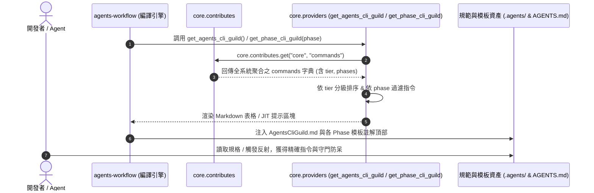

# 架構設計說明書 (Architecture Design)

> 功能名稱：`sub_01_cli_guidance_and_privilege_optimization`  
> 建立日期：2026-08-29  
> 所屬主計畫：`workflow_and_agents_guidance_optimization` (Umbrella Level 2)  
> 狀態：Confirmed  
> 模板版本：v1.2  

---

## 1. 模組架構分層與職責邊界 (Layered Architecture)

```text
+-----------------------------------------------------------------------------------+
|                        1. 宣告層 (Contribution Layer - SSOT)                      |
|  source/<donor>/contributes/core.json                                             |
|  -> commands.<name> = { tier: safe|conditional|gated, phases: [...], ... }        |
+-----------------------------------------+-----------------------------------------+
                                          |
                                          v (core.contributes.get("core", "commands"))
+-----------------------------------------------------------------------------------+
|                        2. 計算與編譯層 (Computed Provider Layer)                   |
|  core.core.providers                                                              |
|  -> get_agents_cli_guild()    : 編譯 🟢/🟡/🔴 三級權限 Markdown 防呆手冊            |
|  -> get_phase_cli_guild(phase): 依 Phase 過濾產生 JIT 階段推薦指令與紅線警示       |
+-----------------------------------------+-----------------------------------------+
                                          |
                                          v (code.func:// & contributes/agents-workflow.json)
+-----------------------------------------------------------------------------------+
|                        3. 呈現與注入層 (Workflow & Assets Layer)                   |
|  - agents-workflow: AgentsCliGuild.md, ContextInit.md, AgentsStandards.md, JIT   |
|  - knowledge-db   : KnowledgeAgentsStandards.md (日常搜尋強制替代 + ftype 分流)   |
+-----------------------------------------+-----------------------------------------+
```

---

## 2. 核心資料流與循序圖 (Data Flow & Sequence Diagram)



---

## 3. 受影響檔案與新建檔案清單 (Impacted & New Files Inventory)

| 檔案路徑 | 類型 | 職責與變更說明 |
| :--- | :---: | :--- |
| `source/core/core/providers.py` | Modify | 實作三級權限分級手冊渲染與 `get_phase_cli_guild(context, phase)` 動態過濾產生器。 |
| `source/core/contributes.format.md` | Modify | 更新 `commands` 擴充 Schema 說明文件（記錄 `tier` 與 `phases` 規格）。 |
| `source/core/contributes/core.json` | Modify | 更新 `core` 指令宣告，補齊 `tier` 與 `phases`。 |
| `source/dev/contributes/core.json` | Modify | 更新 `dev` 指令宣告（`dev test`, `dev release` 等），明確標註 `safe`/`conditional`/`gated` 與適用 Phase。 |
| `source/knowledge-db/contributes/core.json` | Modify | 更新 `knowledge-db` 指令宣告，標註 `knowledge-db search` 為 `safe` 等。 |
| `source/agents-workflow/contributes/core.json` | Modify | 更新 `agents-workflow` 指令宣告（`plan status` 為 `safe`, `plan archive` 為 `gated`）。 |
| `source/knowledge-db/assets/KnowledgeAgentsStandards.md` | Modify | 強化「🚨 執行紀律：日常代碼搜尋強制工具替代」條款與 `--ftype=c,cpp,py` / `--ftype=md` 決策樹。 |
| `source/agents-workflow/assets/workflows/ContextInit.md` | Modify | 職責解耦：聚焦 `AgentsStandards` 剛性必讀，將 `DevelopmentStandards.md` 讀取遞延至開立計畫時。 |
| `source/agents-workflow/assets/standards/AgentsStandards.md` | Modify | 剛性純化：排除非防呆禁令之流程描述，確保 100% 聚焦於最高執行紀律。 |
| `source/core/tests/test_cli_guild.py` | Modify | 新增 `tier` 分級斷言、`get_phase_cli_guild` 階段過濾測試與邊界容錯用例。 |

---

## 4. 架構決策記錄 (Architecture Decision Records)

- **[P02:DR-01] Provider 採用純無狀態無副作用設計**：
  `get_agents_cli_guild` 與 `get_phase_cli_guild` 皆為純函數，輸入 `context` 與可選參數，依賴 `core.contributes.get` 取得不可變資料結構，確保跨環境與沙盒編譯之確定性。
- **[P02:DR-02] 權限三級與 Emoji 視覺防呆標準化**：
  - 🟢 **`safe`**：`🟢 自主安全`（可自主主動調用）
  - 🟡 **`conditional`**：`🟡 階段約束`（依 SOP 階段條件調用）
  - 🔴 **`gated`**：`🔴 🚨 授權守門`（必須獲開發者顯式指示方可調用）
