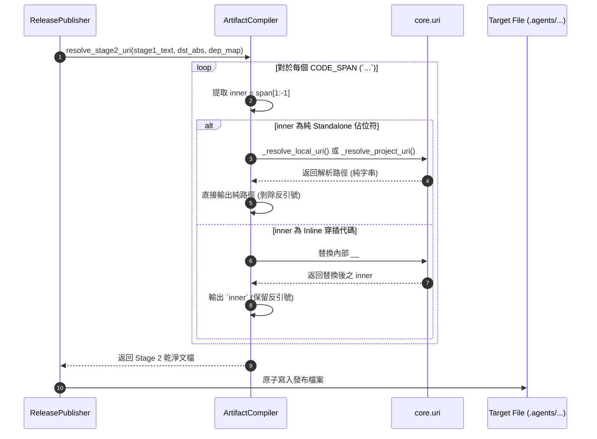

# 架構設計說明書 (Architecture Design)

> 功能名稱：`sub_02_uri_placeholders_and_workflow_path_healing`  
> 建立日期：2026-08-29  
> 所屬主計畫：`workflow_and_agents_guidance_optimization` (Umbrella Level 2)  
> 狀態：Confirmed  
> 模板版本：v1.2  

---

## 1. 模組架構分層與職責邊界 (Layered Architecture)

```text
┌────────────────────────────────────────────────────────────────────────┐
│                   Stage 2 佔位符二分法解析架構                          │
└────────────────────────────────────────────────────────────────────────┘
                                    │
                                    ▼
                      ┌───────────────────────────┐
                      │    CODE_SPAN_REGEX.sub    │
                      │    掃描 `...` 代碼區塊     │
                      └─────────────┬─────────────┘
                                    │
                                    ▼
                 ┌──────────────────────────────────────┐
                 │ 判定 inner.strip() 是否為「純佔位符」？│
                 │   - `__#{...}__` (本地相對)          │
                 │   - `__${...}__` (專案根目錄相對)    │
                 └──────────────┬────────────────┬──────┘
                                │                │
                           Yes  │                │ No (包含其他字元)
                                ▼                ▼
                 ┌────────────────────┐   ┌────────────────────────┐
                 │ 純佔位符 (Standalone)│   │ 穿插類型 (Inline)      │
                 │ 解算後直接返回純字串 │   │ 替換內部佔位符後       │
                 │ 剝除外層反引號 (吞噬)│   │ 保留外層反引號 `...`   │
                 └────────────────────┘   └────────────────────────┘
```

---

## 2. 核心資料流與循序圖 (Data Flow & Sequence Diagram)



---

## 3. 受影響檔案與新建檔案清單 (Impacted & New Files Inventory)

| 檔案路徑 | 類型 | 職責與變更說明 |
| :--- | :---: | :--- |
| `ys_codebase/source/agents-workflow/agents_workflow/compiler.py` | Modify | 升級 `resolve_stage2_uri`，實作 Standalone vs Inline 佔位符二分判定與反引號剝除 |
| `ys_codebase/source/agents-workflow/assets/workflows/ContextInit.md` | Modify | 檔案讀取動線全量切換為 `__${...}__` |
| `ys_codebase/source/agents-workflow/assets/workflows/Auto.md` | Modify | 檔案與模板引用全量切換為 `__${...}__` |
| `ys_codebase/source/agents-workflow/assets/workflows/Continue.md` | Modify | 檔案與模板引用全量切換為 `__${...}__` |
| `ys_codebase/source/agents-workflow/assets/workflows/Discuss.md` | Modify | 檔案與模板引用全量切換為 `__${...}__` |
| `ys_codebase/source/agents-workflow/assets/workflows/Idea.md` | Modify | 檔案與模板引用全量切換為 `__${...}__` |
| `ys_codebase/source/agents-workflow/assets/workflows/Pause.md` | Modify | 檔案與模板引用全量切換為 `__${...}__` |
| `ys_codebase/source/agents-workflow/assets/workflows/Research.md` | Modify | 檔案與模板引用全量切換為 `__${...}__` |
| `ys_codebase/source/agents-workflow/assets/workflows/Review.md` | Modify | 檔案與模板引用全量切換為 `__${...}__` |
| `ys_codebase/source/agents-workflow/assets/standards/DevelopmentStandards.md` | Modify | 模板清單全量切換為 `__${...}__` |
| `ys_codebase/source/agents-workflow/assets/standards/DocumentationStandards.md` | Modify | 修復 L43 `plans://` ➔ `workflow.plans://` |
| `ys_codebase/source/agents-workflow/assets/templates/P07_walkthrough.md` | Modify | 修復 L07 `plans://` ➔ `workflow.plans://` |
| `ys_codebase/source/agents-workflow/assets/templates/umbrella_overview.md` | Modify | 修復 L08 `archive://` ➔ `workflow.archived://` |
| `ys_codebase/source/agents-workflow/tests/test_compiler.py` | Modify | 新增 Standalone 與 Inline Stage 2 佔位符替換之單元測試案例 |

---

## 4. 架構決策記錄 (Architecture Decision Records)

- **[P02:DR-01] 使用精確 Regex 判定 Standalone 佔位符**：
  定義 `LOCAL_URI_EXACT_REGEX = re.compile(r"^__#\{\s*([^}]+)\s*\}__$")` 與 `PROJECT_URI_EXACT_REGEX = re.compile(r"^__\$\{\s*([^}]+)\s*\}__$")`，僅當整個 code span 內容完全匹配時才剝除反引號。
- **[P02:DR-02] 專案根目錄基準路徑統一收斂至 `__${...}__`**：
  規範所有面向 Agent 操作與終端執行的文檔路徑指引，一律使用 `__${...}__`，從根源杜絕跨目錄相對路徑失效問題。
