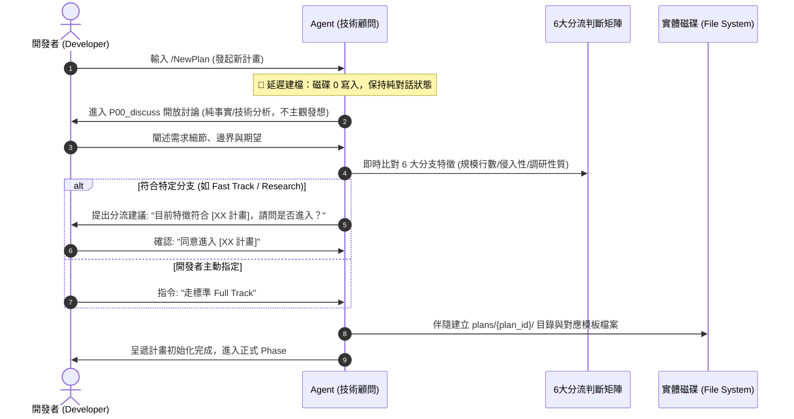
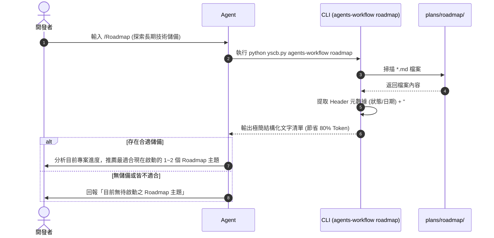

# 架構設計說明書 (Architecture Design)

> 功能名稱：計畫分流維度重構、工作類型拓撲擴充與策略資產規範 (Plan Taxonomy, Archetypes & Strategic Assets)  
> 建立日期：2026-08-29  
> 所屬主計畫：`2026_08_29_1505_workflow_and_agents_guidance_optimization`  
> 狀態：Confirmed  
> 模板版本：v1.2  

---

## 1. 模組架構分層與職責邊界 (Layered Architecture)

本計畫對 `agents-workflow` 體系進行 4 層架構重構，建立涵蓋 6 大計畫分支、即時修訂短循環與長期策略資產的全景拓撲：

```text
+-----------------------------------------------------------------------------------+
| 1. 標準規範與空間協議層 (Standards & Protocols Layer)                               |
|    - DevelopmentStandards.md: 4維度Fast Track矩陣 / Umbrella雙軌 / 6大分支SOP      |
|    - AgentsStandards.md: P00_discuss 顧問角色防呆 / JIT 分流引導 / 延遲建檔守門      |
|    - contributes.format.md / contributes: 註冊 workflow.roadmap:// (-> plans/roadmap/)|
+-----------------------------------------------------------------------------------+
                                         │
+-----------------------------------------------------------------------------------+
| 2. 工作流導引層 (Workflows & Guidance Layer)                                       |
|    - NewPlan.md: 延遲建檔動線 / 長對話防呆阻斷 / 調研無痛升級流程                     |
|    - Roadmap.md [NEW]: 讀取 roadmap 儲備庫並依現況推薦主題之專用工作流               |
|    - Research.md: 3 步調研生命週期 (P00 ➔ R01 ➔ 三向出口)                          |
+-----------------------------------------------------------------------------------+
                                         │
+-----------------------------------------------------------------------------------+
| 3. 模板與資產層 (Templates & Artifacts Layer)                                      |
|    - P00_discuss.md [NEW/RENAME]: 開放討論與客觀技術顧問模板                          |
|    - roadmap.md [NEW]: 標準技術路線圖模板 (元數據 / 背景量化 / 方案對比 / SOP / 路線) |
|    - umbrella_overview.md: 擴充模式 B-1 (Pre-planned) 與 模式 B-2 (Incremental) 標頭 |
|    - fast_track_plan.md: 嵌入 4 維度判定與 Escalation Gate 聲明                     |
+-----------------------------------------------------------------------------------+
                                         │
+-----------------------------------------------------------------------------------+
| 4. CLI 工具與自動化層 (CLI & Automation Layer)                                     |
|    - scripts/cli.py: 新增 `agents-workflow roadmap` 指令分發                       |
|    - agents_workflow/roadmap.py [NEW]: 結構化解析 roadmap header 與量化分析摘要    |
|    - contributes.core.commands: 標註 roadmap 指令 (tier: safe, phases: [P00])       |
+-----------------------------------------------------------------------------------+
```

---

## 2. 核心資料流與循序圖 (Data Flow & Sequence Diagram)

### 2.1 `/NewPlan` 延遲建檔與 JIT 動態分流引導資料流



### 2.2 `/Roadmap` 讀取與 CLI 結構化摘要流程



---

## 3. 受影響檔案與新建檔案清單 (Impacted & New Files Inventory)

| 檔案路徑 | 類型 | 職責與變更說明 |
| :--- | :---: | :--- |
| `ys_codebase/source/agents-workflow/assets/standards/DevelopmentStandards.md` | **Modify** | 寫入 4 維度 Fast Track 判定矩陣、Umbrella 雙軌拓撲、修訂計畫、調研計畫 3 步 SOP 與 Roadmap 空間規範。 |
| `ys_codebase/source/agents-workflow/assets/standards/AgentsStandards.md` | **Modify** | 注入 P00_discuss 顧問角色紀律、JIT 分流引導守門、延遲建檔鐵律與長對話調研升級機制。 |
| `ys_codebase/source/agents-workflow/assets/workflows/NewPlan.md` | **Modify** | 重構動線：移除立即建檔，改為延遲建檔 + JIT 判斷引導 + 長對話防呆。 |
| `ys_codebase/source/agents-workflow/assets/workflows/Roadmap.md` | **New** | 新增 `/Roadmap` 工作流，定義 Agent 智能讀取與推薦主題的標準 SOP。 |
| `ys_codebase/source/agents-workflow/assets/templates/P00_discuss.md` | **New** | 原 `P00_semantic_requirements.md` 更名與純化之開放討論模板。 |
| `ys_codebase/source/agents-workflow/assets/templates/P00_semantic_requirements.md` | **Delete** | 移除舊版模板（由 `P00_discuss.md` 完全替代）。 |
| `ys_codebase/source/agents-workflow/assets/templates/roadmap.md` | **New** | 新增標準 Roadmap 模板（Header 元數據、問題背景與量化分析、方案對比、SOP、路線圖）。 |
| `ys_codebase/source/agents-workflow/assets/templates/umbrella_overview.md` | **Modify** | 標頭增加 `Umbrella 模式：[Pre-planned | Incremental]` 與雙軌引導。 |
| `ys_codebase/source/agents-workflow/agents_workflow/roadmap.py` | **New** | 實作 `RoadmapManager`，負責 `plans/roadmap/` 目錄掃描、Markdown AST/Regex 提取 Header 與背景量化分析區塊。 |
| `ys_codebase/source/agents-workflow/scripts/cli.py` | **Modify** | 註冊 `cmd_roadmap` 子指令並接入 CLI 分發。 |
| `ys_codebase/source/agents-workflow/agents-workflow.json` | **Modify** | 註冊 `roadmap` command 與新模板/工作流 export。 |
| `test/test_agents_workflow.py` | **Modify** | 新增 Roadmap CLI 測試、模板編譯與路徑治癒測試。 |

---

## 4. 架構決策記錄 (Architecture Decision Records)

- **[P02:DR-01] Roadmap 解析器無外部依賴設計**：
  `agents_workflow/roadmap.py` 採純 Python 輕量字串與區塊正則提取，不依賴龐大的外部 Markdown 解析套件，確保在任何環境下皆能秒級零依賴執行。
- **[P02:DR-02] 語意空間協議預設與解析**：
  `workflow.roadmap://` 在模組 contributes 宣告為 `!undefined`，於系統自舉解析為 `workflow.plans://roadmap/`，保持統一在 `plans/` 下的管理邊界。
- **[P02:DR-03] P00 檔名全面平滑過渡**：
  將模板命名統一為 `P00_discuss.md`，但在編譯器與工作流歷史相容性上維持向前相容，支援舊計畫 `P00_semantic_requirements.md` 的索引讀取。
