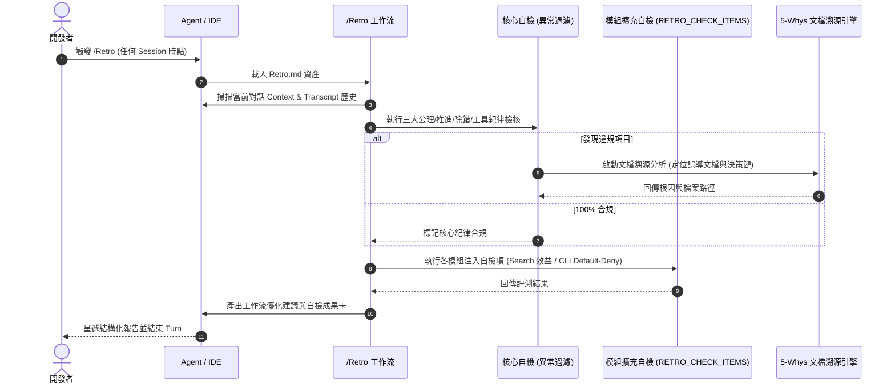

# 架構設計說明書 (Architecture Design)

> 功能名稱：開發歷程自檢工作流與擴充 Token (Retro Workflow & Contributed Token)  
> 建立日期：2026-08-29  
> 所屬主計畫：`2026_08_29_1505_workflow_and_agents_guidance_optimization`  
> 狀態：Confirmed  
> 模板版本：v1.2  

---

## 1. 模組架構分層與職責邊界 (Layered Architecture)

```text
+-----------------------------------------------------------------------------------+
|                           IDE 運行端 (Slash Commands / Workflows)                  |
|                                     /Retro                                        |
+-----------------------------------------------------------------------------------+
                                       |
                                       v
+-----------------------------------------------------------------------------------+
|                   Retro Workflow 資產層 (Generic Context Driven)                   |
|  - 不合規文檔溯源分析 (Documentation-Root-Cause Traceability)                        |
|  - Step 1: Context & Transcript 歷程掃描                                           |
|  - Step 2: 三維自檢與評測                                                          |
|      +-- agents-workflow 核心自檢 (異常過濾呈遞模式)                                |
|      +-- 模組擴充自檢錨點 (__@{RETRO_CHECK_ITEMS}__)                               |
|            |                                                                      |
|            +---> (knowledge-db: Search 效益評測四維度)                             |
|            +---> (core: CLI Default-Deny 守門查核)                                 |
|  - Step 3: 工作流優化建議與摩擦點反思                                                |
|  - Step 4: 自檢成果摘要卡                                                          |
+-----------------------------------------------------------------------------------+
                                       |
                                       v
+-----------------------------------------------------------------------------------+
|               Contributes 宣告與編譯物化層 (Declarative Injection & Compiler)        |
|  - contributes/agents-workflow.json (export / token: RETRO_CHECK_ITEMS)           |
|  - ArtifactCompiler (Stage 1 Token 替換 / Stage 2 佔位符解析 / 清理未命中錨點)        |
|  - ReleasePublisher (物化投影至 .agents/workflows/Retro.md)                         |
+-----------------------------------------------------------------------------------+
```

---

## 2. 核心資料流與循序圖 (Data Flow & Sequence Diagram)



---

## 3. 受影響檔案與新建檔案清單 (Impacted & New Files Inventory)

| 檔案路徑 | 類型 | 職責與變更說明 |
| :--- | :---: | :--- |
| `source/agents-workflow/assets/workflows/Retro.md` | New | `/Retro` 工作流 Markdown 模板資產 |
| `source/agents-workflow/contributes/agents-workflow.json` | Modify | 註冊 `Retro.md` 導出與 `RETRO_CHECK_ITEMS` / `WORKFLOW_RETRO` Token |
| `source/agents-workflow/contributes.format.md` | Modify | 新增 `RETRO_CHECK_ITEMS` 規範與 `knowledge-db` / `core` 注入範例說明 |
| `source/agents-workflow/assets/standards/DevelopmentStandards.md` | Modify | 更新標準流程手冊之工作流導引清單與說明 |
| `source/agents-workflow/tests/test_compiler.py` | Modify | 新增 `Retro.md` 編譯、Token 錨點解析與導出測試 |

---

## 4. 架構決策記錄 (Architecture Decision Records)

- **[P02:DR-01] 異常過濾呈遞與 Token 節省設計**：
  - 核心自檢項目採「全量檢核、異常呈現」策略。僅在發現不符合項目時詳細呈報並附帶文檔溯源分析，全數合規時僅輸出單行確認，避免干擾開發焦點與膨脹 Token。
- **[P02:DR-02] 模組擴充注入解耦**：
  - `agents-workflow` 僅負責定義 `__@{RETRO_CHECK_ITEMS}__` 錨點與通用架構；`knowledge-db` 與 `core` 各自的特定檢核邏輯在文檔中以標準範本規範，保持核心自包含與高可擴充性。
