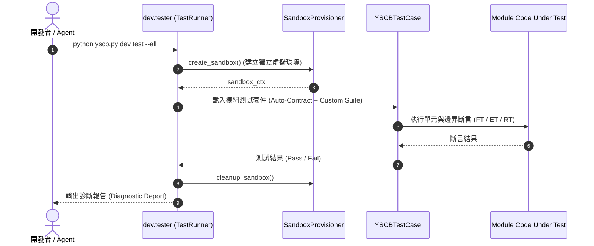

# 架構設計說明書 (Architecture Design)

> 功能名稱：`unit_tests_audit_and_maintenance`  
> 建立日期：2026-08-29  
> 狀態：Confirmed  
> 模板版本：v1.2  

---

## 1. 模組架構分層與職責邊界 (Layered Architecture)

重構後全生態系四大模組之單元測試套件分層與職責邊界如下：

```text
YS-Codebase 全生態系單元測試套件 (All-Module Unit Test Matrix)
├── [Layer 1] core 測試套件 (12 檔)
│   ├── test_uri.py                   # 語意空間協議 VFS、Option B、循環引用防護
│   ├── test_semver.py                # 【整合後】四段式與三段式 SemVer 解析、比較、升級與約束
│   ├── test_config.py                # 2x2 組態矩陣、點號導航、自動修復
│   ├── test_engine.py                # 微核心原子操作、依賴拓撲、跨程序鎖、快照備份
│   ├── test_installer.py             # 模組安裝、升級、解除安裝與逆向依賴守門
│   ├── test_contributes.py           # 擴充貢獻掃描、深度合併、動態注入
│   ├── test_symbols.py               # code.func:// 符號解析與 Callable 加載
│   ├── test_cli_guild.py             # CLI 權限查表防呆動態生成
│   ├── test_cli_help.py              # CLI 全域說明與拼寫建議演算法
│   ├── test_migration_ladder.py      # 版本遷移階梯推進與失敗隔離
│   ├── test_remote_zip_bootstrap.py  # Provider Zip 匯入與 Zip Slip 安全防護
│   └── test_robustness.py            # 執行上下文不可變性與異常安全
│
├── [Layer 2] dev 測試套件 (6 檔)
│   ├── test_builder.py               # 本地打包、發布打包與 3-Revision 滑動窗口
│   ├── test_checker.py               # 靜態合規檢查器與 Manifest 語意驗證
│   ├── test_sandbox.py               # 虛擬沙盒上下文、環境變數隔離與生命週期 Hook
│   ├── test_tester.py                # 測試調度器與並行跑測
│   ├── test_release_pipeline.py      # 純淨發布 3-Gate 守門與 DAG 拓撲
│   └── test_case.py                  # YSCBTestCase 測試夾具本體測試
│
├── [Layer 3] agents-workflow 測試套件 (8 檔)
│   ├── test_auto_workflow.py         # /Auto 連續推進工作流與三大熔斷
│   ├── test_compiler.py              # 動態 Token 佔位符解析與多 Donor 聚合
│   ├── test_initializer.py           # 工作流一鍵初始化與 project:// 防呆
│   ├── test_manifest_placement.py    # 模組 Manifest 宣告與 Hook 配置
│   ├── test_plans_toolchain.py       # SOP 計畫生命週期、狀態掃描與 plan verify
│   ├── test_publisher.py             # 多目標 IDE 規範發布與原子事務
│   ├── test_roadmap.py               # 長期策略路線圖 CLI
│   └── test_targets.py               # Release Target 目標管理
│
└── [Layer 4] knowledge-db 測試套件 (10 檔)
    ├── test_parsers.py               # 【整合後】多語言 AST 解析器 (Python/C/C++/MD) 與深層語意
    ├── test_tokenizer.py             # 【整合後】駝峰/蛇形分詞器與雙層軟工同義詞庫擴展
    ├── test_retrieval.py             # 多欄位加權 BM25 檢索引擎與過濾器
    ├── test_scanner.py               # 空間掃描器與雙階增量指紋比對
    ├── test_schema.py                # UnifiedSymbol 與 MemberInfo 結構校驗
    ├── test_space.py                 # 空間管理與 Contributes 聚合
    ├── test_engine.py                # KnowledgeEngine 門面 SDK 調用
    ├── test_search_aggregation.py    # 檔案層級聚合與代碼切片預覽
    ├── test_jit_hot_healing.py       # JIT 索引即時感應與熱重建
    ├── test_cli.py                   # knowledge-db search/scan/index/status CLI
    └── test_bundler.py               # SemanticBundle 打包與快照
```

---

## 2. 核心資料流與循序圖 (Data Flow & Sequence Diagram)



---

## 3. 受影響檔案與新建檔案清單 (Impacted Files Inventory)

| 檔案路徑 | 類型 | 職責與變更說明 |
| :--- | :---: | :--- |
| `source/core/tests/test_semver.py` | Modify | 整合四段式版本解析、數值大小排序、`bump_version` 與約束求解，統整為單一核心 SemVer 測試。 |
| `source/core/tests/test_semver_v4.py` | Delete | 移除已整併至 `test_semver.py` 的重複檔案。 |
| `source/dev/tests/test_tester.py` | Modify | 精簡與 `test_sandbox.py` 重疊之沙盒斷言，聚焦於測試調度。 |
| `source/agents-workflow/tests/test_basic.py` | Delete | 移除早期冗餘孤立之冒煙測試（已由 `test_compiler.py` 完全覆蓋）。 |
| `source/knowledge-db/tests/test_parsers.py` | Modify | 整合 `test_parsers_deep.py` 的 AST 解析深度邊界案例。 |
| `source/knowledge-db/tests/test_parsers_deep.py` | Delete | 移除已整併至 `test_parsers.py` 的重複檔案。 |
| `source/knowledge-db/tests/test_tokenizer.py` | Modify | 整合同義詞群組擴展與分詞測試。 |
| `source/knowledge-db/tests/test_thesaurus.py` | Delete | 移除已整併至 `test_tokenizer.py` 的重複檔案。 |

---

## 4. 架構決策記錄 (Architecture Decision Records)

- **[P02:DR-01] 測試檔案單一真理原則 (One Test File per Domain)**：
  每個核心領域（如 `semver`, `parsers`, `tokenizer`）維持單一高聚合測試檔案，杜絕因歷史迭代產生 `_v4`, `_deep` 等割裂之重複測試檔案。
- **[P02:DR-02] 零覆蓋遺失守門 (Zero Regression Gate)**：
  在刪除任何重複測試檔案前，必須 100% 確保其測試案例已完整移植至主測試檔中，並經由沙盒跑測驗證。
