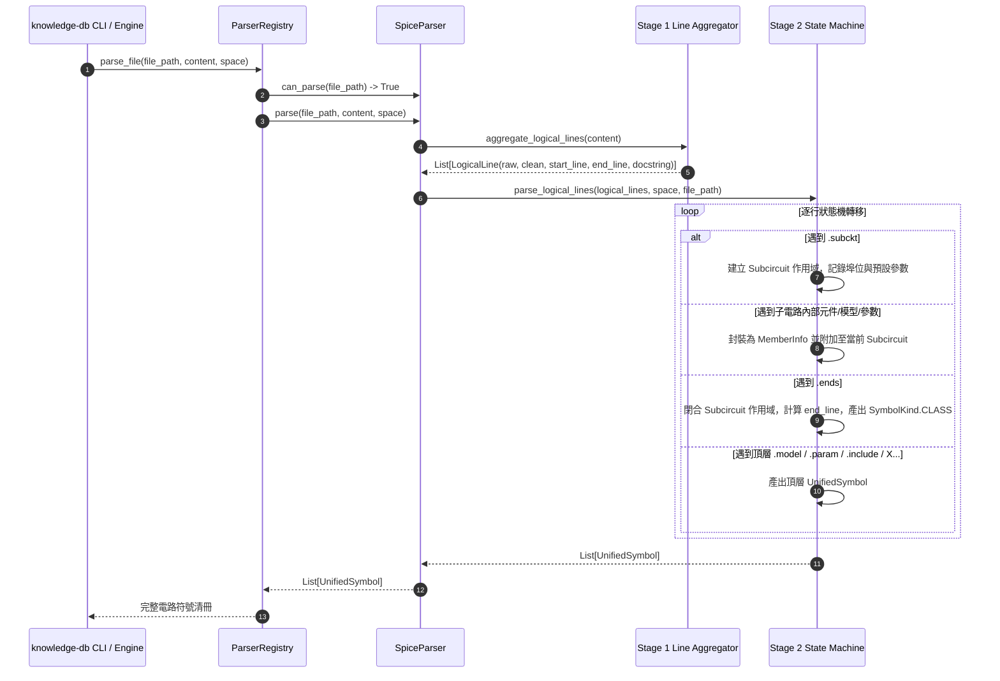

# 架構設計說明書 (Architecture Design)

> 功能名稱：knowledge-db 模組 SPICE 網表語系解譯器 (SpiceParser) 整合  
> 建立日期：2026-08-29  
> 所屬主計畫：無  
> 狀態：Confirmed  
> 模板版本：v1.2  

---

## 1. 模組架構分層與職責邊界 (Layered Architecture)

```text
+-------------------------------------------------------------------------------+
|                             knowledge-db Client / CLI                         |
|      (python yscb.py knowledge-db search '<query>' --ftype=cir,sp,spice -s)   |
+-------------------------------------------------------------------------------+
                                       │
                                       ▼
+-------------------------------------------------------------------------------+
|                       ParserRegistry (解析器註冊與調度中心)                     |
|           - get_parser(path) -> SpiceParser (優先級 100)                      |
|           - parse_file(path, content, space) -> List[UnifiedSymbol]           |
+-------------------------------------------------------------------------------+
                                       │
                                       ▼
+-------------------------------------------------------------------------------+
|                    SpiceParser(BaseParser) 雙階段解析引擎                      |
|                                                                               |
|  [Stage 1: Line Aggregator & Preprocessor]                                    |
|   - 換行接續符號 (+) 邏輯行合併                                                 |
|   - 註解剝離 (整行 * ➔ Docstring 萃取 / 行尾 ; $ 剝離)                          |
|   - 精確行號映射 (line_number ~ end_line)                                      |
|                                                                               |
|  [Stage 2: Hierarchical State Machine]                                        |
|   - 作用域堆疊：Top-Level Scope <--> Subcircuit Scope (.subckt ... .ends)     |
|   - 指令解析：.subckt, .model, .param, .include, .lib, .global                |
|   - 元件拓撲解析：X (Instance), M (MOSFET), Q (BJT), D (Diode), R/C/L (Passive)|
+-------------------------------------------------------------------------------+
                                       │
                                       ▼
+-------------------------------------------------------------------------------+
|                             UnifiedSymbol 體系                                |
|  - LanguageType.SPICE ("spice")                                               |
|  - SymbolKind.CLASS (Subcircuits + members)                                   |
|  - SymbolKind.STRUCT (.model)                                                 |
|  - SymbolKind.VARIABLE / CONSTANT (.param)                                    |
|  - SymbolKind.MACRO (.include / .lib / .global)                               |
|  - SymbolKind.FUNCTION / VARIABLE (Top-level Instance X...)                   |
+-------------------------------------------------------------------------------+
```

---

## 2. 核心資料流與循序圖 (Data Flow & Sequence Diagram)



---

## 3. 受影響檔案與新建檔案清單 (Impacted & New Files Inventory)

| 檔案路徑 | 類型 | 職責與變更說明 |
| :--- | :---: | :--- |
| `source/knowledge-db/knowledge_db/schema.py` | Modify | 於 `LanguageType` 新增 `SPICE = "spice"` 列舉值。 |
| `source/knowledge-db/knowledge_db/parsers/spice_parser.py` | New | 實作 `SpiceParser` 雙階段解析引擎，完整承接 FR-01 ~ FR-04 與 EC-01 ~ EC-04。 |
| `source/knowledge-db/knowledge_db/parsers/__init__.py` | Modify | 導出 `SpiceParser` 模組符號。 |
| `source/knowledge-db/knowledge_db/parsers/registry.py` | Modify | 於 `ParserRegistry.__init__` 預設註冊 `SpiceParser` (優先級 100)。 |
| `source/knowledge-db/tests/test_spice_parser.py` | New | 撰寫完整 SPICE 解析器單元測試與邊界測試套件 (FT-01 ~ FT-05, ET-01 ~ ET-04)。 |

---

## 4. 架構決策記錄 (Architecture Decision Records)

- **[P02:DR-01] 雙階段解析架構**：將「換行接續與註解清洗 (Stage 1)」與「階層語意狀態機 (Stage 2)」完全分離，確保行號追蹤精準無誤且代碼高度可維護。
- **[P02:DR-02] 階層成員聚合策略**：子電路內部的元件實例（如 `X1`, `M1`）、局部模型（`.model`）與局部參數（`.param`）統一聚合為 `MemberInfo` 存入父級子電路的 `members` 清單中，避免頂層符號命名空間污染。
- **[P02:DR-03] 頂層與內部實例區分**：頂層（子電路外部）出現的 `X` 開頭子電路實例提升為頂層 `UnifiedSymbol`，離散 RLC 元件若在頂層則視為基本連線不污染全域名稱空間。
