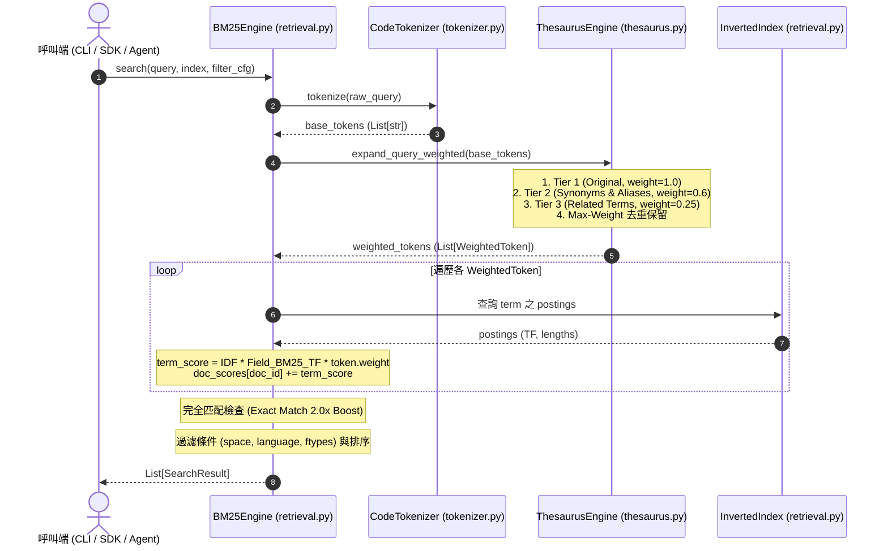

# 架構設計說明書 (Architecture Design)

> 功能名稱：sub_01_three_tier_weighted_expansion  
> 建立日期：2026-08-29  
> 所屬主計畫：2026_08_29_2349_knowledge_db_thesaurus_enhancement_and_decoupling  
> 狀態：Confirmed  
> 模板版本：v1.2  

---

## 1. 模組架構分層與職責邊界 (Layered Architecture)

```text
┌────────────────────────────────────────────────────────────────────────┐
│                        knowledge-db 模組架構                           │
├────────────────────────────────────────────────────────────────────────┤
│ 1. Schema & Data Model (schema.py)                                     │
│    - WeightedToken(term, weight, kind)                                 │
│    - ThesaurusConfig (thesaurus: List, aliases: Dict, related: List)   │
├────────────────────────────────────────────────────────────────────────┤
│ 2. Expansion Engine (thesaurus.py)                                     │
│    - ThesaurusEngine:                                                  │
│      * _synonym_map: Dict[str, Set[str]] (雙向等價, Tier 2, 0.6)       │
│      * _alias_map: Dict[str, Set[str]]   (單向特化, Tier 2, 0.6)       │
│      * _related_map: Dict[str, Set[str]] (雙向關聯, Tier 3, 0.25)      │
│      * expand_query_weighted(tokens) -> List[WeightedToken]            │
│      * expand_query(tokens) -> List[str] (向後相容包裝)                │
├────────────────────────────────────────────────────────────────────────┤
│ 3. Contributes Aggregator (space.py)                                   │
│    - SpaceManager.load_thesaurus(): 載入 contributes 擴充同義詞/別名/關聯│
├────────────────────────────────────────────────────────────────────────┤
│ 4. Weighted Retrieval Engine (retrieval.py)                            │
│    - BM25Engine.search():                                              │
│      * term_score = idf * field_scores_sum * weighted_token.weight     │
│      * Exact Match (2.0x Boost)                                        │
└────────────────────────────────────────────────────────────────────────┘
```

---

## 2. 核心資料流與循序圖 (Data Flow & Sequence Diagram)



---

## 3. 受影響檔案與新建檔案清單 (Impacted & New Files Inventory)

| 檔案路徑 | 類型 | 職責與變更說明 |
| :--- | :---: | :--- |
| `source/knowledge-db/knowledge_db/schema.py` | Modify | 新增 `WeightedToken` dataclass；擴充 `ThesaurusConfig` 支援 `aliases` 與 `related` 欄位與序列化。 |
| `source/knowledge-db/knowledge_db/thesaurus.py` | Modify | 重構 `ThesaurusEngine`：新增單向別名、關聯詞容器與展開方法 `expand_query_weighted()`；相容包裝 `expand_query()`。 |
| `source/knowledge-db/knowledge_db/retrieval.py` | Modify | 更新 `BM25Engine.search()`：整合 `expand_query_weighted()` 並於 BM25 評分套用 `token.weight` 衰減乘數。 |
| `source/knowledge-db/knowledge_db/space.py` | Modify | 擴充 `SpaceManager.load_thesaurus()` 聚合 `thesaurus`, `aliases`, `related` 資料結構。 |
| `source/knowledge-db/tests/test_thesaurus_weighted.py` | New | 新增三階加權展開、單向別名、關聯詞、權重保留與 BM25 衰減計分之單元測試套件。 |

---

## 4. 架構決策記錄 (Architecture Decision Records)

- **[P02:DR-01] 三階層加權係數基準**：
  - 原始查詢詞 (Original)：`1.0`
  - 嚴格同義詞 (Synonyms) 與單向別名 (Aliases)：`0.6`
  - 領域關聯詞 (Related Terms)：`0.25`
- **[P02:DR-02] 權重衝突解決策略**：
  - 以詞條小寫規格化字串為鍵，採用 `max(existing_weight, new_weight)` 確保高優先順序權重永不被次級展開覆蓋。
