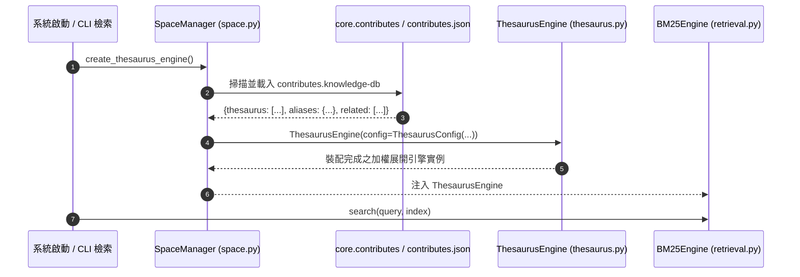

# 架構設計說明書 (Architecture Design)

> 功能名稱：sub_02_thesaurus_pool_decoupling_and_enrichment  
> 建立日期：2026-08-30  
> 所屬主計畫：2026_08_29_2349_knowledge_db_thesaurus_enhancement_and_decoupling  
> 狀態：Confirmed  
> 模板版本：v1.2  

---

## 1. 模組架構分層與職責邊界 (Layered Architecture)

```text
┌────────────────────────────────────────────────────────────────────────┐
│                        knowledge-db 解耦體系                           │
├────────────────────────────────────────────────────────────────────────┤
│ 1. Contributes Asset (contributes/knowledge-db.json)                   │
│    - 宣告式靜態資產：                                                  │
│      * 6 大維度雙向同義詞 (thesaurus: List[List[str]])                │
│      * 單向特化別名 (aliases: Dict[str, List[str]])                   │
│      * 領域相依關聯詞 (related: List[List[str]])                      │
├────────────────────────────────────────────────────────────────────────┤
│ 2. SpaceManager (space.py)                                             │
│    - load_thesaurus_config() -> 聚合全系統 Donor 宣告之詞庫           │
│    - create_thesaurus_engine() -> 裝配並返回已載入詞庫之 ThesaurusEngine│
├────────────────────────────────────────────────────────────────────────┤
│ 3. Pure Container Engine (thesaurus.py)                                │
│    - ThesaurusEngine:                                                  │
│      * 零硬編碼常數 (徹底刪除 BUILTIN_THESAURUS)                       │
│      * 純粹無狀態加權展開狀態機容器                                    │
├────────────────────────────────────────────────────────────────────────┤
│ 4. Retrieval & Search Service (retrieval.py & engine.py)               │
│    - BM25Engine 預設透過 SpaceManager 注入聚合詞庫                     │
└────────────────────────────────────────────────────────────────────────┘
```

---

## 2. 核心資料流與循序圖 (Data Flow & Sequence Diagram)



---

## 3. 受影響檔案與新建檔案清單 (Impacted & New Files Inventory)

| 檔案路徑 | 類型 | 職責與變更說明 |
| :--- | :---: | :--- |
| `source/knowledge-db/knowledge_db/thesaurus.py` | Modify | 刪除硬編碼 `BUILTIN_THESAURUS` 常數，構造函式支援傳入 `ThesaurusConfig` 或三個自訂集合，預設無傳參為空容器。 |
| `source/knowledge-db/knowledge_db/space.py` | Modify | 新增 `create_thesaurus_engine(extra_config=None) -> ThesaurusEngine` 工廠方法。 |
| `source/knowledge-db/contributes/knowledge-db.json` | Modify | 宣告完整六大維度初始詞庫（25+ 同義詞、25+ 別名、6 關聯詞組）。 |
| `source/knowledge-db/tests/test_thesaurus_decoupling.py` | New | 單元測試：驗證純淨無狀態構造、`create_thesaurus_engine` 聚合載入、六大維度詞庫可用性與邊界防護。 |

---

## 4. 架構決策記錄 (Architecture Decision Records)

- **[P02:DR-01] 詞彙表 100% 宣告式資產化**：
  - 核心 Python 代碼中不允許留存任何具體業務/領域字串清單，所有詞庫皆作為宣告式 JSON 資料維護於 `contributes/`。
- **[P02:DR-02] SpaceManager 工廠單一聚合點**：
  - 檢索引擎與呼叫端統一透過 `SpaceManager.create_thesaurus_engine()` 獲得完整詞庫，保留 `ThesaurusEngine` 自身之獨立可測試性。
