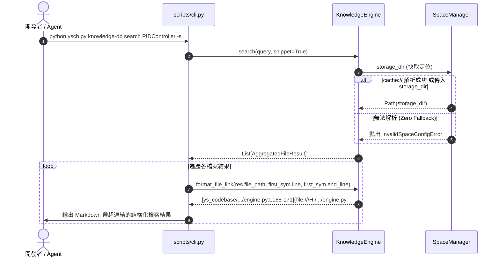

# 架構設計說明書 (Architecture Design)

> 功能名稱：knowledge-db 快取隔離零 Fallback 固化與搜尋輸出 URI 連結格式重構  
> 建立日期：2026-08-30  
> 所屬主計畫：無  
> 狀態：Confirmed  
> 模板版本：v1.2  

---

## 1. 模組架構分層與職責邊界 (Layered Architecture)

```text
+--------------------------------------------------------------------------+
| 表現層 (Presentation Layer: scripts/cli.py)                              |
| - search 簡易模式 / 詳細模式 / 預覽模式 輸出渲染                          |
| - 調用 format_file_link 注入 [rel_path:Lxx](file:///abs_path#Lxx)        |
| - --json 輸出注入 file_uri 屬性                                          |
+--------------------------------------------------------------------------+
                                    │
                                    ▼
+--------------------------------------------------------------------------+
| 門面服務層 (Facade & Service Layer: knowledge_db/engine.py)               |
| - to_file_uri(file_path, line=None) -> str                               |
| - format_file_link(file_path, line=None, end_line=None) -> str           |
| - normalize_workspace_path(file_path) -> str                              |
+--------------------------------------------------------------------------+
                                    │
                                    ▼
+--------------------------------------------------------------------------+
| 空間管理與 VFS 守門層 (Storage & VFS Layer: knowledge_db/space.py)        |
| - _get_storage_root(): 嚴格解算 cache://knowledge-db/                    |
| - 異常防禦: 無法解析且未指定 storage_dir 立即拋出 InvalidSpaceConfigError |
+--------------------------------------------------------------------------+
```

---

## 2. 核心資料流與循序圖 (Data Flow & Sequence Diagram)



---

## 3. 受影響檔案與新建檔案清單 (Impacted & New Files Inventory)

| 檔案路徑 | 類型 | 職責與變更說明 |
| :--- | :---: | :--- |
| `source/knowledge-db/knowledge_db/space.py` | Modify | 重構 `_get_storage_root()` 移除 `Path("./.cache/knowledge-db")` 回退，改為拋出 `InvalidSpaceConfigError`。 |
| `source/knowledge-db/knowledge_db/engine.py` | Modify | 新增 `to_file_uri()` 與 `format_file_link()` 方法，強化路徑轉譯。 |
| `source/knowledge-db/scripts/cli.py` | Modify | 重構 `search` 各輸出模式，全面使用 `engine.format_file_link()` 格式化檔案標籤與超連結。 |
| `source/knowledge-db/tests/test_space.py` | Modify | 更新 `test_ft_11_cache_storage_root_resolution` 與零 Fallback 異常斷言。 |
| `source/knowledge-db/tests/test_engine.py` | Modify | 確保 `KnowledgeEngine` 測試具備隔離 `storage_dir`，並驗證 `to_file_uri` 與 `format_file_link`。 |
| `source/knowledge-db/tests/test_cli.py` | Modify | 更新 CLI search 輸出模式斷言，驗證 `file:///` 連結格式。 |

---

## 4. 架構決策記錄 (Architecture Decision Records)

- **[P02:DR-01] (零 Fallback 異常類型固化)**：
  維持使用 `knowledge_db.exceptions.InvalidSpaceConfigError` 作為無法定位快取根目錄時的標準異常類型，具備清晰的錯誤提示字串。
- **[P02:DR-02] (IDE 協議 URL 格式標準化)**：
  `file:///` 協議標準遵循 RFC 8089，Windows 磁碟代號前置斜線統一處理為 `file:///C:/path/file.py`，行號統一使用 `#L{line}` 標記，確保 VS Code、Cursor、JetBrains 及終端機點擊相容性。
