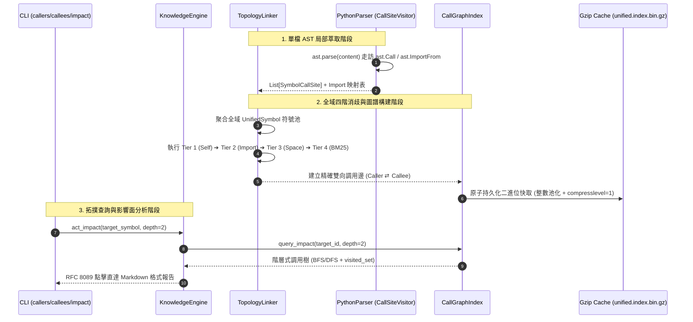

# 架構設計說明書 (Architecture Design)

> 功能名稱：knowledge_db_call_graph_and_reference_index  
> 建立日期：2026-08-31  
> 所屬主計畫：無 (獨立主計畫)  
> 狀態：Confirmed  
> 模板版本：v1.2  

---

## 1. 模組架構分層與職責邊界 (Layered Architecture)

```text
+-----------------------------------------------------------------------------------+
|                        Presentation & Facade Layer                                |
|  - cli.py: callers, callees, impact 子命令 (RFC 8089 連結標籤輸出)                 |
|  - engine.py: KnowledgeEngine (act_callers, act_callees, act_impact, format_tree) |
+-----------------------------------------------------------------------------------+
                                      |
                                      v
+-----------------------------------------------------------------------------------+
|                        Topology & Graph Index Layer                               |
|  - linker.py: TopologyLinker (四階消歧鏈接演算法 Tier 1~4)                         |
|  - graph.py: CallGraphIndex (雙向稀疏鄰接表 + Integer String Pool + Gzip 快取)      |
+-----------------------------------------------------------------------------------+
                                      |
                                      v
+-----------------------------------------------------------------------------------+
|                     AST Parsing & Extraction Layer                                |
|  - parsers/base.py: BaseParser.extract_call_sites() 抽象介面                      |
|  - parsers/python_parser.py: PythonParser & CallSiteVisitor (ScopeStack 作用域棧)  |
|  - bundler.py: SemanticBundler (單檔符號快取池 + 調用點聚合)                       |
+-----------------------------------------------------------------------------------+
                                      |
                                      v
+-----------------------------------------------------------------------------------+
|                          Core Schema & Value Objects                              |
|  - schema.py: SymbolCallSite (不可變調用點), CallGraphNode (雙向邊結構)             |
+-----------------------------------------------------------------------------------+
```

---

## 2. 核心資料流與循序圖 (Data Flow & Sequence Diagram)



---

## 3. 受影響檔案與新建檔案清單 (Impacted & New Files Inventory)

| 檔案路徑 | 類型 | 職責與變更說明 |
| :--- | :---: | :--- |
| `source/knowledge-db/knowledge_db/schema.py` | Modify | 新增 `SymbolCallSite` 與 `CallGraphNode` 資料結構模型。 |
| `source/knowledge-db/knowledge_db/parsers/base.py` | Modify | 於 `BaseParser` 新增 `extract_call_sites()` 與 `extract_imports()` 通用介面。 |
| `source/knowledge-db/knowledge_db/parsers/python_parser.py` | Modify | 實作 `CallSiteVisitor`、`ScopeStack` 與 `extract_call_sites()`。 |
| `source/knowledge-db/knowledge_db/linker.py` | **New** | 實作 `TopologyLinker`，提供四階消歧演算法與跨檔案調用邊綁定。 |
| `source/knowledge-db/knowledge_db/graph.py` | **New** | 實作 `CallGraphIndex`（整數池化、雙向鄰接表、BFS/DFS 多階追溯、二進位序列化與增量修補）。 |
| `source/knowledge-db/knowledge_db/retrieval.py` | Modify | 於 `InvertedIndex` 與快取序列化流程中掛載/協同 `CallGraphIndex`。 |
| `source/knowledge-db/knowledge_db/engine.py` | Modify | 新增 `act_callers`、`act_callees`、`act_impact` 與 JIT 增量熱重載同步修補。 |
| `source/knowledge-db/knowledge_db/cli.py` | Modify | 擴充 `callers`、`callees`、`impact` CLI 指令與 RFC 8089 格式化輸出。 |
| `source/knowledge-db/tests/test_call_graph.py` | **New** | 涵蓋 FR-01~06 與 EC-01~05 之完整單元與整合測試套件。 |

---

## 4. 架構決策記錄 (Architecture Decision Records)

- **[P02:DR-01] 兩階段解耦架構**：單檔 AST 解析器（Parser）僅負責提取局部調用點與 Import 映射，不感知外部檔案；跨檔案鏈接 100% 委任 `TopologyLinker`，保證 Parser 模組可並發、可單檔快取復用。
- **[P02:DR-02] 雙向稀疏圖與整數池化**：`CallGraphIndex` 內部使用 `Dict[int, Set[int]]` 儲存調用邊，字串與整數透過 `Integer String Pool` 映射，杜絕巨量字串物件與深拷貝記憶體浪費。
- **[P02:DR-03] 防循環 BFS/DFS 走訪**：`impact` 擴散分析強制引入 `visited_set`，遭遇循環調用時自動剪枝，杜絕遞迴死循環。
