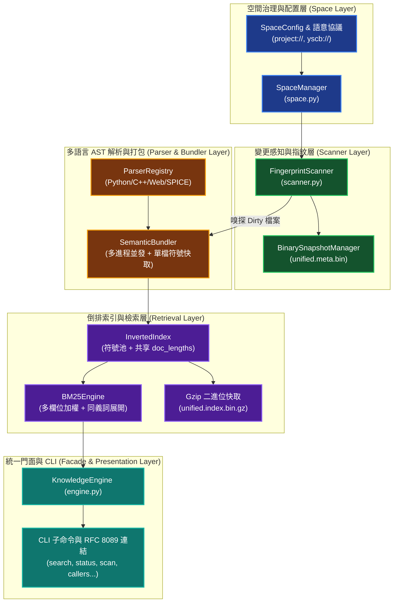
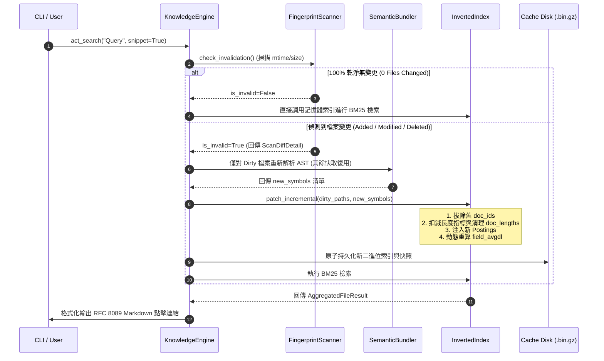

# 技術調研報告：knowledge-db 分詞器與全棧資料庫運作架構深度調研 (Research Report)

> 調研主題：knowledge_db_architecture_and_tokenizer  
> 建立日期：2026-08-31  
> 所屬主計畫：2026_08_31_1026_knowledge_db_call_graph_and_reference_index  
> 調研狀態：Concluded  
> 模板版本：v1.0  

---

## 1. 背景問題與調研目標 (Background & Objectives)

本調研旨在全面剖析 `knowledge-db` 的核心底層機制，包括：
1. **分詞機制 (`CodeTokenizer`)**：程式碼標識符（駝峰/底線）與 CJK 中文（1-gram/2-gram）如何極速解析並避免效能瓶頸。
2. **全系統運作拓撲 (System Architecture)**：從原始碼空間掃描、AST 解譯、符號打包、倒排索引建置、JIT 變更感知熱自愈到 BM25 語意檢索的完整生命週期。
3. **本次計畫之架構對接點**：為即將展開的 `Call Graph & Reference Index`（跨檔案調用圖譜與引用拓撲）確立 AST 走訪擴充點、消歧依賴與圖索引快取整合策略。

---

## 2. 代碼與 CJK 混合分詞器深入剖析 (`CodeTokenizer`)

`knowledge-db/tokenizer.py` 為 100% 純 Python 原生標準庫實作（Zero External Dependency），具備極速字元分流與記憶體快取特性：

### 2.1 分詞核心演算法與三大流程

```mermaid
flowchart TD
    In["輸入字串 text (程式碼 / Docstring / 標頭)"] --> Loop{"逐字元掃描 (index i)"}
    
    Loop -->|_is_cjk_ord(code)| CJK["1. CJK 中文區塊處理<br/>(Unicode 整數區間比對)"]
    Loop -->|isalnum() or '_'| Ident["2. 代碼識別碼區塊處理<br/>(駝峰與底線拆分)"]
    Loop -->|標點 / 空白| Skip["3. 跳過無效字元 (i += 1)"]
    
    CJK --> CJK1["1-gram: 單字提取"]
    CJK --> CJK2["2-gram: 滑動窗口二元詞組"]
    CJK --> CJK3["3~6 字: 完整詞組保留"]
    CJK1 & CJK2 & CJK3 --> StopFilter1["過濾中英文停用詞 (DEFAULT_STOPWORDS)"]
    
    Ident --> SplitLRU["_split_identifier_cached<br/>(@functools.lru_cache maxsize=8192)"]
    SplitLRU --> Camel1["正則1: ([A-Z]+)([A-Z][a-z0-9])"]
    SplitLRU --> Camel2["正則2: ([a-z0-9])([A-Z])"]
    SplitLRU --> TokenList["保留子詞組 + 原始全字串 (小寫)"]
    TokenList --> StopFilter2["過濾停用詞"]
    
    StopFilter1 & StopFilter2 --> Out["輸出標準小寫 Token 清單 (List[str])"]
```

### 2.2 關鍵效能設計
1. **Unicode 整數區間直接比對 (`_is_cjk_ord`)**：
   - 捨棄主迴圈中的逐字元 `re.match`，直接以整數範圍判定 CJK Unified (`0x4E00~0x9FFF`)、Extension A (`0x3400~0x4DBF`)、Extension B (`0x20000~0x2A6DF`)、相容漢字 (`0xF900~0xFAFF`)、平假名/片假名 (`0x3040~0x30FF`) 與韓文音節 (`0xAC00~0xD7AF`)。
   - 消除每次字元判定的正則調度開銷，分詞吞吐量提升數倍。
2. **LRU 標識符拆解快取 (`_split_identifier_cached`)**：
   - 針對高頻重複出現的識別碼（如 `get_storage_root`, `UnifiedSymbol`, `InvertedIndex`），以 `Tuple[str, ...]` 為輸出並設定 `@lru_cache(maxsize=8192)`，重複標識符拆分耗時接近 O(1)。
3. **拆解範例**：
   - `'PIDController'` $\longrightarrow$ `['pid', 'controller', 'pidcontroller']`
   - `'getHTTPResponse'` $\longrightarrow$ `['get', 'http', 'response', 'gethttpresponse']`
   - `'user_id_v5'` $\longrightarrow$ `['user', 'id', 'v5', 'user_id_v5']`

---

## 3. knowledge-db 全系統架構與運作拓撲 (System Architecture)

`knowledge-db` 由七大核心子系統組成，構成自空間治理到語意檢索的高效閉環：



### 3.1 七大子系統職責劃分

| 子系統 | 核心檔案 | 職責與關鍵技術 |
| :--- | :--- | :--- |
| **空間治理中心** | `space.py` | 管理 `SpaceConfig`、空間 include/exclude 與路徑解析，快取物理隔離於 `cache://knowledge-db/`。 |
| **雙階指紋與 JIT 嗅探** | `scanner.py` | 雙階指紋比對（第一階 `mtime + size`，未命中才計算 `SHA1`）；`check_invalidation()` 提供查詢時即時變更感知。 |
| **多語言 AST 解析器** | `parsers/*.py` | 模組化解析器（`PythonParser`, `CppParser`, `JsTsParser`, `HtmlParser`, `CssParser`, `MarkdownParser`, `SpiceParser`, `CSharpParser`），提取 `UnifiedSymbol` 與 `MemberInfo`。 |
| **語意打包與符號池快取** | `bundler.py` | 依檔案數（$\ge 10$）動態調度 `ProcessPoolExecutor` 多進程解析；維護單檔符號快取 `_file_symbols_cache`，未修改檔案零 I/O 記憶體復用。 |
| **倒排索引與符號池** | `retrieval.py` | 符號池解耦 (`symbols: Dict[str, UnifiedSymbol]`)、`Posting` 採用 `__slots__`、文檔長度共享池 `doc_lengths`；二進位快取 Protocol 5 + Gzip。 |
| **多欄位 BM25 檢索** | `retrieval.py` | 多欄位加權評分（`name: 3.5`, `signature: 2.0`, `members: 2.0`, `docstring: 1.5`）+ 同義詞展開 (`ThesaurusEngine`) + 檔案級聚合。 |
| **中樞 Facade SDK 與 CLI** | `engine.py`, `cli.py` | 統一門面 SDK、JIT 熱自愈排程、RFC 8089 可點擊 Markdown 連結輸出 (`to_file_uri` / `format_file_link`)。 |

---

## 4. JIT 查詢時智能變更感知與增量熱自愈機制 (JIT Hot Healing)

當 Agent 執行 `python yscb.py knowledge-db search` 時，系統自動觸發 JIT 變更嗅探流水線，保證檢索結果 100% 即時且低延遲：



- **效能指標**：
  - 無變更時：檢索耗時 $< 50\text{ ms}$。
  - 單檔變更熱自愈：耗時約 $20\text{ ms} \sim 50\text{ ms}$（提速 $50\times$ 以上）。
  - 全專案完全重建：耗時 $< 0.9\text{ s}$。

---

## 5. 與本次 Dev Plan (Call Graph & Reference Index) 的架構對接點

本次計畫為 `knowledge-db` 注入調用拓撲與引用索引能力，與既有架構的對接點如下：

1. **Schema 層 (`schema.py`)**：
   - 擴充 `SymbolCallSite`（記錄 `callee_name`, `line_number`, `caller_member_name`, `context_prefix` 等不可變欄位）。
   - 保持 `UnifiedSymbol` 欄位向後相容。
2. **解析層 (`parsers/base.py` & `parsers/python_parser.py`)**：
   - 於 `BaseParser` 擴充 `extract_call_sites()` 介面。
   - 於 `PythonParser` 實作 `CallSiteVisitor`（走訪 `ast.Call`、`ast.Attribute` 與 `ast.ImportFrom`），並維護 `ScopeStack` 識別調用者作用域。
3. **拓撲鏈接與消歧層 (新模組 `linker.py`)**：
   - 實作 `TopologyLinker`，執行四階消歧鏈接演算法（$\text{Self/Scope} \rightarrow \text{Import Alias} \rightarrow \text{Same-Space} \rightarrow \text{Context Scoring}$），將 `SymbolCallSite` 與目標 `UnifiedSymbol` 精準綁定。
4. **圖索引與快取層 (`retrieval.py` & `graph.py`)**：
   - 實作 `CallGraphIndex`，採用整數池化 (Integer Pool) 與雙向稀疏鄰接表（`forward_graph` 與 `reverse_graph`）。
   - 整合至 `unified.index.bin.gz` Gzip 二進位快取中，支援 `patch_incremental` 差量同步。
5. **CLI 與 Facade 層 (`engine.py` & `cli.py`)**：
   - 擴充 `KnowledgeEngine` 與 CLI 子命令：`callers`（上游調用者）、`callees`（下游被調用者）、`impact`（影響面擴散拓撲），全數輸出符合 RFC 8089 的可點擊連結。

---

## 6. 調研結論 (Concluded)

1. **分詞器架構極度精準高效**：`CodeTokenizer` 的 Unicode 整數範圍判定與 LRU 快取機制已達到極佳效能，後續可直接復用於調用識別碼與 Import 別名之分詞比對。
2. **JIT 增量熱自愈架構穩固**：`SemanticBundler` 的單檔快取池與 `InvertedIndex.patch_incremental` 提供現成基礎，後續 `CallGraphIndex` 應鏡像此差量修補模式以達成一致的熱重載體驗。
3. **無外部依賴公理不變**：100% 基於 Python 原生 `ast` 與標準庫，不引入任何肥大 LSP 或 Node.js 依賴，確保沙盒環境 100% 相容。
