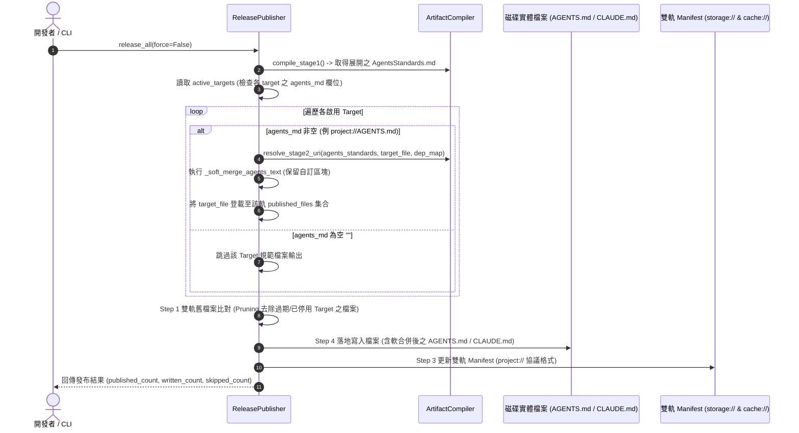

# 架構設計說明書 (Architecture Design)

> 功能名稱：sub_01_existing_injection_mode_optimization  
> 建立日期：2026-08-31  
> 所屬主計畫：2026_08_31_1718_agents_workflow_architecture_optimization  
> 狀態：Confirmed  
> 模板版本：v1.2  

---

## 1. 模組架構分層與職責邊界 (Layered Architecture)

```text
┌─────────────────────────────────────────────────────────────────────────────────┐
│ 宣告層 (Declaration Layer): contributes/agents-workflow.json & contributes.format.md │
│   - release_target[].agents_md: "project://AGENTS.md" | "project://CLAUDE.md" | ""│
└───────────────────────────────────────┬─────────────────────────────────────────┘
                                        │ (get_release_targets)
                                        ▼
┌─────────────────────────────────────────────────────────────────────────────────┐
│ 引擎層 (Publishing Engine): ReleasePublisher (agents_workflow/publisher.py)     │
│   ├── [Stage 0] Fingerprint: SHA-256 綜合指紋計算納入 agents_md 欄位              │
│   ├── [Stage 2] Targets Loop:                                                   │
│   │     - 遍歷啟用之 active_targets                                             │
│   │     - 若 target.agents_md != "":                                            │
│   │         * 依 target 檔案位置執行 Stage 2 URI 相對路徑轉譯                   │
│   │         * 執行 _soft_merge_agents_text 軟合併                                │
│   │         * 登錄至 precomputed_project_files / precomputed_local_files        │
│   ├── [Step 1] Pruning: 雙軌 Manifest 比對，若 Target 停用且無其他 Target 引用  │
│   │            該 agents_md 檔案，精確安全清理                                   │
│   └── [Step 4] File IO: 增量比對落地寫入 (LF newline="\n")                      │
└───────────────────────────────────────┬─────────────────────────────────────────┘
                                        │
                                        ▼
┌─────────────────────────────────────────────────────────────────────────────────┐
│ 組態與模板清理 (Config & Initialization): initializer.py & config.project.json   │
│   - 徹底移除 enable_agents_md 鍵值，完全由 Target 宣告式驅動                    │
└─────────────────────────────────────────────────────────────────────────────────┘
```

---

## 2. 核心資料流與循序圖 (Data Flow & Sequence Diagram)



---

## 3. 受影響檔案與新建檔案清單 (Impacted & New Files Inventory)

| 檔案路徑 | 類型 | 職責與變更說明 |
| :--- | :---: | :--- |
| `source/agents-workflow/contributes/agents-workflow.json` | Modify | 為 `antigravity`、`claude`、`codex` 增量添加 `agents_md` 欄位。 |
| `source/agents-workflow/contributes.format.md` | Modify | 規格書新增 `release_target.agents_md` 欄位定義與說明。 |
| `source/agents-workflow/agents_workflow/publisher.py` | Modify | 重構 `ReleasePublisher`：移除 `enable_agents_md`，改為 Target 驅動軟合併與 Manifest 追蹤。 |
| `source/agents-workflow/agents_workflow/initializer.py` | Modify | 移除 `enable_agents_md` 預設組態寫入。 |
| `source/agents-workflow/tests/test_publisher.py` | Modify | 更新發布測試套件，覆蓋 `agents_md` 啟用/跳過/多目標與 Pruning 案例。 |
| `docs/agents-workflow/user_guide.md` & `README.md` | Modify | 同步更新文檔與操作指南。 |

---

## 4. 架構決策記錄 (Architecture Decision Records)

- **[P02:DR-01] 軟合併函式純粹化 (`_soft_merge_agents_text`)**：
  - 將原先直接進行磁碟 I/O 的 `_soft_merge_agents_md` 拆解出純文字運算的 `_soft_merge_agents_text(existing_text: str, new_standards: str) -> str`，以便在 Stage 2 記憶體預計算階段統一進行 Diff 比對、短路與雙軌分流。
- **[P02:DR-02] 共享目標檔案之安全 Pruning 演算法**：
  - 判定檔案是否需 Pruning 刪除的條件為：該檔案存在於 `old_manifest` 中，但 **不存在於當前所有啟用 Target 計算出的 `current_published_set` 聯集中**。此演算法天然保證多 Target 共享同路徑時的安全性。
