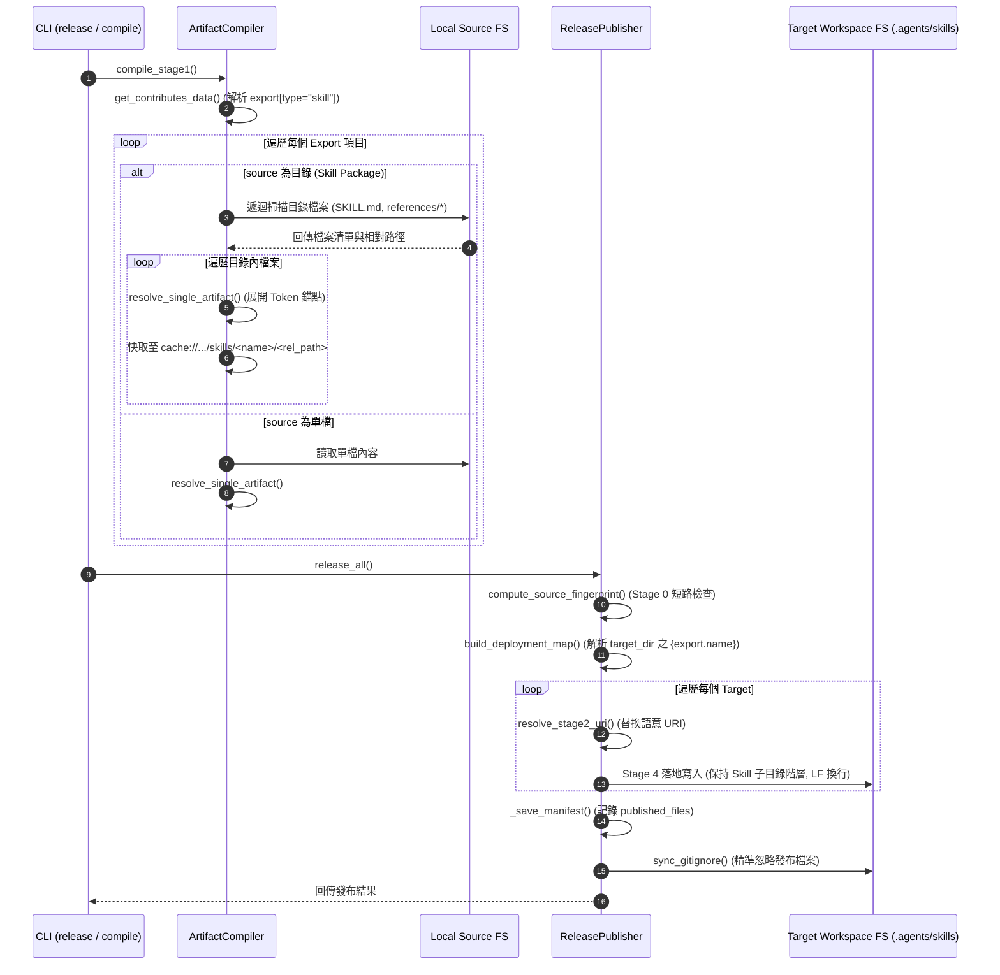

# 架構設計說明書 (Architecture Design)

> 功能名稱：sub_02_skills_architecture  
> 建立日期：2026-08-31  
> 所屬主計畫：2026_08_31_1718_agents_workflow_architecture_optimization  
> 狀態：Confirmed  
> 模板版本：v1.2  

---

## 1. 模組架構分層與職責邊界 (Layered Architecture)

```text
+-----------------------------------------------------------------------------------+
|                           Contributes 宣告層 (JSON Schema)                         |
|  - contributes.agents-workflow.export: 支援 type="skill", source=<dir_or_file>    |
|  - contributes.agents-workflow.release_target: 支援 projections.skill, {export.name}|
+-----------------------------------------------------------------------------------+
                                         |
                                         v
+-----------------------------------------------------------------------------------+
|                        Stage 1: 編譯器層 (ArtifactCompiler)                        |
|  - 來源路徑型態探測 (檔案 vs. 目錄)                                               |
|  - 目錄遞迴走訪 (Skill Package Scanner): 收集 SKILL.md, references/, scripts/ 等   |
|  - 文字資產多輪 Token Anchor 展開 (__@{token}__)                                  |
|  - 快取持久化: cache://agents-workflow/resolved_contents/skills/<name>/<rel_path> |
+-----------------------------------------------------------------------------------+
                                         |
                                         v
+-----------------------------------------------------------------------------------+
|                       Stage 2~4: 發布引擎層 (ReleasePublisher)                     |
|  - 目錄巨集插值: target_dir 解析 {export.name} / {export.basename}                 |
|  - 階層式部署映射 (build_deployment_map): 保留 Skill 內部相對路徑 (rel_path)      |
|  - Stage 2 語意 URI 替換 (__#{uri}__) ➔ 落地端 Diff 增量輸出                      |
|  - 雙軌 Manifest 追蹤 (Project/Local) & Pruning 自動清理                           |
|  - Gitignore 非破壞性軟合併 (精準檔案忽略)                                        |
+-----------------------------------------------------------------------------------+
```

---

## 2. 核心資料流與循序圖 (Data Flow & Sequence Diagram)



---

## 3. 受影響檔案與新建檔案清單 (Impacted & New Files Inventory)

| 檔案路徑 | 類型 | 職責與變更說明 |
| :--- | :---: | :--- |
| `source/agents-workflow/agents_workflow/compiler.py` | Modify | 擴充 `_scan_directory_files`、支援目錄級 export、產生帶 `rel_path` 的 `resolved_items` |
| `source/agents-workflow/agents_workflow/publisher.py` | Modify | 支援 `projections.skill`、目錄巨集插值、保留 `rel_path` 投影至目標階層、Gitignore 精準過濾 |
| `source/agents-workflow/contributes/agents-workflow.json` | Modify | 為 `antigravity`、`claude`、`codex` 加入 `projections.skill`，修正 `codex` 專案路徑至 `.agents/` |
| `source/agents-workflow/contributes.format.md` | Modify | 補充 `export.type: "skill"` 與 `projections.skill` 官方規範手冊 |
| `source/agents-workflow/tests/test_compiler.py` | Modify | 增補目錄級 Skill 編譯與 Token 展開單元測試 |
| `source/agents-workflow/tests/test_publisher.py` | Modify | 增補 Skill 發布、目錄結構保留、巨集插值與 Pruning 單元測試 |
| `source/agents-workflow/tests/test_targets.py` | Modify | 驗證三大 Target 之 `projections.skill` 解析與 `codex` 官方路徑 |

---

## 4. 架構決策記錄 (Architecture Decision Records)

- **[P02:DR-01] 目錄級走訪與多檔案資產封裝**：
  - `ArtifactCompiler` 引入遞迴走訪器，當 `source` 指向目錄時，以其相對路徑 `rel_path` 為鍵值快取並分發至 `resolved_items`，原生支援包含 `references/`、`scripts/` 的完整 Skill 目錄結構。
- **[P02:DR-02] 投影目錄巨集動態插值**：
  - `ReleasePublisher.build_deployment_map` 在計算 `target_dir` 時，支援 `{export.name}` 與 `{export.basename}` 替換，使 Skill 自適應展開至各 Target 的子資料夾（如 `.agents/skills/<name>/`）。
- **[P02:DR-03] Codex Target 官方標準對齊**：
  - 依 OpenAI Codex 官方標準，將 `codex` 的 `workflows`、`templates`、`standards` 與 `skills` 投影目錄全面對齊至 `project://.agents/`。
