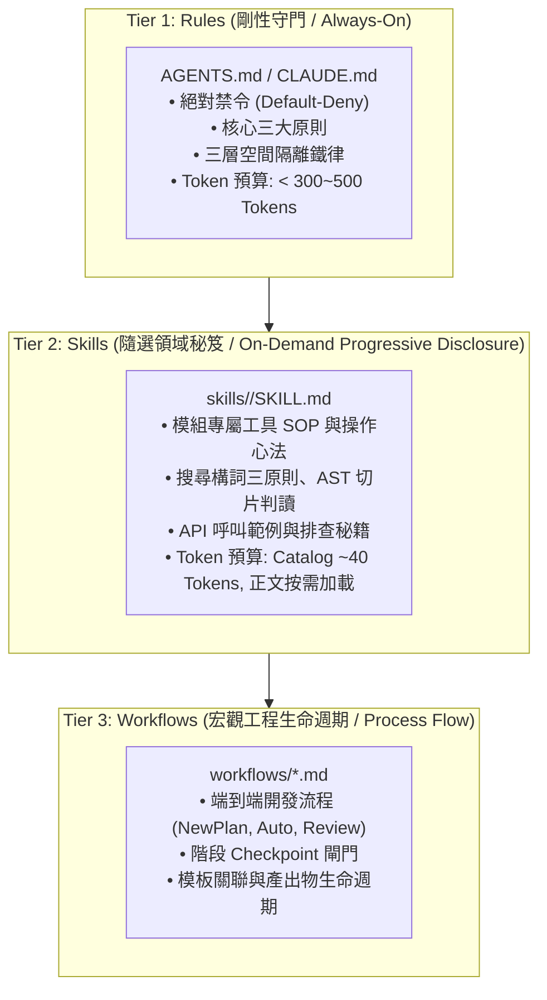

# 技術調研報告：跨平台 AI Agent Skills 規範與體系架構調研

> 調研主題：AI Agent Skills 規範定義與跨平台 (Antigravity / Claude Code / Codex) 綜合調研  
> 建立日期：2026-08-31  
> 所屬主計畫：2026_08_31_1718_agents_workflow_architecture_optimization  
> 所屬子計畫：sub_02_skills_architecture  
> 調研狀態：Concluded  
> 模板版本：v1.0  

---

## 1. 調研背景與核心痛點 (Problem Statement & Context)

### 1.1 現狀痛點分析
在當前的 `agents-workflow` 生態系中，所有已安裝模組（如 `knowledge-db`、`dev` 等）若要向 Agent 傳遞工具使用指南、排查技巧或特定情境的最佳實踐，唯一的方式是透過 `contributes.agents-workflow.insert` 將大段文字硬性注入專案全域規範檔 `AGENTS.md` / `CLAUDE.md`。

這引發了嚴重的架構與資源問題：
1. **Context Window 嚴重膨脹**：隨著模組增加，`AGENTS.md` 迅速膨脹至 2,000 ~ 3,000+ Tokens，且**每輪對話 (Turn) 都會被無條件 100% 注入**。
2. **雜訊干擾與注意力稀釋**：即使使用者只是進行簡單的字串修改或單元測試，模型依然被迫讀取完整的知識庫檢索三維構詞法、AST 切片判讀、依賴拓撲排查等細節。
3. **缺少「隨選知識 (On-Demand Knowledge)」層級**：系統只有「常駐剛性規則 (Rules)」與「宏觀作業流程 (Workflows)」，缺少介於兩者之間的「任務領域指南與秘笈 (Skills)」。

### 1.2 調研目標
深入調研現代主要 AI 程式碼助理（Google Antigravity IDE、Anthropic Claude Code、OpenAI Codex）對 **Skill** 的具體規範、檔案格式、元數據定義、漸進式揭露 (Progressive Disclosure) 機制與目錄結構，為 `agents-workflow` 的 Skills 基礎架構提供權威依據。

---

## 2. 跨平台 Skills 規範與機制深入剖析 (Cross-Platform Analysis)

### 2.1 Google Antigravity IDE Skills 官方標準規範

在 Antigravity Customization 體系中，Skill 是最核心的隨選能力包：

#### A. 目錄組織結構 (Directory Hierarchy)
一個標準的 Workspace Skill 必須置於專案根目錄 `.agents/skills/<skill_name>/` 下：
```text
.agents/skills/<skill_name>/
├── SKILL.md          # [必備] 技能主入口，必須包含 YAML Frontmatter
├── scripts/          # [可選] 輔助自動化腳本與可執行工具 (如 prepare.sh)
├── examples/         # [可選] 參考實作代碼、Sample Input/Output
├── resources/        # [可選] 靜態資源、資產模板、設定檔片段
└── references/       # [可選] 詳細技術文檔、深入操作手冊、API 規格書
```

#### B. `SKILL.md` 格式與 Frontmatter 定義
`SKILL.md` 必須以標準 YAML Frontmatter 開頭，定義 `name` 與 `description`：
```markdown
---
name: knowledge-db
description: >-
  知識庫語意檢索、AST 切片代碼探索與調用圖譜分析專用指南。
  當需要閱讀理解代碼、排查調用源或評估重構影響半徑時啟用此 Skill。
---

# Knowledge-DB 檢索與代碼探索指南

## 核心操作心法
1. 閱讀與架構探索優先使用 `knowledge-db search -s`
2. 調用源追蹤使用 `knowledge-db callers`
...
```

- **`name`**（必填，字串）：小寫連字號命名（如 `knowledge-db`、`git-workflow`）。
- **`description`**（必填，字串，**核心關鍵**）：以第三人稱撰寫，明確說明**本技能具體做什麼**以及**在什麼時機/情境下 Agent 應主動激活它**。

#### C. 漸進式揭露機制 (Progressive Disclosure)
- **初始對話階段**：IDE 的系統提示詞 `<available_skills>` 區塊**僅載入所有 Skills 的 Frontmatter (`name` + `description`)**，每個 Skill 僅佔用約 30~50 tokens！
- **按需激活階段**：當使用者的請求命中 `description` 描述的領域時，Agent 透過工具（如 `view_file`）定點讀取 `.agents/skills/<name>/SKILL.md`。
- **深層參考遞延**：若 `SKILL.md` 中引用了 `references/*.md`，Agent 僅在遇到特定長篇細節時才進一步讀取，達成最高效的 Token 節約。

---

### 2.2 Anthropic Claude Code 規範

Claude Code 體系採用 Commands / Skills 與 Memory 雙軌機制：
- **目錄路徑**：`.claude/skills/<skill_name>/SKILL.md` 或 `.claude/commands/<command_name>.md`。
- **格式規範**：支援標準 Markdown 文件與 Frontmatter（定義指令說明、引數與觸發提示）。
- **觸發模式**：
  1. 顯式調用：使用者輸入 `/skill-name`。
  2. 語意感知：Agent 根據任務描述動態閱讀對應的技能手冊。

---

### 2.3 OpenAI Codex / 現代 Agent IDE 規範

- **目錄路徑**：`.codex/skills/<skill_name>/SKILL.md` 或 `.codex/workflows/<name>.md`。
- **格式規範**：標準 Markdown 指令文件，內含 YAML 標頭與結構化執行步驟 (Procedure / Runbook)。
- **觸發模式**：JIT 索引與按需注入 (On-Demand Context Loading)。

---

## 3. 三層架構資產分類矩陣 (Rules vs. Skills vs. Workflows)

經由本次調研，確立生態系資產的「三層金字塔分類治理矩陣」：



| 維度 | Tier 1: Rules (規則) | Tier 2: Skills (技能) | Tier 3: Workflows (工作流) |
| :--- | :--- | :--- | :--- |
| **代表檔案** | `project://AGENTS.md`, `CLAUDE.md` | `.agents/skills/<name>/SKILL.md` | `.agents/workflows/<name>.md` |
| **載入機制** | **100% 常駐** (Unconditional Always-On) | **漸進式隨選** (Progressive On-Demand) | **顯式 / 流程驅動** (Slash Commands) |
| **Token 成本** | 隨對話每一輪全量消耗 (極度敏感) | 目錄 ~40 tokens；正文僅在需要時讀取 | 僅在執行工作流時讀取 |
| **核心職責** | 剛性邊界、行為禁令、防呆紀律、安全守門 | 工具操作心法、領域 SOP、排查秘笈、代碼範例 | 宏觀多階段推進流程、審查檢查點、生命週期管理 |
| **治理原則** | **嚴格控制體積 (<500 tokens)**，嚴禁放入 How-To | **任意擴充**，善用 `references/` 封裝長篇文檔 | 遵循 NewPlan SOP 規範與模板拓撲 |

---

## 4. `agents-workflow` Skills 基礎架構設計結論

為達成各 IDE 平台支援與生態系模組解耦，`agents-workflow` 的 Skills 基礎架構應落實以下具體設計：

### 4.1 Export 宣告格式擴充 (`contributes.agents-workflow.export`)
支援 `type: "skill"`，`source` 直接宣告為整個 Skill 資料夾路徑（相容單檔路徑）：
```json
{
  "type": "skill",
  "name": "knowledge-db",
  "source": "module.root://assets/skills/knowledge-db",
  "description": "知識庫檢索與語意搜尋工作流指南，提供 AST 切片檢索、調用圖譜與依賴拓撲分析之最佳實踐。"
}
```

### 4.2 Release Target 投影映射 (`projections.skill`)
各 Target 定義專屬的 Skill 投影路徑與目錄插值：
- **`antigravity`**：
  ```json
  "projections": {
    "skill": {
      "target_dir": "project://.agents/skills/{export.name}",
      "extension": ".md"
    }
  }
  ```
- **`claude`**：
  ```json
  "projections": {
    "skill": {
      "target_dir": "project://.claude/skills/{export.name}",
      "extension": ".md"
    }
  }
  ```
- **`codex`**：
  ```json
  "projections": {
    "skill": {
      "target_dir": "project://.codex/skills/{export.name}",
      "extension": ".md"
    }
  }
  ```

### 4.3 編譯與發布管線核心能力 (`ArtifactCompiler` & `ReleasePublisher`)
1. **目錄級走訪與多檔案結構保留**：`ArtifactCompiler` 自動遞迴走訪 Skill 目錄下的所有檔案（`SKILL.md`、`references/*.md`、`scripts/*`），對文字檔案執行 Stage 1/Stage 2 佔位符展開，並保持相對子目錄結構。
2. **目錄巨集插值與投影**：`ReleasePublisher.build_deployment_map` 支援解析 `target_dir` 中的 `{export.name}` / `{export.basename}`，自動將整個 Skill 目錄結構投影至 `.agents/skills/<skill_name>/`。
3. **雙軌 Manifest 追蹤與 Pruning**：Skill 目錄下的所有落地檔案均納入 Manifest 精確追蹤，在 Skill 更新或移除時自動執行殘留檔案清理。
4. **精準 Gitignore 同步**：自動將 `.agents/skills/<name>/` 下所有發布產物納入管理區塊，不整目錄忽略 `.agents/`，保護開發者自訂的 Workspace Skills。

---

## 5. 後續執行步驟 (Action Plan)

1. **Sub-Plan 02 執行（Skills 基礎架構實作）**：
   - 擴充 `ArtifactCompiler` 與 `ReleasePublisher` 支援 `export.type = "skill"`。
   - 實作 `projections.skill` 與目錄巨集插值。
   - 更新內建三大 Release Targets (`antigravity`, `claude`, `codex`)。
   - 撰寫單元與邊界測試（覆蓋目錄生成、巨集插值、Gitignore 驗證）。
2. **Sub-Plan 03 執行（內容遷移與 AGENTS.md 瘦身）**：
   - 將 `knowledge-db` 中的「四、知識庫檢索與搜尋規範」提煉封裝為 `assets/skills/knowledge-db/SKILL.md`。
   - 將 `AGENTS.md` 瘦身為剛性指引（如「進行代碼閱讀或探索時，強制使用 knowledge-db skill」），將 Token 消耗由 2,500+ Tokens 驟降至 < 400 Tokens。
