# 技術調研報告：全生態系安全熱更新與 JIT 變更感知自愈機制 (Research Report)

> 調研主題：ecosystem_safe_hot_update_and_jit_synchronization  
> 建立日期：2026-09-02  
> 所屬主計畫：2026_09_02_0533_ecosystem_hot_update_git_decoupling_and_pip_governance  
> 調研狀態：Concluded  
> 模板版本：v1.0  

---

## 1. 問題陳述與根因量化 (Problem & Root Cause)

### 1.1 痛點現象

YS-Codebase 採用微內核與宣告式擴充（Contributes / Targets / Tokens）架構。然而在當前全生態系中，**僅有 `knowledge-db` 模組完整實作了高效安全的 JIT（Just-In-Time）增量變更感知與熱自愈快取機制**；其餘核心環節存在快取盲區、文檔過期與更新感知斷層：

1. **`core` 模組：`contributes.merged.json` 聚合快取完全無變更感知**
   - `core.contributes.get()` 僅在快取檔案不存在時進行聚合。一旦快取生成，即使修改了 `config/<module>/contribute.json` 或模組新增了 `contributes/<target>.json`，`core` 仍持續讀取過期的 `contributes.merged.json`，必須強制手動執行 `python yscb.py reload` 才能生效。
2. **`agents-workflow` 模組：原始碼/模板/片段變更無法自動投影至 Release Targets**
   - 模組資產（如 Workflows、Skills、Templates、Standards）與專案特化片段（`config/agents-workflow/snippets/`）在修改後，不會在 Agent 讀取或 CLI 執行時自動同步更新至 `.agents/` 或 `AGENTS.md`。
   - 這導致開發者與 AI Agent 在 IDE 中經常讀取到**陳舊過期的工作流規範與 Prompt 指令**，引發 Agent 行為偏差或幻覺。
3. **`yscb.py` 宿主與 `core` 模組：缺少安裝來源版本新鮮度探測與 12 小時週期升級提示**
   - 當模組在安裝來源（Provider / Remote Registry）發布了新功能、品質優化或錯誤修復版本時，使用者端無法獲知更新資訊，除非主動手動執行 `python yscb.py update`。
   - 缺乏輕量、具備時間節流（12 小時週期）的來源端版本探測器，無法在使用者日常操作中給予友好的升級引導。
4. **`dev` 模組：Dogfooding 閉環存在手動脫節**
   - `dev test` 雖然內建跑測前前置構建，但跑測通過後至 `python yscb.py install <mod>@build` 之間缺乏智慧聯動或自動提醒，容易讓開發者在舊版本環境中除錯。
5. **動態 Tokens 與 Space 註冊缺乏 JIT 聯動**
   - Computed Token Provider（如動態解算 Space 清冊）在空間定義變更時，依賴手動 reload，無法即時熱響應。
6. **`modules/` 運行端產物缺乏冷啟動再生管線**
   - `ys_codebase/modules/` 是 `install` 指令的部署目標（運行端副本），目前受 Git 追蹤。每次 `install mod@build` 覆寫檔案群都會產生 Git 歷史 Blob 沉澱。
   - 若系統具備冷啟動自動再生能力（如 clone 後自動從 `build/` 或 Provider 重裝），`modules/` 便可安全排除 Git 追蹤，從根源消除運行端歷史膨脹，與「發布產物二進位儲存」路線圖中 `release/` 的脫鉤策略形成對稱閉環。

### 1.2 現況分析與各模組熱感知成熟度矩陣

```
模組 / 核心環節           | 變更感知機制           | 熱自愈/熱更新能力        | 成熟度評級
----------------------- | -------------------- | ---------------------- | :---:
knowledge-db            | BinarySnapshot (mtime) | JIT 增量熱重載 (<10ms)  | 🟢 完備 (黃金標準)
core (contributes)      | ❌ 無 (僅檢測檔案存在) | ❌ 需手動 yscb reload   | 🔴 嚴重缺陷
agents-workflow         | 僅顯式 release 計算 Hash| ❌ 需手動 release/reload | 🔴 嚴重缺陷
yscb / core (update)    | ❌ 無定時來源比對      | ❌ 缺少 12hr 更新提示   | 🟡 待補齊
dev (dogfooding)        | 僅 dev test 自動構建   | ❌ 缺少安裝閉環提示     | 🟡 待補齊
core (modules/ runtime) | ❌ 無 (純 Git 追蹤)   | ❌ 無冷啟動再生管線     | 🔴 嚴重缺陷
core (config)           | mtime 比對           | ✅ 記憶體自動載入最新    | 🟢 良好
```

### 1.3 核心根因分析

1. **缺乏統一的 JIT 輕量檔案指紋嗅探庫**：各模組各自為政，`knowledge-db` 自建了成熟的 `BinarySnapshotManager` 與 `ScanDiffDetail`，但未抽象為微內核共用基底。
2. **Read-Path 缺少 Freshness Gate**：`core.contributes.get()` 與 `agents-workflow` CLI 入口均直接讀取靜態快取，未在讀取路徑（Read Path）前置執行 sub-2ms 的 mtime 快照比對。
3. **缺少帶節流的來源端版本探測與快取機制**：`yscb.py` 與 `core` 未建立每 12 小時探測一次 Provider `index.json` 並提示升級的非阻塞通道。

---

## 2. 三大候選架構方案對比 (Candidate Solutions)

| 方案 | 運作原理 | 優點 (Pros) | 缺點 / 成本 (Cons) | 適用度評級 |
| :--- | :--- | :--- | :--- | :---: |
| **方案 1：常駐檔案監聽與即時聯網守護進程 (Daemon)** | 背景執行 `watchdog` 與定時網路輪詢。 | 變更即時觸發。 | 需常駐進程、耗費 CPU/記憶體、網路開銷大、Dev Container 與跨平台相容性差。 | ⭐️⭐️ |
| **方案 2：維持手動顯式觸發 (現況維持)** | 依賴開發者手動執行 `yscb reload`、`dev release` 與 `yscb update`。 | 零代碼變更。 | 嚴重依賴人工作業、極易遺漏、導致 Agent 讀取過期指令、心智負擔重。 | ⭐️ |
| **方案 3：JIT 輕量快照嗅探 + 12 小時節流來源版本探測 (推薦)** | 1. 本地讀取入口前置 sub-2ms mtime 快照檢驗，dirty 時原地自愈。<br/>2. 來源端版本檢查設 12 小時節流，快取比對結果並非阻塞提示。 | 零常駐進程開銷、100% Python 原生標準庫、無網路阻塞、對用戶完全透明、體驗極致順暢。 | 需在 `core` 補齊 12hr 節流快取與 JIT 閘門。 | ⭐️⭐️⭐️⭐️⭐️<br/>**(最高推薦)** |

---

## 3. 多維度綜合可行性評估 (Multi-Dimensional Feasibility)

| 評估維度 | 方案 1：常駐 Daemon | 方案 2：手動維持 | 方案 3：JIT 嗅探 + 12hr 節流探測 (推薦) |
| :--- | :--- | :--- | :--- |
| **可行性 (Feasibility)** | 🟡 中等 (跨平台與鎖問題) | 🟢 高 | 🟢 **極高 (對標已驗證之 JIT 機制)** |
| **後續維護難度 (Maintenance)** | 🔴 偏高 (背景守護生命週期) | 🟡 中等 (持續除錯人為失誤) | 🟢 **極低 (純檔案狀態比對與時間戳節流)** |
| **可靠性與安全性 (Reliability)** | 🟡 中等 (避免重入與死鎖) | 🔴 低 (常態過期與幻覺) | 🟢 **極高 (原子寫入 + 降級保護 + 零網路卡頓)** |
| **落地難度 (Implementation)** | 🔴 高：需引入 `watchdog` 第三方依賴、實作跨平台守護進程生命週期管理與信號處理 | 🟢 零改動 | 🟡 **中等**：`core` 需擴充 Freshness Gate 與 12hr 節流快取（約 200~400 行）；`agents-workflow` 需前置指紋校驗管線；各模組改動獨立收斂，無跨模組耦合風險 |
| **效能開銷 (Performance)** | 🔴 背景常駐佔用資源 | 🟢 零開銷 | 🟢 **極優 (無變更 < 2ms 跳過，12hr 內 0 網路請求)** |
| **開發體驗與使用者感知 (DX/UX)**| 🟡 延遲同步 | 🔴 差 (頻繁手動 reload/update) | 🟢 **極致順暢 (自動熱更新 + 溫和升級提示)** |

---

## 4. 標準作業流程與系統架構設計 (Architecture & SOP)

### 4.1 雙軌熱感知架構拓撲

```mermaid
graph TD
    classDef client fill:#1e3a8a,stroke:#3b82f6,stroke-width:2px,color:#fff;
    classDef gate fill:#78350f,stroke:#f59e0b,stroke-width:2px,color:#fff;
    classDef action fill:#14532d,stroke:#22c55e,stroke-width:2px,color:#fff;
    classDef cache fill:#4c1d95,stroke:#8b5cf6,stroke-width:2px,color:#fff;

    subgraph SG_Local["本地代碼與組態熱自愈 (Local JIT Self-Healing)"]
        CallA["業務呼叫 / CLI 指令<br/>core.contributes.get()<br/>agents-workflow plan/list"]:::client
        GateA{"JIT 變更嗅探閘門<br/>mtime & size 快照比對<br/>(耗時 &lt; 2ms)"}:::gate
        FreshA["快取有效 (Clean)<br/>直接返回快取"]:::cache
        HealA["原子自愈管線<br/>1. 重新聚合 contributes<br/>2. 重新物化 release target"]:::action
        CallA --> GateA
        GateA -->|"無變更"| FreshA
        GateA -->|"有變更"| HealA --> FreshA
    end

    subgraph SG_Remote["安裝來源 12 小時週期升級提示 (12-Hour Throttled Remote Update Check)"]
        CallB["CLI 啟動 / 分發<br/>yscb dispatch / core status"]:::client
        GateB{"時間節流判斷<br/>距離上次探測超過 12 小時 ?"}:::gate
        ReadCacheB["讀取 update_check.json 快取<br/>(耗時 &lt; 0.5ms，零網路開銷)"]:::cache
        FetchB["輕量拉取 Provider index.json<br/>比對 SemVer 最新版本號<br/>更新快取與 timestamp"]:::action
        PromptB["呈遞溫和升級提示<br/>Tip: Module 有新版本可用"]:::action

        CallB --> GateB
        GateB -->|"未達 12 小時"| ReadCacheB
        GateB -->|"超過 12 小時"| FetchB --> ReadCacheB
        ReadCacheB -->|"發現新版本"| PromptB
    end
```



### 4.2 各模組特化落地方案

1. **`core.contributes` JIT 自愈**：
   - 於 `core.contributes` 引入快照校驗。
   - 比對清單：`module://*/contributes/*.json`、`module://*/contributes.json`、`config://*/contribute.json` 與 `yscb.config.json` 之 `installed_modules`。
   - 若任何檔案之 `mtime` 或 `size` 與 `cache://{mod}/contributes.meta.json` 不符，自動觸發 `ContributesAggregator.scan_and_inject()`。
2. **`agents-workflow` JIT 投影同步**：
   - 在 `agents-workflow` CLI 入口、`ArtifactCompiler.compile_stage1()` 與各 Workflow 指令調用前，比對來源資產（`assets/`、`contributes`、`snippets/`）之特徵指紋。
   - 若特徵指紋改變，自動調用 `ReleasePublisher.release_all()` 物化至 `.agents/` 等 Target，徹底消除過期文檔。
3. **`yscb.py` 宿主與 `core` 安裝來源 12 小時週期版本探測與升級提示**：
   - **快取定位**：`cache://core/update_check.json`。
   - **快取結構**：
     ```json
     {
       "last_checked_at": 1756708900.0,
       "updates": {
         "agents-workflow": {
           "current_version": "1.0.0.0",
           "latest_version": "1.0.1.0",
           "has_update": true,
           "provider": "https://..."
         }
       }
     }
     ```
   - **探測流程**：
     1. 每次 CLI 執行時檢查 `time.time() - last_checked_at > 43200` (12 小時)。
     2. 若超過 12 小時，對各已安裝模組的 `provider` 來源（如 `provider_url/<module>/index.json`）進行輕量版本比對（若為遠端 HTTP 則設置 2 秒短超時，失敗安全靜默忽略不阻塞主流程），更新 `update_check.json`。
     3. 若在 12 小時內，直接從 `update_check.json` 讀取狀態。
     4. 若存在可用更新，在 CLI 執行結束前輸出非阻塞提示：  
        `💡 提示: 模組 'agents-workflow' 有新版本可用 (當前: v1.0.0.0, 最新: v1.0.1.0)。可執行 'python yscb.py update agents-workflow' 進行升級。`
4. **`dev` 模組 Dogfooding 閉環加固**：
   - `dev test <mod>` 通過後，若檢測到是本地已安裝模組，主動提示或支援 `--sync` 旗標自動完成 `@build` 本地安裝。
5. **`modules/` 運行端產物冷啟動再生與 Git 解耦**：
   - 實作 `yscb bootstrap` 或 `install --restore` 冷啟動再生管線：clone 後自動從 `build/` 本機套件庫或 Provider 遠端來源重建 `modules/` 全量運行端。
   - 達成後可安全將 `modules/` 加入 `.gitignore`，並更新 STANDARDS.md 空間協議表中 `module.root://` 的 Git 追蹤政策。
   - 此舉與「發布產物二進位儲存」路線圖中 `release/` 的脫鉤策略形成對稱閉環，共同驅動倉庫純文字化。

---

## 5. 實施路線圖與里程碑 (Roadmap & Stages)

### 5.1 近期策略 (Current Strategy)
- 保持各模組「零外部依賴」原則，直接複用純 Python 標準庫 `os.stat` / `json` / `time` 實現輕量級快照校驗與時間節流。
- 遵循「讀取時自動自愈 (Self-Healing on Read)」與「12 小時節流非阻塞提示」哲學，消除手動 `reload` 心智負擔，同時確保使用者能即時得知上游新功能與品質更新。

### 5.2 實施步驟 (Implementation Stages)

```
[Stage 1: core JIT Contributes] ➔ [Stage 2: agents-workflow JIT Release] ➔ [Stage 3: 12hr 來源更新探測與提示] ➔ [Stage 4: dev Dogfooding 閉環] ➔ [Stage 5: modules/ 冷啟動再生與 Git 解耦]
```

1. **Stage 1 (`core` 模組 Contributes JIT 自愈)**：
   - 實作 `core.contributes` 檔案變更嗅探器，支援 `contributes.meta.json` 快照比對。
   - 當調用 `core.contributes.get()` 時，若 dirty 則以 $< 2\text{ms}$ 極速完成原地聚合與快取重整。
   - 單元測試覆蓋：新增 `test_contributes_jit_invalidation.py`，驗證動態增刪改 contribute 檔案時的即時自愈能力。
2. **Stage 2 (`agents-workflow` JIT Release Target 投影同步)**：
   - 整合 `ReleasePublisher.compute_source_fingerprint()` 至 CLI 前置檢查管線。
   - 支援來源資產變更時的無感原子同步，保障 `.agents/` 與 `AGENTS.md` 永遠與 `source/` 和 `config/` 100% 鏡像同步。
   - 單元測試覆蓋：驗證修改 template 或 snippet 後，調用 workflow 即刻自動物化最新內容。
3. **Stage 3 (`yscb.py` 宿主與 `core` 安裝來源 12 小時週期版本探測與升級提示)**：
   - 於 `core` 模組實作 `UpdateChecker`，負責 `cache://core/update_check.json` 的 12 小時節流管理與來源 `index.json` 解析。
   - 於 `yscb.py` 分發路由與 `core status` / `list` 接入非阻塞更新提示（短超時、無痛降級、友善輸出）。
   - 單元測試覆蓋：模擬超過 12 小時、未達 12 小時、網路超時降級與新版本檢測等多種邊界場景。
4. **Stage 4 (`dev` 模組 Dogfooding 閉環加固)**：
   - `dev test` 跑測成功後輸出直裝引導；支援 `--sync` 直裝快捷參數。
5. **Stage 5 (`modules/` 運行端冷啟動再生、Git 解耦與全生態系端到端驗收)**：
   - 實作 `yscb bootstrap` 或 `install --restore` 冷啟動再生管線，支援從 `build/` 本機套件庫或 Provider 來源自動重建 `modules/` 全量運行端。
   - 將 `ys_codebase/modules/` 加入 `.gitignore`，更新 STANDARDS.md 空間協議表 `module.root://` 追蹤政策為 🚫 忽略。
   - 全生態系 4 大模組全量回歸測試（270+ 測試全數通過），正式結案發布。
