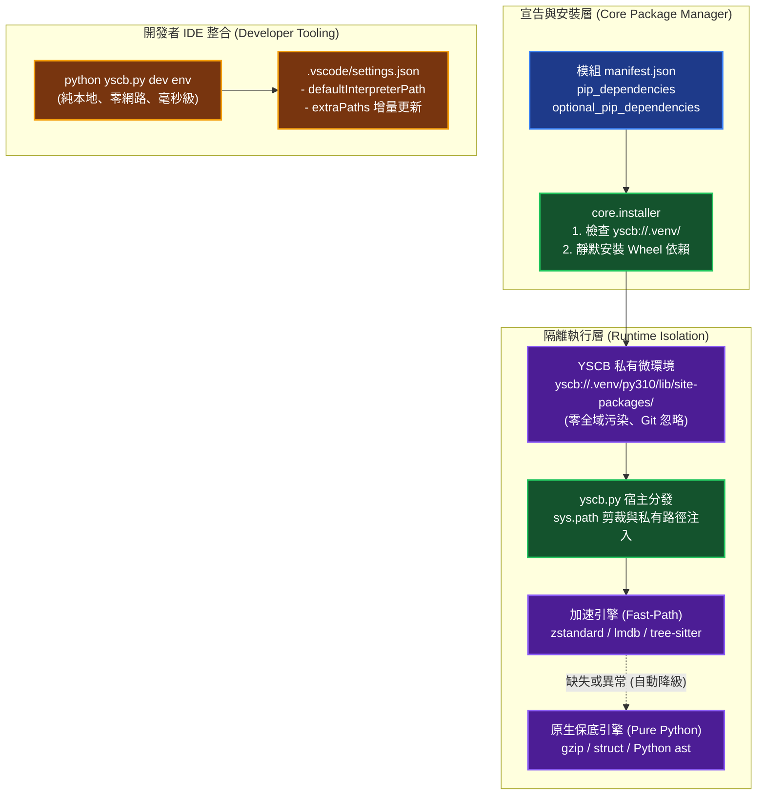

# 技術調研報告：YSCB 私有 Pip 相依性治理體系與可選硬體加速架構 (Research Report)

> 調研主題：pip_dependency_governance_and_optional_acceleration  
> 建立日期：2026-09-02  
> 所屬主計畫：2026_09_02_0533_ecosystem_hot_update_git_decoupling_and_pip_governance  
> 調研狀態：Concluded  
> 模板版本：v1.0  

---

## 1. 問題陳述與根因量化 (Problem & Root Cause)

### 1.1 痛點現象

YS-Codebase 自創立以來堅持「100% 純 Python 原生標準庫（Zero-Pip）」原則。此設計有效消除了使用者端的依賴地獄與環境配置門檻。然而隨著專案規模增長與語意探索能力的演進，純 Python 直譯與自製啟發式演算法開始面臨物理效能與語法精度的極限：

1. **計算與 I/O 密集型場景的效能天花板**：
   - `knowledge-db` 的二進位倒排索引與調用圖譜採用 `pickle` + `gzip`，在大型專案（> 50,000 符號）下，冷啟動反序列化需 20~50ms，無法達成內核級 Mmap（零拷貝記憶體映射）的 $< 0.5\text{ms}$ 極速啟動。
   - BM25 檢索由 Python 迴圈運算，無法利用 Rust / C++ 原生 SIMD（如 SIMD-BP128）指令集加速。
2. **多語言語法解析的邊界瓶頸**：
   - 對 Python 代碼可依賴內建 C 實作的 `ast` 模組；但針對 C++、C#、TypeScript/JavaScript 與 Markdown，自製正則狀態機在面對複雜泛型、JSX/TSX 嵌套、巨集與多行 Lambda 時，存在語意邊界誤判與大檔案解析卡頓。
3. **語意搜索維度的限制**：
   - 僅依賴「BM25 關鍵字 + 人工維護同義詞庫 (`thesaurus.json`)」，缺乏 Dense Vector 嵌入語意理解能力，無法自動識別跨詞彙概念。
4. **傳統 Pip 導入模式的恐懼點**：
   - 若直接採用傳統 `pip install`，會面臨本機全域環境污染、PEP 668 系統鎖定、宿主已有 Venv 的 Package Shadowing、C-Extension 編譯報錯等災難性問題。

### 1.2 現況分析與依賴治理矩陣

```
治理維度               | 傳統 Pip 模式                 | YSCB 現有模式 (Zero-Pip)     | YSCB 私有微環境治理架構 (目標)
-------------------- | ---------------------------- | --------------------------- | :---:
全域 Python 污染度   | 🔴 高 (直接寫入系統環境)         | 🟢 零污染                    | 🟢 零污染 (專屬 .venv 隔離)
效能與現代函式庫運用  | 🟢 可用 SIMD/C/Rust 極速庫    | 🟡 受限純 Python 直譯速度     | 🚀 極速 (Zstd / Tree-sitter / LMDB)
安裝失敗與崩潰風險   | 🔴 高 (C 編譯失敗直接拋錯中斷)   | 🟢 零風險                    | 🟢 零風險 (雙軌平穩降級 Fallback)
多 Python 版本 ABI   | 🔴 容易 ABI Mismatch 崩潰    | 🟢 100% 相容                | 🟢 依 Py3.x 版本分層隔離
IDE 語法輔助 (DX)    | 🟢 依賴本機直裝               | 🟡 需自行配置                | 🟢 `dev env` 一鍵增量同步
```

### 1.3 核心根因

- **核心矛盾**：使用者端「追求零依賴、零配置、開箱即用」與底層引擎「追求極致效能（Mmap、SIMD、Tree-sitter）」之間的矛盾。
- **解法本質**：將 Pip 相依性從「使用者本機層級」徹底**下沉並封裝為「YSCB 內部私有基礎設施」**，並以雙軌平穩降級做兜底，讓使用者完全無感，模組開發者享受極致 DX。

---

## 2. 三大候選架構方案對比 (Candidate Solutions)

| 方案 | 運作原理 | 優點 (Pros) | 缺點 / 成本 (Cons) | 適用度評級 |
| :--- | :--- | :--- | :--- | :---: |
| **方案 1：全域 Pip 直接安裝 (Global Pip)** | 模組安裝時直接呼叫系統 `pip install` 至當前 Python 環境。 | 實作簡單。 | 嚴重污染使用者本機環境、引發套件版本衝突、破壞開箱即用體驗。 | ❌ **不予考慮** |
| **方案 2：維持 100% 純原生標準庫 (現況)** | 完全不引入任何第三方套件，持續用純 Python 演算法手動優化。 | 100% 絕對相容、零依賴。 | 效能上限明顯，維護多語言正則解析器與同義詞庫的心智負擔日益沉重。 | ⭐️⭐️⭐️ |
| **方案 3：YSCB 私有微虛擬環境 + 雙軌平穩降級 + `dev env` IDE 映射 (推薦)** | 1. 於 `yscb://.venv/` 建立私有隔離庫，按 Python 版本分層。<br/>2. 採用 Wheel-Only 策略，安裝失敗 0.1ms 自動降級回純 Python。<br/>3. `dev env` 純本地增量同步 `.vscode/settings.json`。 | 零全域污染、使用者 100% 無感、效能躍升 10x~50x、IDE 完美補全、零崩潰風險。 | 需在 `core` 擴充 Pip 隔離管理器，模組需實作 Fallback 介面。 | ⭐️⭐️⭐️⭐️⭐️<br/>**(最高推薦)** |

---

## 3. 多維度綜合可行性評估 (Multi-Dimensional Feasibility)

| 評估維度 | 方案 2：維持純原生 | 方案 3：私有微環境 + 雙軌降級 (推薦) |
| :--- | :--- | :--- |
| **可行性 (Feasibility)** | 🟢 極高 | 🟢 **極高 (對標 uv / pipx 隔離架構)** |
| **後續維護難度 (Maintenance)** | 🟢 零額外維護成本 | 🟡 **中等**：需維護 `.venv/` 生命週期（Python 版本淘汰時清理舊分層、Wheel 快取定期修剪）；但可透過 `install --gc` 自動化收斂 |
| **可靠性 (Reliability)** | 🟢 100% 確定性行為 | 🟢 **極高**：Wheel-Only 策略消除 C 編譯失敗風險；Fallback 降級延遲 $< 0.1\text{ms}$，效能衰退至現有純 Python 基線（非崩潰），使用者完全無感 |
| **落地難度 (Implementation)** | 🟢 零改動 | 🟡 **中等**：`core` 需新增 `pip_manager` 子模組（約 300~500 行）；各業務模組需統一實作 `try...except ImportError` 雙軌適配器介面，但模式固定可範本化 |
| **使用者與 Agent 體驗 (AX/UX)**| 🟢 零配置（依然單純調用 `yscb`） | 🟢 **100% 維持零配置，無感享受十倍加速** |
| **模組開發者體驗 (DX)** | 🟡 缺少專用 C 擴充庫支援 | 🟢 **`dev env` 一鍵打通 IDE 補全與型別推導** |
| **環境隔離與安全性** | 🟢 絕對安全 | 🟢 **絕對安全（`include-system-site-packages = false`）** |
| **極端無網路/編譯器環境相容性** | 🟢 100% 正常運行 | 🟢 **100% 正常運行（自動無縫降級原生標準庫）** |

---

## 4. 標準作業流程與系統架構設計 (Architecture & SOP)

### 4.1 四重剛性隔離架構拓撲



### 4.2 模組 `manifest.json` 雙軌宣告規範

```json
{
  "name": "knowledge-db",
  "version": "1.1.0.0",
  "dependencies": {
    "core": ">=1.0.0.0"
  },
  "pip_dependencies": {
    "zstandard": ">=0.22.0",
    "lmdb": ">=1.4.1"
  },
  "optional_pip_dependencies": {
    "tree-sitter": ">=0.21.0",
    "tree-sitter-languages": ">=1.10.0",
    "fastembed": ">=0.3.0"
  }
}
```

### 4.3 職責邊界嚴格劃分 (Separation of Concerns)

1. **`core` 模組**：
   - 負責在 `install` / `update` 階段，依據 `manifest.json` 收集依賴聯集，並在 `yscb://.venv/` 下管理預編譯 Wheels。
   - `yscb.py` 啟動時負責動態將 `yscb://.venv/py{major}_{minor}/site-packages` 注入 `sys.path`。
2. **`dev env` 指令**：
   - 純粹負責 IDE 整合：掃描 `source/*` 與 `yscb://.venv/` 路徑，增量更新 `.vscode/settings.json`。
   - **嚴格不進行聯網與 pip 下載**，確保指令 Deterministic 且 $< 5\text{ms}$ 完成。
3. **業務模組代碼**：
   - 遵循 `try...except ImportError` 雙軌適配器模式，保證無 Pip 套件時具備 100% 純原生保底能力。

---

## 5. 實施路線圖與里程碑 (Roadmap & Stages)

### 5.1 近期策略 (Current Strategy)
- 保持現有代碼的純標準庫完整性作為第一優先級（Baseline）。
- 逐步建立 `core` 模組私有環境隔離基礎設施，並以 `knowledge-db` 作為第一試點模組。

### 5.2 實施步驟 (Implementation Stages)

```
[Stage 1: core 私有微環境隔離器] ➔ [Stage 2: dev env IDE 增量映射] ➔ [Stage 3: knowledge-db 雙軌加速外掛] ➔ [Stage 4: 沙盒測試與全量驗證]
```

1. **Stage 1 (`core` 模組私有 Pip 依賴解析與隔離空間)**：
   - 實作 `core.pip_manager`，支援 `yscb://.venv/` 私有微虛擬環境建立。
   - `core.installer` 支援解析 `pip_dependencies`，並調用 Wheel-Only 靜默安裝。
   - `yscb.py` 注入 `sys.path` 剪裁與版本分層路徑。
2. **Stage 2 (`dev env` CLI 指令與 IDE 設定增量投影)**：
   - 實作 `python yscb.py dev env`。
   - 掃描 `source/` 與 `.venv/`，安全增量更新 `.vscode/settings.json` 中的 `python.defaultInterpreterPath` 與 `python.analysis.extraPaths`。
   - 開發者一鍵獲得 100% Pylance 語法高亮、型別推導與自動補全。
3. **Stage 3 (`knowledge-db` 加速外掛試點與雙軌降級)**：
   - 導入 `zstandard` + `lmdb` 實現 Mmap 零拷貝二進位倒排索引（冷啟動 $< 0.5\text{ms}$）。
   - 導入 `tree-sitter` 實現 C++/C#/JS/TS 編譯器級增量 AST 語法樹解析。
   - 完整實作純 Python 原生 Fallback 介面。
4. **Stage 4 (`dev` 模組沙盒對接與全生態系端到端驗證)**：
   - `SandboxProvisioner` 支援沙盒環境繼承 `yscb://.venv/`。
   - `dev check` 新增合規檢查：自動檢驗所有第三方套件導入是否具備 Fallback 降級保護。
   - 實機全量回歸跑測（270+ 測試 100% 通過）。
