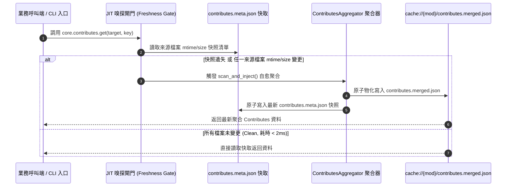

# 架構設計說明書 (Architecture Design)

> 功能名稱：ecosystem_safe_hot_update_and_jit_synchronization  
> 建立日期：2026-09-03  
> 所屬主計畫：2026_09_02_0533_ecosystem_hot_update_git_decoupling_and_pip_governance  
> 狀態：Confirmed  
> 模板版本：v1.2  

---

## 1. 模組架構分層與職責邊界 (Layered Architecture)

```text
+-----------------------------------------------------------------------------------+
|                                yscb.py 宿主路由器                                  |
|   - 捕獲 CLI 指令與分發                                                            |
|   - 結束時調用 UpdateChecker.check_and_prompt() 顯示非阻塞更新提示                 |
+-----------------------------------------+-----------------------------------------+
                                          |
        +---------------------------------+---------------------------------+
        |                                 |                                 |
        v                                 v                                 v
+-----------------------+ +-------------------------------+ +-----------------------+
|      core 模組        | |     agents-workflow 模組      | |       dev 模組        |
|                       | |                               | |                       |
| 1. core.contributes   | | 1. scripts/cli.py             | | 1. dev.tester.Tester  |
|    - Freshness Gate   | |    - _ensure_jit_release()    | |    - 支援 --sync 旗標  |
|    - contributes.meta | |    - 依據指紋比對自動觸發     | |    - 測試成功直裝閉環 |
|    - 觸發自愈聚合     | |      ReleasePublisher         | |    - 友善提示引導     |
| 2. update_checker     | | 2. ReleasePublisher          | +-----------------------+
|    - 12hr 節流快取    | |    - compute_source_          |
|    - 2s 短超時探測    | |      fingerprint() 提前短路   |
|    - 離線安全靜默     | +-------------------------------+
+-----------------------+
```

---

## 2. 核心資料流與循序圖 (Data Flow & Sequence Diagram)



---

## 3. 受影響檔案與新建檔案清單 (Impacted & New Files Inventory)

| 檔案路徑 | 類型 | 職責與變更說明 |
| :--- | :---: | :--- |
| `source/core/core/contributes.py` | Modify | 實作 `_is_contributes_dirty()` 與 JIT 自愈閘門，快取 `contributes.meta.json` |
| `source/core/core/update_checker.py` | New | 實作 12 小時節流來源端版本比對器 `UpdateChecker`，管理 `update_check.json` |
| `source/core/tests/test_contributes_jit.py` | New | 針對 `core.contributes` JIT 變更嗅探與自愈聚合之單元測試 |
| `source/core/tests/test_update_checker.py` | New | 針對 12 小時節流、網路超時靜默與版本提示之單元測試 |
| `source/agents-workflow/agents_workflow/scripts/cli.py` | Modify | 於 CLI 指令分發前調用 `_ensure_jit_release()` 執行來源特徵比對與自動物化 |
| `source/agents-workflow/tests/test_jit_release.py` | New | 針對 `agents-workflow` JIT 投影物化同步之單元測試 |
| `source/dev/dev/tester.py` | Modify | 擴充 `Tester.run()` 支援 `--sync` 旗標，測試通過時鏈式觸發本地 `@build` 直裝並提供提示 |
| `source/dev/tests/test_tester_sync.py` | New | 針對 `dev test --sync` 與提示引導邏輯之單元測試 |

---

## 4. 架構決策記錄 (Architecture Decision Records)

- **[P02:DR-01]** 快照比對採精確路徑白名單嗅探：僅探測 `yscb.config.json`、`module://*/contributes/*.json`、`module://*/contributes.json` 與 `config://*/contribute.json`，杜絕全目錄遞迴掃描，確保比對時間穩定 $< 2\text{ms}$。
- **[P02:DR-02]** `agents-workflow` JIT 投影同步復用既有 `ReleasePublisher.compute_source_fingerprint()` 與 Manifest，保持單一真相來源，不自造指紋算法。
- **[P02:DR-03]** `UpdateChecker` 採非阻塞、短超時（2.0 秒）與 12 小時（43,200 秒）節流設計，所有網路例外靜默兜底，不干擾使用者指令執行。
- **[P02:DR-04]** `dev test --sync` 在沙盒與本機測試皆可運行，測試 100% Passed 後調用本機直裝邏輯，達成零手動介入的 Dogfooding 四步閉環。
