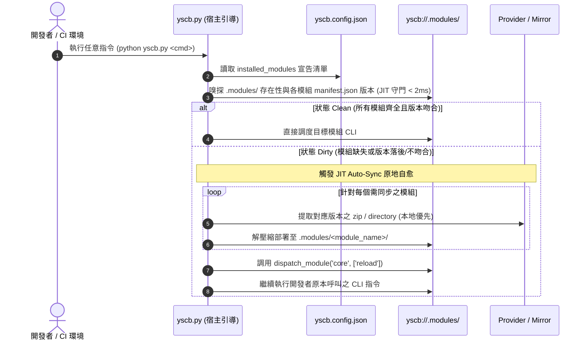

# 架構設計說明書 (Architecture Design)

> 功能名稱：modules_git_decoupling  
> 建立日期：2026-09-03  
> 所屬主計畫：2026_09_02_0533_ecosystem_hot_update_git_decoupling_and_pip_governance  
> 狀態：Confirmed  
> 模板版本：v1.2  

---

## 1. 模組架構分層與職責邊界 (Layered Architecture)

```text
+-----------------------------------------------------------------------------------+
|  Layer 1: 宿主引導與守門層 (yscb.py)                                               |
|    - _generate_internal_gitignore: 宣告 /.modules/ 於 yscb://.gitignore           |
|    - _ensure_jit_modules_sync: 極速嗅探 (<2ms) installed_modules vs .modules/    |
|    - cmd_restore / cmd_bootstrap: 批量自 provider / mirror 還原模組至 .modules/   |
|    - dispatch_module: 動態同進程分發至 yscb_root/.modules/<module>/scripts/cli.py |
+-----------------------------------------------------------------------------------+
                                       │ 語意 URI 解析 (module://)
                                       ▼
+-----------------------------------------------------------------------------------+
|  Layer 2: 語意空間與 URI 協議層 (core.uri & core.contributes)                     |
|    - contributes/core.json: module 協議預設對齊為 yscb://.modules/                |
|    - core/uri.py: _BOOTSTRAP_FALLBACK_SCHEMES module 預設對齊為 yscb://.modules/  |
+-----------------------------------------------------------------------------------+
                                       │ 模組安裝與執行
                                       ▼
+-----------------------------------------------------------------------------------+
|  Layer 3: 運行端消費空間 (yscb://.modules/ - Git 忽略)                            |
|    - yscb://.modules/core/                                                        |
|    - yscb://.modules/dev/                                                         |
|    - yscb://.modules/agents-workflow/                                             |
|    - yscb://.modules/knowledge-db/                                                |
+-----------------------------------------------------------------------------------+
                                       ▲ 規範約束
+-----------------------------------------------------------------------------------+
|  Layer 4: 全專案最高工程規範層 (docs/_project/STANDARDS.md)                        |
|    - module.root:// -> yscb://.modules/ (🚫 忽略)                                  |
|    - module://      -> yscb://.modules/{module}/ (🚫 忽略)                         |
+-----------------------------------------------------------------------------------+
```

---

## 2. 核心資料流與循序圖 (Data Flow & Sequence Diagram)



---

## 3. 受影響檔案與新建檔案清單 (Impacted & New Files Inventory)

| 檔案路徑 | 類型 | 職責與變更說明 |
| :--- | :---: | :--- |
| `yscb.py` | Modify | 1. `_generate_internal_gitignore` 加入 `/.modules/`；<br/>2. 實作 `_ensure_jit_modules_sync` 與 `cmd_restore`；<br/>3. 全面將 `modules` 路徑更換為 `.modules`。 |
| `ys_codebase/source/core/contributes/core.json` | Modify | 更新 `module` 協議預設值由 `yscb://modules/` 為 `yscb://.modules/`。 |
| `ys_codebase/source/core/core/uri.py` | Modify | 更新 `_BOOTSTRAP_FALLBACK_SCHEMES` 中 `module` 為 `yscb://.modules/`。 |
| `docs/_project/STANDARDS.md` | Modify | 空間協議更新：`module.root://` 與 `module://` 指向 `yscb://.modules/`，Git 政策標記為 `🚫 忽略`。 |
| `ys_codebase/source/core/tests/test_restore_and_jit_modules.py` | New | 單元測試：涵蓋 `restore` 批次還原、JIT Auto-Sync 嗅探自愈、Clean 短路跳過與極限邊界。 |
| `docs/core/README.md` | Modify | 補充 `.modules/` 運行端解耦與 `restore` 命令說明。 |

---

## 4. 架構決策記錄 (Architecture Decision Records)

- **[P02:DR-01] 宿主層原生自包含冷啟動還原**：
  - 考量到全新克隆倉庫時 `.modules/core` 尚未物化，JIT 守門與 restore 邏輯直接自包含於 `yscb.py`，僅依賴純 Python 標準庫，徹底消除循環依賴。
- **[P02:DR-02] 零向下過渡代碼原則**：
  - 嚴格遵守 `[P00:DR-05]`，全系統所有路徑組裝唯一面向 `.modules`，不引入任何探測或搬移舊 `modules/` 之技術債。
- **[P02:DR-03] JIT 嗅探極速化策略 (< 2ms)**：
  - 嗅探邏輯直接讀取本機 `.modules/<name>/manifest.json` 的版本欄位，不進行昂貴的遞迴雜湊計算，確保命令響應時間零感知增加。
