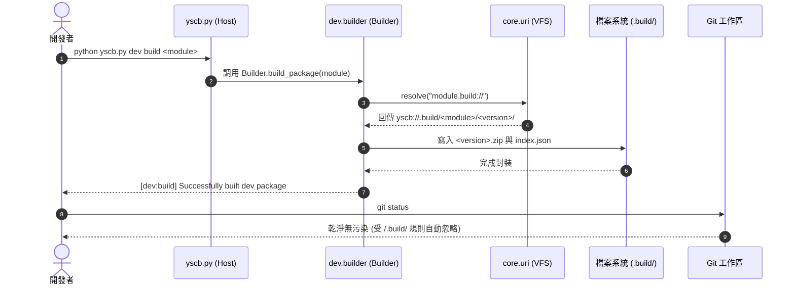

# 架構設計說明書 (Architecture Design)

> 功能名稱：build_git_decoupling  
> 建立日期：2026-09-03  
> 所屬主計畫：2026_09_02_0533_ecosystem_hot_update_git_decoupling_and_pip_governance  
> 狀態：Confirmed  
> 模板版本：v1.2  

---

## 1. 模組架構分層與職責邊界 (Layered Architecture)

```text
+-----------------------------------------------------------------------------------+
| 宿主引導與命令分發層 (Host Bootstrapper Layer: yscb.py)                              |
| - _generate_internal_gitignore(): 標記區塊軟合併注入 /.build/                        |
| - _restore_module_package(): 模組還原管線優先探測 yscb_abs/.build/<mod>/<ver>.zip  |
+-----------------------------------------------------------------------------------+
                                         │ 語意空間解析 (module.build://)
                                         ▼
+-----------------------------------------------------------------------------------+
| 語意空間虛擬檔案系統 (Semantic URI VFS: core.uri & contributes/core.json)           |
| - module.build.root:// -> yscb://.build/                                          |
| - module.build://      -> yscb://.build/{module}/{version}/                       |
+-----------------------------------------------------------------------------------+
                                         │ 建置輸出 / 套件載入
                                         ▼
+-----------------------------------------------------------------------------------+
| 開發工具鏈與沙盒測試層 (Dev Toolchain & Testing: dev.builder, dev.testing.sandbox) |
| - Builder.build_package(): 打包產物原子輸出至 module.build:// (.build/)           |
| - SandboxProvisioner: 沙盒虛擬環境自 module.build:// (.build/) 提取覆蓋最新套件     |
+-----------------------------------------------------------------------------------+
                                         │ 規範約束
                                         ▼
+-----------------------------------------------------------------------------------+
| 最高工程規範層 (Engineering Standards: docs/_project/STANDARDS.md)                 |
| - module.build.root:// & module.build:// Git 追蹤政策正式標記為 🚫 忽略            |
+-----------------------------------------------------------------------------------+
```

---

## 2. 核心資料流與循序圖 (Data Flow & Sequence Diagram)



---

## 3. 受影響檔案與新建檔案清單 (Impacted & New Files Inventory)

| 檔案路徑 | 類型 | 職責與變更說明 |
| :--- | :---: | :--- |
| `yscb.py` | Modify | 於 `_generate_internal_gitignore` 注入 `/.build/`；於 `_restore_module_package` 優先探測 `.build/` |
| `source/core/contributes/core.json` | Modify | 更新 `module.build` 空間協議預設解析目標為 `yscb://.build/{module}/{version}/` |
| `source/core/core/uri.py` | Modify | 更新 `_BOOTSTRAP_FALLBACK_SCHEMES` 中 `module.build` 預設路徑為 `yscb://.build/` |
| `source/dev/dev/builder.py` | Modify | 確認與對齊建置輸出路徑至 `module.build://`（即 `.build/`） |
| `source/dev/dev/testing/sandbox.py` | Modify | 沙盒建置產物覆蓋邏輯確認對齊 `module.build://`（即 `.build/`） |
| `docs/_project/STANDARDS.md` | Modify | 修訂空間協議表第 1 節，`module.build` 系列政策標記為 `🚫 忽略`，實體路徑改為 `yscb://.build/` |
| `source/core/tests/test_build_git_decoupling.py` | New | 新增 `build` Git 解耦、協議解析與建置輸出忽略專屬單元測試套件 |

---

## 4. 架構決策記錄 (Architecture Decision Records)

- **[P02:DR-01] 語意空間協議 SSOT 統一定義**：
  - `module.build` 空間協議由 `core.json` 統一宣告，任何工具鏈（`dev`、`core`、`yscb.py`）存取建置產物空間必須統一透過 `module.build://` 語意協議或對齊之 `.build` 路徑，消除硬編碼歧異。
- **[P02:DR-02] 零過渡極致純淨架構**：
  - 徹底秉持使用者指示，不引入任何針對歷史 `build/` 目錄之探測、相容或遷移代碼，維持核心微內核極致精練。
- **[P02:DR-03] Git 忽略雙重防護**：
  - 於 `_generate_internal_gitignore` 標記區塊內同步管理 `/.modules/` 與 `/.build/`，確保在 `"yscb://" == "project://"` 拓撲下均具備自包含之自動防護。
