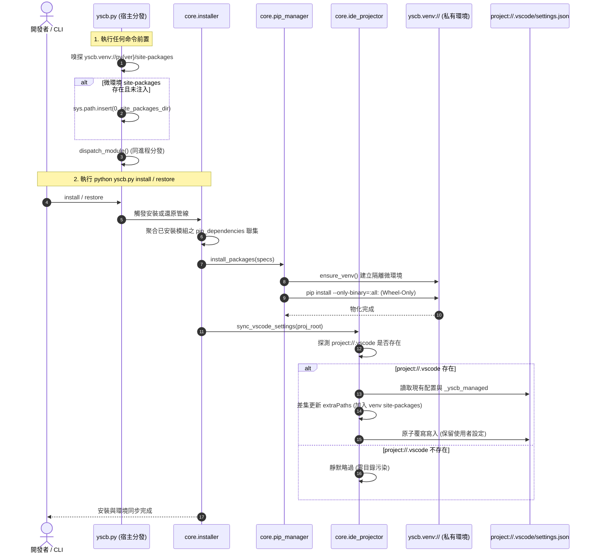

# 架構設計說明書 (Architecture Design)

> 功能名稱：yscb_venv_core  
> 建立日期：2026-09-03  
> 所屬主計畫：2026_09_02_0533_ecosystem_hot_update_git_decoupling_and_pip_governance  
> 狀態：Confirmed  
> 模板版本：v1.2  

---

## 1. 模組架構分層與職責邊界 (Layered Architecture)

```text
+-----------------------------------------------------------------------------------+
| Layer 1: 宿主引導與守門層 (yscb.py)                                               |
| - _generate_internal_gitignore(): 標記區塊軟合併注入 /.venv/                      |
| - _ensure_private_venv_path(): 極速探測 (<0.1ms) yscb.venv:// 並動態注入 sys.path |
| - cmd_restore(): 宿主冷啟動管線自動觸發私有 Pip 依賴檢查與物化                    |
+-----------------------------------------------------------------------------------+
                                         │
                                         ▼
+-----------------------------------------------------------------------------------+
| Layer 2: 語意空間協議與規範層 (STANDARDS.md & core.uri)                           |
| - yscb.venv:// 空間協議註冊 (實體解析指向 yscb://.venv/，Git 政策: 🚫 忽略)        |
| - contributes/core.json & _BOOTSTRAP_FALLBACK_SCHEMES 同步宣告                    |
+-----------------------------------------------------------------------------------+
                                         │
                                         ▼
+-----------------------------------------------------------------------------------+
| Layer 3: 私有微環境隔離管理器 (source/core/core/pip_manager.py)                    |
| - PipManager:                                                                     |
|   ├── get_current_py_tag(): 計算 py{major}{minor} (如 py310, py311)              |
|   ├── get_site_packages_dir(): 跨平台解析 (POSIX lib/... vs Windows Lib/...)       |
|   ├── ensure_venv(): 呼叫標準庫 venv.EnvBuilder 建立純淨私有微環境                 |
|   └── install_packages(specs): 調用微環境 pip 執行 Wheel-Only 靜默安全安裝        |
+-----------------------------------------------------------------------------------+
                                         │
                                         ▼
+-----------------------------------------------------------------------------------+
| Layer 4: 安裝與宣告對接層 (source/core/core/installer.py)                         |
| - 擴充 Manifest 支援 pip_dependencies 宣告解析                                    |
| - install / update / restore 階段自動聚合依賴聯集並呼叫 PipManager 物化           |
| - 調用 IdeProjector 執行專案 IDE 自動感知與軟合併                                |
+-----------------------------------------------------------------------------------+
                                         │
                                         ▼
+-----------------------------------------------------------------------------------+
| Layer 5: IDE 自動感知與可復原軟合併投影器 (source/core/core/ide_projector.py)     |
| - sync_vscode_settings():                                                         |
|   ├── 自動探測 project://.vscode 目錄是否存在 (不存在則完全靜默略過)              |
|   ├── 讀取 settings.json 並以 _yscb_managed 區塊精確管理 YSCB 注入清單            |
|   ├── 差集運算更新 extraPaths 與 defaultInterpreterPath，100% 保留使用者自訂項    |
|   └── 支援卸載/復原時依標記 100% 乾淨剔除舊路徑                                  |
+-----------------------------------------------------------------------------------+
```

---

## 2. 核心資料流與循序圖 (Data Flow & Sequence Diagram)



---

## 3. 受影響檔案與新建檔案清單 (Impacted & New Files Inventory)

| 檔案路徑 | 類型 | 職責與變更說明 |
| :--- | :---: | :--- |
| `yscb.py` | Modify | 1. `_generate_internal_gitignore` 注入 `/.venv/`；<br/>2. 實作 `_ensure_private_venv_path` 極速嗅探並動態注入 `sys.path`；<br/>3. `cmd_restore` 對接微環境 Pip 依賴還原。 |
| `docs/_project/STANDARDS.md` | Modify | 增補 `yscb.venv://` 空間協議，實體路徑指向 `yscb://.venv/`，Git 政策標記 `🚫 忽略`。 |
| `source/core/contributes/core.json` | Modify | 宣告 `yscb.venv` 空間協議預設解析路徑為 `yscb://.venv/`。 |
| `source/core/core/uri.py` | Modify | 更新 `_BOOTSTRAP_FALLBACK_SCHEMES` 註冊 `yscb.venv` 預設路徑。 |
| `source/core/core/pip_manager.py` | New | 實作 `PipManager`：微環境建立、跨平台路徑解析、Wheel-Only 靜默安裝與錯誤捕獲。 |
| `source/core/core/ide_projector.py` | New | 實作 `IdeProjector`：自動感知 `project://.vscode`，以 `_yscb_managed` 區塊進行可復原軟合併。 |
| `source/core/core/installer.py` | Modify | 解析 `manifest.json` 之 `pip_dependencies`，調用 `PipManager` 與 `IdeProjector` 整合閉環。 |
| `source/core/tests/test_venv_core.py` | New | 單元測試套件：微環境生命週期、路徑解析、Wheel 靜默安裝、IDE 軟合併與復原驗證。 |

---

## 4. 架構決策記錄 (Architecture Decision Records)

- **[P02:DR-01] 語意空間協議統一定義**：
  - `yscb.venv://` 由 `core.json` 與 `uri.py` 統一宣告，任何工具鏈存取私有虛擬環境必須統一透過 `yscb.venv://` 或對齊之 `.venv` 路徑，杜絕硬編碼歧異。
- **[P02:DR-02] 零外部依賴之微內核自包含保證**：
  - `PipManager` 與 `IdeProjector` 100% 採用 Python 內建標準庫（`venv`、`urllib`、`subprocess`、`json`、`platform`、`pathlib`），嚴格遵守 `core` 模組 Zero-Pip 與零污染公理。
- **[P02:DR-03] Wheel-Only 剛性安全約束**：
  - 所有 pip 操作強制附加 `--only-binary=:all:` 與 `--no-warn-script-location`，任何缺乏預編譯 Wheel 之依賴在嘗試編譯前即被安全攔截並提供友好報錯。
- **[P02:DR-04] 明確標示之可復原 IDE 軟合併架構**：
  - 於 `settings.json` 引入 `_yscb_managed` 區塊，精準記錄所有注入路徑。更新時以集合差集替換舊路徑，保留所有使用者自訂值；若目錄不存在則完全不建立，消除非 VS Code 專案目錄污染。
