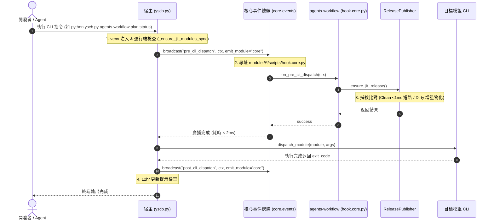

# 架構設計說明書 (Architecture Design)

> 功能名稱：sub_05_jit_self_healing_integration  
> 建立日期：2026-09-04  
> 所屬主計畫：2026_09_02_0533_ecosystem_hot_update_git_decoupling_and_pip_governance  
> 狀態：Confirmed  
> 模板版本：v1.2  

---

## 1. 模組架構分層與職責邊界 (Layered Architecture)

```text
+---------------------------------------------------------------------------------------+
| Layer 1: 宿主調度層 (yscb.py)                                                          |
| - CLI 統一入口與同進程分發路由 (runpy.run_path)                                          |
| - 宿主生命週期管線: venv 注入 -> 運行端完整性嗅探 -> core.events.broadcast("pre_cli_dispatch")|
|   -> 模組指令分發 -> core.events.broadcast("post_cli_dispatch") -> 12hr 更新檢查提示          |
| - CLI 查表功能: python yscb.py event list (聚合全生態系 contributes.events)              |
+-------------------------------------------+-------------------------------------------+
                                            | 調用生命週期廣播
                                            v
+---------------------------------------------------------------------------------------+
| Layer 2: 微內核獨立事件總線層 (core.events) - 與 Engine 完全解耦                       |
| - 獨立輕量模組 core.events (純 Python 標準庫，零 Engine / Installer 依賴)             |
| - broadcast(event_name, context=None, emit_module="core", search_roots=None)          |
| - 標準尋址: module://{mod}/scripts/hook.{emit_module}.py (支援指定自定義搜尋路徑)       |
| - 函式名稱雙向匹配: on_{event_name} -> {event_name} -> on_event(ctx)                  |
| - 徹底移除 Engine.act_broadcast_event，核心內部 (installer, engine) 統一調用本模組     |
| - 異常隔離沙盒 (Fail-Safe)，避免單一模組 Hook 拋錯導致 CLI 癱瘓                        |
+-------------------------------------------+-------------------------------------------+
                                            | 廣播分發至各模組 Hook (<Sender> 命名空間)
                                            v
+---------------------------------------------------------------------------------------+
| Layer 3: 業務模組 Hook 擴充與測試對齊 (agents-workflow, dev, knowledge-db ...)         |
| - agents-workflow/scripts/hook.core.py: 實作 on_pre_cli_dispatch(ctx)                     |
|   - 接入 ReleasePublisher.ensure_jit_release(): 指紋比對、Clean 提前短路               |
| - 移除 agents-workflow/scripts/cli.py 中的 Ad-hoc 前置攔截代碼                         |
| - dev/dev/testing/sandbox.py: 移除 _dispatch_test_hooks 重複造輪子實作，改為調用        |
|   core.events.broadcast(hook_name, ctx, emit_module="dev", search_roots=[...])       |
| - 各模組 contribute.json: 選配宣告 events: [ { "<name>": "description" } ]        |
+---------------------------------------------------------------------------------------+
```

---

## 2. 核心資料流與循序圖 (Data Flow & Sequence Diagram)



---

## 3. 受影響檔案與新建檔案清單 (Impacted & New Files Inventory)

| 檔案路徑 | 類型 | 職責與變更說明 |
| :--- | :---: | :--- |
| `ys_codebase/source/core/core/events.py` | New | 新增微內核獨立事件總線模組，提供 `broadcast(event_name, context, emit_module, search_roots)`，與 `Engine` 徹底解耦 |
| `ys_codebase/source/core/core/__init__.py` | Modify | 匯出 `events` 模組，供宿主與其他模組以 `from core import events` 直接調用 |
| `ys_codebase/source/core/core/engine.py` | Modify | 徹底移除 `act_broadcast_event` 實作，內部事件廣播點（如 `on_reload`）改直接調用 `core.events.broadcast` |
| `ys_codebase/source/core/core/installer.py` | Modify | 內部事件廣播點（`on_installed`、`on_update`、`on_remove`）改調用 `core.events.broadcast` |
| `ys_codebase/source/core/contribute.json` | Modify | 新增 `events` 宣告節點，註冊 `core` 所發布之標準生命週期事件中繼資料 |
| `ys_codebase/source/core/contributes.format.md` | Modify | 更新格式手冊，增加 `events` 節點結構規範說明（供 `event list` 查表使用） |
| `yscb.py` | Modify | 1. 整合前後生命週期管線 (`core.events.broadcast`)；<br/>2. 新增 `event list` CLI 指令，快速聚合並輸出事件清冊 |
| `ys_codebase/source/dev/dev/testing/sandbox.py` | Modify | 移除自建之 `_dispatch_test_hooks` 重複實作，改為統一呼叫 `core.events.broadcast(..., emit_module="dev")` |
| `ys_codebase/source/agents-workflow/scripts/hook.core.py` | Modify | 實作 `on_pre_cli_dispatch(ctx)` 處理常式，調用 `ensure_jit_release()` 執行資產新鮮度檢測與自癒物化 |
| `ys_codebase/source/agents-workflow/scripts/cli.py` | Modify | 徹底移除入口處 Ad-hoc 的 `ensure_jit_release()` 攔截程式碼 |
| `ys_codebase/source/core/tests/test_events_pipeline.py` | New | 涵蓋事件廣播、Hook 觸發、異常隔離、多搜尋路徑與效能短路之單元測試清單 |

---

## 4. 架構決策記錄 (Architecture Decision Records)

- **[P02:DR-01] 獨立微內核事件總線 (`core.events`) 與 `Engine` 徹底解耦**：
  不將事件總線繫結於重型 `Engine` 物件。建立獨立之 `core.events` 輕量模組，徹底移除 `Engine.act_broadcast_event` 門面，使 `yscb.py` 宿主與 `installer.py` 能夠以極速 (<0.1ms) 呼叫廣播，避免冷啟動載入全量微內核實例。
- **[P02:DR-02] 標準 Hook 尋址格式 `module://<module>/scripts/hook.<Sender>.py`**：
  正規化 Hook 檔案命名：由 `<Sender>` 模組所派送之事件，各模組於 `scripts/hook.<Sender>.py` 中實作對應函式（例如由 `core` 派送之 `on_reload` / `on_pre_cli_dispatch`，於 `hook.core.py` 實作；由 `dev` 派送之 `on_test_setup`，於 `hook.dev.py` 實作）。函式匹配支援 `on_{event_name}` 與 `{event_name}`。
- **[P02:DR-03] Dev 沙盒測試 Hook 基礎設施收斂**：
  移除 `dev.testing.sandbox.SandboxProvisioner` 中自建的 `_dispatch_test_hooks` 重複實作，改為直接調用 `core.events.broadcast(hook_name, ctx, emit_module="dev", search_roots=...)`，支援傳入自訂搜尋目錄，達成全生態系事件調度架構 1:1 統一。
- **[P02:DR-04] Contributes `events` 規範與 CLI 查表（純中繼資料）**：
  各模組於 `contribute.json` 中宣告 `events: [ { "<name>": "description" } ]`。程式執行期不產生任何強邏輯耦合，僅供 `python yscb.py event list` 解析並輸出全系統事件對照表，方便開發者與 Agent 掌握事件清冊。
- **[P02:DR-05] 零侵入式 Ad-hoc 清理守則與 Fail-Safe 異常隔離**：
  全面廢除各模組在自身的 `cli.py` 撰寫的前置攔截代碼；所有通用生命週期熱自癒統一由宿主事件驅動。任何模組 Hook 內部之例外強制捕獲並記錄警告，絕不阻斷 CLI 主指令執行。
