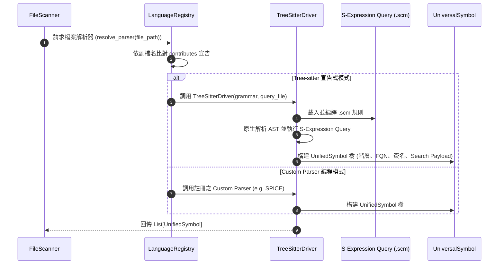

# 架構設計說明書 (Architecture Design)

> 功能名稱：sub_01_universal_ast_and_contributed_tree_sitter  
> 建立日期：2026-09-05  
> 所屬主計畫：2026_09_05_1025_knowledge_db_refactor  
> 狀態：Draft  
> 模板版本：v1.2  

---

## 1. 模組架構分層與職責邊界 (Layered Architecture)

```text
+-----------------------------------------------------------------------------------+
|                           YSCB Contributes Discovery Layer                        |
|   (contribute.json / contributes/*.json: languages, extensions, .scm, custom_kinds)  |
+-----------------------------------------------------------------------------------+
                                          |
                                          v
+-----------------------------------------------------------------------------------+
|                        LanguageRegistry (外掛發現與語言註冊表)                      |
|   - 依副檔名動態分發對應 Parser                                                       |
|   - 管理樹狀語法查詢 (.scm) 與 Grammar 映射                                           |
+-----------------------------------------------------------------------------------+
                                          |
        +---------------------------------+---------------------------------+
        | (mode: "tree_sitter")                                             | (mode: "custom")
        v                                                                   v
+------------------------------------+             +--------------------------------+
|  TreeSitterDriver (通用查詢驅動器)  |             |  CustomParser Interface (DSL)  |
|  - tree-sitter Parser + Query API  |             |  - BaseParser 協議實作         |
|  - .scm S-Expression 規則走訪      |             |  - e.g. SpiceNetlistParser     |
+------------------------------------+             +--------------------------------+
        |                                                                   |
        +---------------------------------+---------------------------------+
                                          |
                                          v
+-----------------------------------------------------------------------------------+
|                       Universal AST Schema (通用語意資料層)                        |
|   - UnifiedSymbol: 遞迴階層 (parent_id/children), FQN, Structured Signature       |
|   - Location (file, lines, byte offsets), Search Payload (精煉語意區塊)             |
|   - 向後相容適配層: @property members 動態適配支援既有測試與呼叫者                    |
+-----------------------------------------------------------------------------------+
```

---

## 2. 核心資料流與循序圖 (Data Flow & Sequence Diagram)



---

## 3. 受影響檔案與新建檔案清單 (Impacted & New Files Inventory)

| 檔案路徑 | 類型 | 職責與變更說明 |
| :--- | :---: | :--- |
| `source/knowledge-db/manifest.json` | Modify | 新增 `pip_dependencies`（`tree-sitter` 等相依性） |
| `source/knowledge-db/contributes/knowledge-db.json` | Modify | 宣告自身支援之語言能力（Python, C, C++, JS/TS, C#, Markdown, SPICE） |
| `source/knowledge-db/knowledge_db/schema.py` | Modify | 重構為遞迴階層 `UnifiedSymbol`、移除 `MemberInfo`、新增 FQN 與結構化簽名 |
| `source/knowledge-db/knowledge_db/parsers/registry.py` | Modify | 重構為基於 `contributes` 的動態 `LanguageRegistry` |
| `source/knowledge-db/knowledge_db/parsers/treesitter.py` | New | 實作通用 `TreeSitterDriver`，負責 S-Expression 走訪與符號構建 |
| `source/knowledge-db/knowledge_db/parsers/base.py` | Modify | 簡化 `BaseParser` 抽象契約，適配 Universal AST |
| `source/knowledge-db/knowledge_db/parsers/*.py` (舊手刻) | Delete | 徹底刪除 `cpp_parser.py`, `js_ts_parser.py`, `csharp_parser.py`, `markdown_parser.py`, `html_parser.py`, `css_parser.py`, `python_parser.py` 等 |
| `source/knowledge-db/assets/queries/*.scm` | New | 存放各語言 S-Expression 宣告式查詢規則檔 |
| `source/knowledge-db/tests/test_parsers.py` | Modify | 廢除針對手刻正則之測試，重構為 Tree-sitter 語意解析測試 |
| `source/knowledge-db/tests/test_spice_parser.py` | Modify | 適配 Custom Parser 模式，清理過時斷言 |
| `source/knowledge-db/tests/test_schema.py` | Modify | 覆蓋遞迴 `UnifiedSymbol`、FQN 與相容適配層測試 |

---

## 4. 架構決策記錄 (Architecture Decision Records)

- **[P02:DR-01] S-Expression Capture Tags 契約標準化**：
  - 規定所有 `.scm` 檔案統一使用標準捕獲標籤：
    - `@definition.function`、`@definition.class`、`@definition.method`、`@definition.module`、`@definition.interface`
    - `@symbol.name`、`@symbol.signature`、`@symbol.docstring`、`@symbol.body`
  - 驅動器依此統一映射為 `UnifiedSymbol`，實現「語言解析驅動與語法規則完全解耦」。

- **[P02:DR-02] 動態外掛自貢獻探索機制**：
  - `LanguageRegistry` 透過 `core.contributes` 探索 `contributes.knowledge_db.languages` 節點。
  - `knowledge-db` 自身作為第一個普通貢獻者宣告內建語言，落實 Zero Core Privilege 與 100% Dogfooding。

- **[P02:DR-03] 歷史手刻代碼與過時測試徹底移除**：
  - 刪除舊有 2,000 行手刻正則實作檔案與針對手刻私有行為的無效測試，徹底消除歷史技術債，測試套件回歸乾淨清晰。
