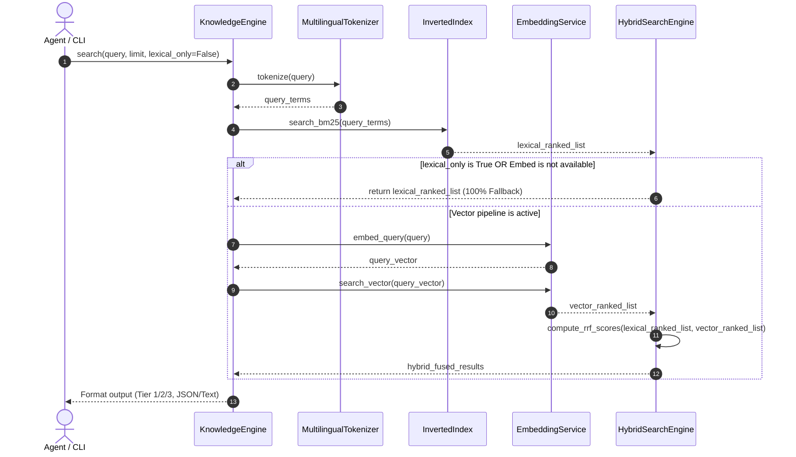

# 架構設計說明書 (Architecture Design)

> 功能名稱：sub_02_multilingual_tokenizer_and_hybrid_search  
> 建立日期：2026-09-05  
> 所屬主計畫：2026_09_05_1025_knowledge_db_refactor  
> 狀態：Confirmed  
> 模板版本：v1.2  

---

## 1. 模組架構分層與職責邊界 (Layered Architecture)

```text
+-------------------------------------------------------------------------------+
| CLI Layer: python yscb.py knowledge-db search <query> [--lexical-only]        |
+-------------------------------------------------------------------------------+
                                      |
+-------------------------------------------------------------------------------+
| KnowledgeEngine / PipelineFacade                                              |
|  - JIT Snapshot Check -> HybridSearchEngine.search()                          |
+-------------------------------------------------------------------------------+
                                      |
       +------------------------------+------------------------------+
       |                                                             |
+--------------------------------+             +--------------------------------+
| BM25 Pipeline                  |             | Vector Pipeline (FastEmbed)    |
| - MultilingualTokenizer        |             | - EmbeddingService (ONNX)      |
|   (CJK + CamelCase + Code)     |             |   - Model: bge-small-zh-v1.5   |
| - InvertedIndex BM25 Scoring   |             | - VectorIndex (Cosine Sim)     |
|   (Keyword Exact & Stemming)   |             |   - Binary Cache (.bin.gz)     |
+--------------------------------+             +--------------------------------+
       |                                                             |
       | Top-N Lexical Hits                                          | Top-N Semantic Hits
       +------------------------------+------------------------------+
                                      |
+-------------------------------------------------------------------------------+
| RRF Fusion & Fallback Layer (Reciprocal Rank Fusion)                          |
|  - If Vector Unavailable -> 100% Fallback to BM25                             |
|  - Score(d) = w_bm25 / (k + rank_bm25) + w_vec / (k + rank_vec)              |
+-------------------------------------------------------------------------------+
                                      |
+-------------------------------------------------------------------------------+
| Snippet Extractor & Output Formatter (--json, -s)                             |
+-------------------------------------------------------------------------------+
```

---

## 2. 核心資料流與循序圖 (Data Flow & Sequence Diagram)



---

## 3. 受影響檔案與新建檔案清單 (Impacted & New Files Inventory)

| 檔案路徑 | 類型 | 職責與變更說明 |
| :--- | :---: | :--- |
| `source/knowledge-db/manifest.json` | Modify | 宣告 `fastembed` (含 `onnxruntime`, `tokenizers`, `numpy`) 相依套件 |
| `source/knowledge-db/knowledge_db/tokenizer.py` | Modify | 重構為 `MultilingualTokenizer`，支援中英/CJK混雜與代碼標識符分詞 |
| `source/knowledge-db/knowledge_db/embedding.py` | New | 實作 `EmbeddingService`，封裝 FastEmbed 離線推論、快取與降級守門 |
| `source/knowledge-db/knowledge_db/hybrid.py` | New | 實作 `HybridSearchEngine`，提供 RRF 倒數排名融合演算法與降級分發 |
| `source/knowledge-db/knowledge_db/thesaurus.py` | Delete | 徹底刪除舊有手刻同義詞庫檔案 |
| `source/knowledge-db/tests/test_thesaurus.py` | Delete | 徹底刪除舊有同義詞庫單元測試 |
| `source/knowledge-db/tests/test_tokenizer.py` | Modify | 擴充中英混雜、CJK、駝峰蛇形分詞驗證案例 |
| `source/knowledge-db/tests/test_hybrid.py` | New | 驗證向量推論、RRF 融合權重與 100% BM25 平滑降級機制 |
| `source/knowledge-db/knowledge_db/engine.py` | Modify | 串接 `HybridSearchEngine`，提供 `--lexical-only` 參數支援 |

---

## 4. 架構決策記錄 (Architecture Decision Records)

- **[P02:DR-01] 零外部依賴分詞器架構**：`MultilingualTokenizer` 使用 Python 原生碼點區間（CJK `0x4E00..0x9FFF`、假名、諺文）配合正則標識符切分，不依賴 `jieba` 等外部肥大分詞庫，兼顧 0MB 體積與微秒級斷詞效能。
- **[P02:DR-02] 動態載入與雙軌降級保證**：`EmbeddingService` 內部透過 `try...except ImportError` 攔截 `fastembed`；若微環境尚未安裝或模型加載失敗，自動設定 `is_available=False`，系統零延遲退化為純 BM25 檢索，永不拋出異常。
- **[P02:DR-03] 離線單元測試與 Mock 向量注入**：在測試環境下預設使用 `MockEmbeddingService`（基於固定隨機種子生成歸一化向量），消除沙盒跑測期間的任何網路請求與模型下載等待，確保測試 100% 離線秒級通過。
