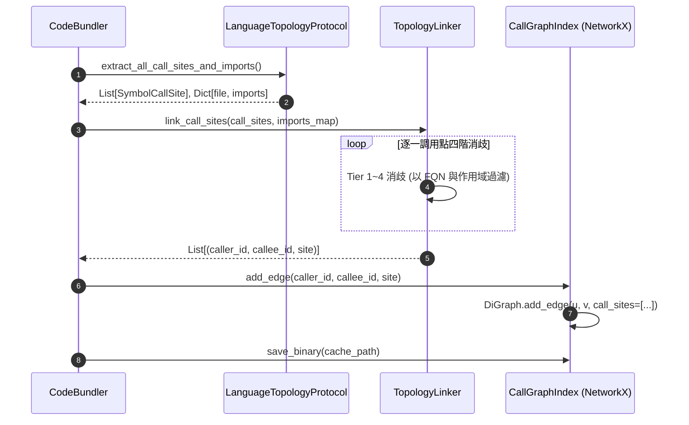
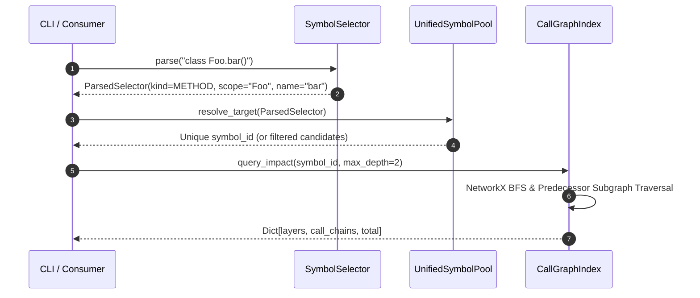

# 架構設計說明書 (Architecture Design)

> 功能名稱：sub_03_networkx_call_graph_and_impact_analysis  
> 建立日期：2026-09-05  
> 所屬主計畫：2026_09_05_1025_knowledge_db_refactor  
> 狀態：Confirmed  
> 依據 P01：[P01_requirements_spec.md](./P01_requirements_spec.md)  
> 模板版本：v1.2  

---

## 1. 模組架構分層與職責邊界 (Layered Architecture)

```text
+-------------------------------------------------------------------------------+
|                       CLI & Consumer Layer (scripts/cli.py)                   |
|   - callers <selector>  - callees <selector>  - impact <selector>  - search   |
+-------------------------------------------------------------------------------+
                                      │
                                      ▼
+-------------------------------------------------------------------------------+
|                 AST Symbol Selector Engine (knowledge_db/selector.py)         |
|   - SymbolSelector.parse(expr) -> ParsedSelector (kind, scope, id, callable)  |
|   - SelectorMatcher.match(symbol, parsed) -> bool                             |
+-------------------------------------------------------------------------------+
                                      │
                                      ▼
+-------------------------------------------------------------------------------+
|              Topology Disambiguation Linker (knowledge_db/linker.py)          |
|   - Tier 1: AST Local & Parent Scope (Self/Class/Function Hierarchy)          |
|   - Tier 2: Normalized Import Mapping (Aliases, Relative Imports)             |
|   - Tier 3: Same Space & Module Path Proximity                                |
|   - Tier 4: Global Disambiguation with Strict Threshold (Eliminate Ghosts)    |
+-------------------------------------------------------------------------------+
                                      │
                                      ▼
+-------------------------------------------------------------------------------+
|                  Call Graph Index Engine (knowledge_db/graph.py)              |
|   - Core Graph Storage: networkx.DiGraph (Nodes: symbol_id, Edges: call_sites)|
|   - Impact Analysis: nx.predecessors, subgraphs, shortest paths               |
|   - Persistence: Protocol 5 Pickle + Gzip (atomic tmp -> replace)             |
+-------------------------------------------------------------------------------+
                                      ▲
                                      │
+-------------------------------------------------------------------------------+
|             Multi-Language Topology Protocol (knowledge_db/protocol.py)       |
|   - LanguageTopologyProtocol (Abstract Interface)                             |
|   - Extractors: extract_call_sites(), extract_imports()                       |
|   - Adapters: Python, TypeScript/JavaScript, C/C++, C#                        |
+-------------------------------------------------------------------------------+
```

---

## 2. 核心資料流與循序圖 (Data Flow & Sequence Diagram)

### 2.1 索引建置與拓撲消歧資料流 (Build & Linking Flow)



### 2.2 CLI 查詢與符號選擇器解析資料流 (Query Flow)



---

## 3. 受影響檔案與新建檔案清單 (Impacted & New Files Inventory)

| 檔案路徑 | 類型 | 職責與變更說明 |
| :--- | :---: | :--- |
| `source/knowledge-db/knowledge_db/selector.py` | New | 實作 `SymbolSelector` 與 `SelectorMatcher`，支援類型前綴、範疇層次與可調用符號解析。 |
| `source/knowledge-db/knowledge_db/protocol.py` | New | 定義 `LanguageTopologyProtocol` 與語言適配器註冊協議。 |
| `source/knowledge-db/knowledge_db/graph.py` | Modify | 引入 `networkx.DiGraph` 替換整數池與手刻雙向字典，保留完整對外 Public API。 |
| `source/knowledge-db/knowledge_db/linker.py` | Modify | 重構消歧演算法，導入 FQN 作用域階層比對，徹底杜絕幽靈關聯。 |
| `source/knowledge-db/manifest.json` | Modify | 宣告 `"networkx": ">=3.0"` 於 `pip_dependencies`。 |
| `source/knowledge-db/scripts/cli.py` | Modify | 讓 `callers`、`callees`、`impact`、`search` 支援符號選擇器語法。 |
| `source/knowledge-db/tests/test_selector.py` | New | 符號選擇器語法解析與比對之獨立單元測試。 |
| `source/knowledge-db/tests/test_networkx_graph.py` | New | NetworkX 圖論演算法、多階影響面與環路剪枝測試。 |
| `source/knowledge-db/tests/test_call_graph.py` | Modify | 回歸驗證現有 22KB 調用圖測試套件，確保 100% 相容。 |

---

## 4. 架構決策記錄 (Architecture Decision Records)

- **[P02:DR-01] NetworkX DiGraph 圖模型設計**：
  - 圖節點：節點 ID 為 `symbol_id`，節點屬性包含 `name`, `fqn`, `kind`, `file_path`, `space`。
  - 圖有向邊：邊自 `caller_id` 指向 `callee_id`，邊屬性字典保存 `call_sites: List[SymbolCallSite]`。
  - 反向查詢：直接使用 `G.pred[v]` 獲取所有調用者 (Callers)，天然具備極高檢索效能。
- **[P02:DR-02] 符號選擇器解析器無依賴設計**：
  - `SymbolSelector` 採純 Python 正則與狀態切分實作，零外部相依，解析時間小於 $0.05\text{ms}$。
- **[P02:DR-03] 語言拓撲協議解耦**：
  - 定義 `LanguageTopologyProtocol`，預設提供 Python 語意萃取器，並提供擴充掛勾讓其他 Tree-sitter 語言擴充。
