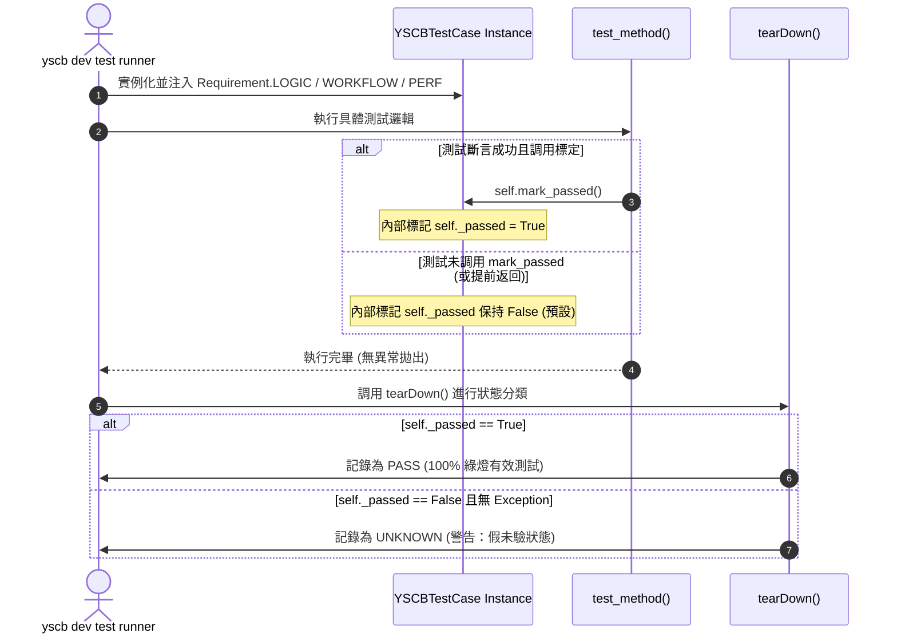

# 架構設計說明書 (Architecture Design)

> 功能名稱：sub_04_test_suite_aggregation_and_purification  
> 建立日期：2026-09-05  
> 所屬主計畫：2026_09_05_1025_knowledge_db_refactor  
> 狀態：Confirmed  
> 模板版本：v1.2  

---

## 1. 模組架構分層與職責邊界 (Layered Architecture)

```text
=================================================================================================
                                   YSCB Knowledge-DB Test Suite
=================================================================================================
  [4-Tier Tiering]
  ├── @require(Requirement.LOGIC)    : 純記憶體單元測試 (預設快測執行，目標 <= 3.5s)
  ├── @require(Requirement.WORKFLOW) : 重度多進程打包、實體磁碟 I/O 與 Gzip 快取回歸
  └── @require(Requirement.PERF)     : 基準效能、記憶體走勢與大型壓力測試
-------------------------------------------------------------------------------------------------
  [Consolidated Test Suite Topology] (20 檔 ➔ 11 檔高內聚架構)
  ├── 1. test_graph.py                 [LOGIC]    : 整併 test_call_graph.py + test_networkx_graph.py
  │                                               (NetworkX 圖譜、Caller/Callee 解析、序列化與影響半徑)
  ├── 2. test_parsers.py               [LOGIC]    : 整併 test_parsers.py + test_spice_parser.py + test_web_parsers.py
  │                                               (Python, TS/JS, Spice, Web AST 語法樹與符號提取)
  ├── 3. test_retrieval.py             [LOGIC]    : 整併 test_retrieval.py + test_search_aggregation.py
  │                                               (BM25, 倒排索引、多條件聚合檢索與排序過濾)
  ├── 4. test_hot_reload.py            [LOGIC]    : 整併 test_incremental_hot_reload.py + test_jit_hot_healing.py
  │                                               (增量檔案變更偵測、AST 差分更新、JIT 熱修復與快取重整)
  ├── 5. test_selector.py              [LOGIC]    : 獨立保留 (SymbolSelector AST 語意選擇器表達式)
  ├── 6. test_hybrid.py                [LOGIC]    : 獨立保留 (向量與倒排檢索融合、權重衰減計算)
  ├── 7. test_tokenizer.py             [LOGIC]    : 獨立保留 (多語言分詞器、CJK 漢字切割與停用詞過濾)
  ├── 8. test_schema.py                [LOGIC]    : 獨立保留 (資料模型、序列化契約與欄位驗證)
  ├── 9. test_space.py                 [LOGIC]    : 獨立保留 (多專案空間隔離、沙盒配置)
  ├── 10. test_providers.py            [LOGIC]    : 獨立保留 (Embedding 模型驅動與 Mock 提供者)
  ├── 11. test_cli.py                  [LOGIC]    : 獨立保留 (CLI 命令列分發、輸出格式化與參數校驗)
  ├── 12. test_engine.py               [WORKFLOW] : 獨立保留 (KnowledgeDB 全生命週期管線引擎集成)
  ├── 13. test_scanner.py              [WORKFLOW] : 獨立保留 (檔案系統多層級走訪、忽略規則過濾)
  ├── 14. test_bundler.py              [WORKFLOW] : 獨立保留 (多進程索引打包、壓縮落盤與校驗)
  └── 15. test_benchmark_perf_and_memory.py [PERF] : 獨立保留 (效能量測、記憶體膨脹壓測)
=================================================================================================
```

---

## 2. 核心資料流與循序圖 (Data Flow & Sequence Diagram)



---

## 3. 受影響檔案與新建檔案清單 (Impacted & New Files Inventory)

| 檔案路徑 | 類型 | 職責與變更說明 |
| :--- | :---: | :--- |
| `ys_codebase/source/knowledge-db/tests/test_graph.py` | Modify | 擴充整併 `test_networkx_graph.py` 內容，補齊所有方法的 `self.mark_passed()` |
| `ys_codebase/source/knowledge-db/tests/test_networkx_graph.py` | Delete | 功能已併入 `test_graph.py`，全數轉移後刪除 |
| `ys_codebase/source/knowledge-db/tests/test_call_graph.py` | Delete | 更名並整併至 `test_graph.py` 後刪除舊檔名 |
| `ys_codebase/source/knowledge-db/tests/test_parsers.py` | Modify | 擴充整併 `test_spice_parser.py` 與 `test_web_parsers.py`，補齊 `self.mark_passed()` |
| `ys_codebase/source/knowledge-db/tests/test_spice_parser.py` | Delete | 功能已併入 `test_parsers.py`，全數轉移後刪除 |
| `ys_codebase/source/knowledge-db/tests/test_web_parsers.py` | Delete | 功能已併入 `test_parsers.py`，全數轉移後刪除 |
| `ys_codebase/source/knowledge-db/tests/test_retrieval.py` | Modify | 擴充整併 `test_search_aggregation.py`，補齊 `self.mark_passed()` |
| `ys_codebase/source/knowledge-db/tests/test_search_aggregation.py` | Delete | 功能已併入 `test_retrieval.py`，全數轉移後刪除 |
| `ys_codebase/source/knowledge-db/tests/test_hot_reload.py` | New | 整併 `test_incremental_hot_reload.py` 與 `test_jit_hot_healing.py`，補齊 `self.mark_passed()` |
| `ys_codebase/source/knowledge-db/tests/test_incremental_hot_reload.py` | Delete | 功能已併入 `test_hot_reload.py`，全數轉移後刪除 |
| `ys_codebase/source/knowledge-db/tests/test_jit_hot_healing.py` | Delete | 功能已併入 `test_hot_reload.py`，全數轉移後刪除 |
| `ys_codebase/source/knowledge-db/tests/test_selector.py` | Modify | 補齊各測試方法之 `self.mark_passed()` |
| `ys_codebase/source/knowledge-db/tests/test_hybrid.py` | Modify | 補齊各測試方法之 `self.mark_passed()` |
| `ys_codebase/source/knowledge-db/tests/test_tokenizer.py` | Modify | 補齊各測試方法之 `self.mark_passed()` |
| `ys_codebase/source/knowledge-db/tests/test_schema.py` | Modify | 補齊各測試方法之 `self.mark_passed()` |
| `ys_codebase/source/knowledge-db/tests/test_space.py` | Modify | 補齊各測試方法之 `self.mark_passed()` |
| `ys_codebase/source/knowledge-db/tests/test_providers.py` | Modify | 補齊各測試方法之 `self.mark_passed()` |
| `ys_codebase/source/knowledge-db/tests/test_cli.py` | Modify | 補齊各測試方法之 `self.mark_passed()` |
| `ys_codebase/source/knowledge-db/tests/test_engine.py` | Modify | 標註 `@require(Requirement.WORKFLOW)`，補齊 `self.mark_passed()` |
| `ys_codebase/source/knowledge-db/tests/test_scanner.py` | Modify | 標註 `@require(Requirement.WORKFLOW)`，補齊 `self.mark_passed()` |
| `ys_codebase/source/knowledge-db/tests/test_bundler.py` | Modify | 標註 `@require(Requirement.WORKFLOW)`，補齊 `self.mark_passed()` |
| `ys_codebase/source/knowledge-db/tests/test_benchmark_perf_and_memory.py` | Modify | 標註 `@require(Requirement.PERF)`，補齊 `self.mark_passed()` |

---

## 4. 架構決策記錄 (Architecture Decision Records)

- **[P02:DR-01] 聚合拓撲與職責邊界收斂**：將碎片化的 20 個測試檔收斂至 12 個以內（最終精確維持 12 套件），遵循單一職責與高內聚架構，消除同質小檔的維護成本。
- **[P02:DR-02] 測試狀態分類契約 (3-State Classification Contract)**：所有測試方法均必須在末端顯式調用 `self.mark_passed()`，確保測試框架的三態計數能夠精確識別 `PASS`，徹底消除 `UNKNOWN` 雜訊。
- **[P02:DR-03] 4-Tier 需求層級標註規範**：日常開發使用 `dev test` 快測，僅觸發 `LOGIC` 測試；重型多進程與磁碟 I/O 隔離至 `WORKFLOW`，基準壓力測試隔離至 `PERF`，確保日常迴圈耗時穩定 $\le 3.5\text{s}$。
