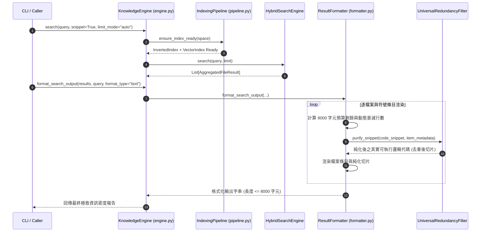

# 架構設計說明書 (Architecture Design)

> 功能名稱：sub_05_pipeline_engine_refactor_and_dogfooding  
> 建立日期：2026-09-05  
> 所屬主計畫：2026_09_05_1025_knowledge_db_refactor  
> 狀態：Confirmed  
> 模板版本：v1.2  

---

## 1. 模組架構分層與職責邊界 (Layered Architecture)

```text
+-------------------------------------------------------------------------------+
|                       CLI Layer (scripts/cli.py)                              |
|           search | callers | callees | impact | status | bundle | clean       |
+-------------------------------------------------------------------------------+
                                      │
                                      ▼
+-------------------------------------------------------------------------------+
|                   Facade Layer: KnowledgeEngine (engine.py)                  |
|    - Thin Orchestrator (目標 <= 450 行，維持 100% 既有 Public API 簽名)          |
|    - 協調子系統注入、工作區解析、快取生命週期管理                                  |
+-------------------+-----------------------------------+-----------------------+
                    │                                   │
                    ▼                                   ▼
+---------------------------------------+   +-----------------------------------+
|  Pipeline Layer: IndexingPipeline     |   | Presentation: ResultFormatter     |
|             (pipeline.py)             |   |            (formatter.py)         |
|  - build_unified_index()              |   |  - UniversalRedundancyFilter      |
|  - _hot_patch_unified_index()         |   |    (剔除 Docstring/Header/License)|
|  - build_index()                      |   |  - 8000 字元預算動態衰減計算器     |
|  - Gzip 二進位快取管理與指紋校驗       |   |  - format_search_output (純邏輯)  |
+---------------------------------------+   |  - format_callers/callees/impact  |
                    │                       +-----------------------------------+
                    ▼
+-------------------------------------------------------------------------------+
|                      Subsystems & Domain Engine Layer                         |
|  - HybridSearchEngine (hybrid.py) / BM25Engine (retrieval.py)                 |
|  - CallGraphIndex (graph.py) / TopologyLinker (linker.py) / SymbolSelector   |
|  - ParserRegistry (parsers/) / SemanticBundler (bundler.py) / SpaceManager    |
+-------------------------------------------------------------------------------+
```

---

## 2. 核心資料流與循序圖 (Data Flow & Sequence Diagram)



---

## 3. 受影響檔案與新建檔案清單 (Impacted & New Files Inventory)

| 檔案路徑 | 類型 | 職責與變更說明 |
| :--- | :---: | :--- |
| `ys_codebase/source/knowledge-db/knowledge_db/formatter.py` | New | 實作 `ResultFormatter`、`UniversalRedundancyFilter`、8,000 字元動態衰減預算計算，解耦 700+ 行呈現邏輯 |
| `ys_codebase/source/knowledge-db/knowledge_db/pipeline.py` | New | 實作 `IndexingPipeline`，封裝多空間倒排索引與向量索引建置、增量指紋嗅探、熱修復補丁與 Gzip 快取持久化 |
| `ys_codebase/source/knowledge-db/knowledge_db/engine.py` | Modify | 瘦身為輕量 Facade 中樞（$\le 450$ 行），委派呈現與索引流程，維持 100% Public API 相容 |
| `ys_codebase/source/knowledge-db/knowledge_db/__init__.py` | Modify | 導出 `IndexingPipeline`、`ResultFormatter`、`UniversalRedundancyFilter` |
| `ys_codebase/source/knowledge-db/tests/test_engine.py` | Modify | 增補解耦後 Pipeline 與 Formatter 單元測試，以及 8,000 字元預算與全域切片去重驗證 |
| `docs/knowledge-db/DESIGN_NOTES.md` | Modify | 登記 `[DN-12]`：Pipeline 引擎解耦、全域重複資訊剔除與 8,000 字元資訊密度最大化 |
| `docs/knowledge-db/README.md` | Modify | 更新架構全景圖、流水線職責與子計畫演進清冊 |
| `CHANGELOG.md` | Modify | 記錄 sub_05 結案與 Milestone 5 達成之高階變更條目 |

---

## 4. 架構決策記錄 (Architecture Decision Records)

- **[P02:DR-01] UniversalRedundancyFilter 雙向資訊純化**：以符號中繼資料（`name`, `signature`, `docstring_summary`, `heading`）作為參考基準集合，於切片行提取時比對剔除：（1）與 Docstring 重疊之引號註解；（2）與標題重疊之 Markdown `# Heading`；（3）版權樣板 (License/Copyright)；（4）連續 2 行以上之冗餘空行。
- **[P02:DR-02] 8,000 字元線性衰減預算曲線**：硬上限定為 8,000 字元，衰減區間為 3,500 ~ 6,000 字元（線性由 30 行遞減至 10 行），6,000 ~ 7,000 字元維持 10 行，超過 7,000 字元強制 0 行切片，保證至少渲染 5 個核心檔案節點。
- **[P02:DR-03] IndexingPipeline 獨立生命週期管理**：將索引快取載入、指紋比對差異運算、倒排表建置、向量運算與熱補丁合併為獨立流水線物件，`KnowledgeEngine` 僅持有其實例並轉發。
