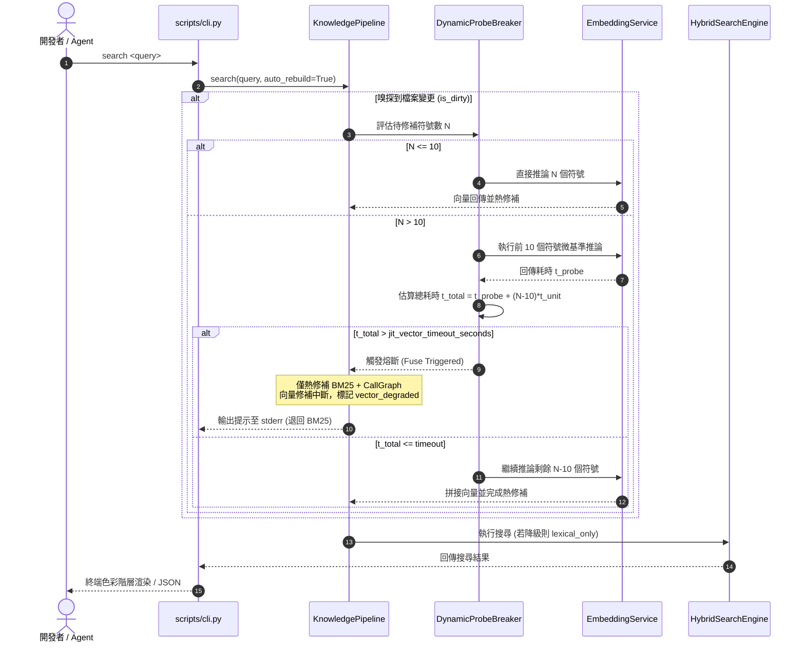

# 架構設計說明書 (Architecture Design)

> 功能名稱：knowledge_db_cli_ux_flow_refactor_and_optimization  
> 建立日期：2026-09-05  
> 所屬主計畫：2026_09_05_1025_knowledge_db_refactor  
> 狀態：Confirmed  
> 模板版本：v1.2  

---

## 1. 模組架構分層與職責邊界 (Layered Architecture)

```text
+-----------------------------------------------------------------------------------+
|                           CLI & UX Presentation Layer                             |
|  - scripts/cli.py: 入口分發、ANSI 色彩階層渲染 (TerminalStyler)、--help/status 修復  |
|  - 雙軌反饋：JIT 單行輸出 (stderr) vs. 手動 index 分階段進度條與耗時報表 (stdout)   |
+-----------------------------------------------------------------------------------+
                                         │
                                         ▼
+-----------------------------------------------------------------------------------+
|                        KnowledgeEngine & Pipeline Controller                      |
|  - pipeline.py: 全域流水線調度                                                    |
|  - JIT 動態探針熔斷器 (DynamicProbeBreaker)：首批 10 符號推估，超時降級 BM25     |
|  - 快取一致性檢查：比對 Model / Dim 元資料，模型切換自動標記向量失效              |
+-----------------------------------------------------------------------------------+
                                         │
                                         ▼
+-----------------------------------------------------------------------------------+
|                       Configuration & Adaptive Inference Layer                    |
|  - config.py / core.config: 讀取 local / project 級 4 大組態                      |
|    * enable_vector_search, embedding_model, jit_vector_timeout_seconds, max_threads|
|  - embedding.py (EmbeddingService):                                               |
|    * 動態計算 max_threads (auto = cpu//2)，動態傳入 ONNX & OMP                    |
|    * 屏蔽 HF Hub 未認證警告，白名單模型合法性預檢                                 |
|  - embedding.py (VectorIndex):                                                    |
|    * 向量快取儲存 model_name 與 dim 元資料，防禦矩陣維度衝突                      |
+-----------------------------------------------------------------------------------+
```

---

## 2. 核心資料流與循序圖 (Data Flow & Sequence Diagram)

### JIT 搜尋動態探針與優雅降級資料流



---

## 3. 受影響檔案與新建檔案清單 (Impacted & New Files Inventory)

| 檔案路徑 | 類型 | 職責與變更說明 |
| :--- | :---: | :--- |
| `source/knowledge-db/knowledge_db/embedding.py` | Modify | 支援 `max_threads` 算力解析（auto=cpu//2）、HF Hub 警告屏蔽、模型白名單比對、`VectorIndex` 保存 `model_name`/`dim` 元資料與模型切換校驗。 |
| `source/knowledge-db/knowledge_db/pipeline.py` | Modify | 實作 JIT 10 符號動態探針、可配置臨界值熔斷邏輯、雙軌進度呈現回調 (`interactive: bool`)、模型切換快取失效處理。 |
| `source/knowledge-db/scripts/cli.py` | Modify | 補齊 `--help` 中 `index` 說明、修復 `status` 對 `unified.index.bin.gz` 倒排索引判定、實作 ANSI 階層著色與 `NO_COLOR` 支援、保障 `--json` 純淨度。 |
| `source/knowledge-db/knowledge_db/engine.py` | Modify | 整合 YSCB Local/Project Config 讀取（`enable_vector_search`, `embedding_model`, `jit_vector_timeout_seconds`, `max_threads`），注入至 Pipeline 與 EmbeddingService。 |
| `source/knowledge-db/tests/test_cli_ux.py` | New | 涵蓋 FR-01~08 與 EC-01~07 之完整單元測試套件（含 Config 讀取、動態探針熔斷、ANSI 渲染、狀態修正）。 |

---

## 4. 架構決策記錄 (Architecture Decision Records)

- **[P02:DR-01] Config 讀取整合至 SpaceManager / Engine**：
  - 利用 `core.config` 模組或直接解析 `yscb.config.local.json` 與 `yscb.config.json`，在 `KnowledgeEngine.__init__` 統一載入，組態物件透過 dataclass / TypedDict 注入各子元件，維持無狀態解耦。
- **[P02:DR-02] 向量快取檔頭元資料擴充**：
  - `VectorIndex.save_binary` 保存時於檔頭封裝 JSON 元資料區塊（`{"model_name": ..., "dim": ..., "count": ...}`），載入時先行解碼元資料驗證，未通過時平滑回退，100% 免疫維度不合崩潰。
- **[P02:DR-03] 終端渲染無侵入性抽象 (`TerminalStyler`)**：
  - 定義輕量色彩輔助類別，基於標準 ANSI 代碼，自動判斷 `sys.stdout.isatty()` 與 `os.getenv("NO_COLOR")`；若非 TTY 或啟用 `NO_COLOR`，所有色彩方法返回原生文字，外部無感知。
