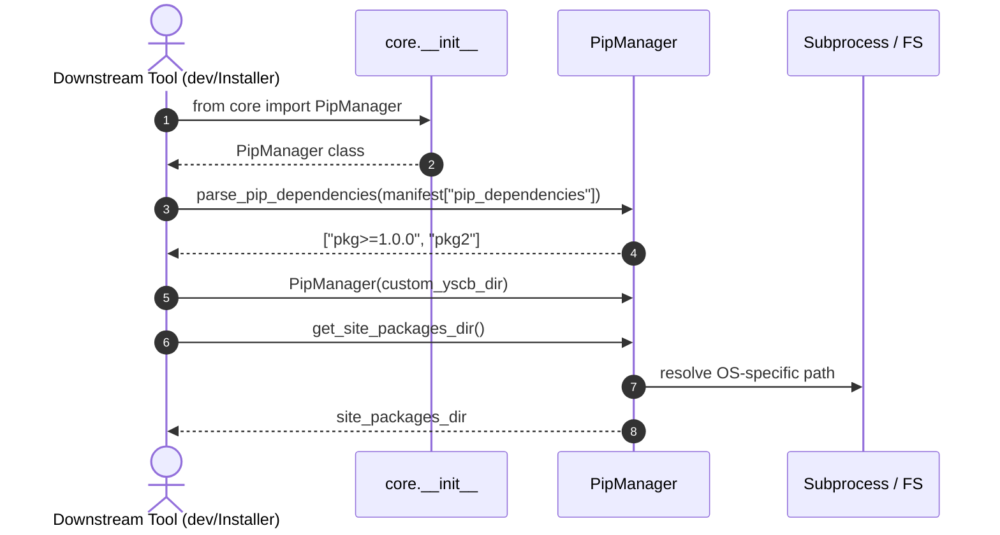

# 架構設計說明書 (Architecture Design)

> 功能名稱：core_pip_sdk_and_environment_export  
> 建立日期：2026-09-05  
> 所屬主計畫：2026_09_05_1300_core_dev_toolchain_upgrade  
> 狀態：Confirmed  
> 模板版本：v1.2  

---

## 1. 模組架構分層與職責邊界 (Layered Architecture)

```text
+-------------------------------------------------------------------------+
|                  Caller Layer (dev, downstream modules)                 |
|       e.g., from core import PipManager, PipInstallError                |
+------------------------------------+------------------------------------+
                                     |
                                     v
+-------------------------------------------------------------------------+
|                        Core Facade Layer (__init__.py)                  |
|    - Exposes PipManager, PipInstallError to __all__                     |
|    - Ensures zero circular dependencies and clean re-exports             |
+------------------------------------+------------------------------------+
                                     |
                                     v
+-------------------------------------------------------------------------+
|                        Service Layer (pip_manager.py)                   |
|    - PipManager:                                                        |
|        + parse_pip_dependencies(pip_deps: Any) -> List[str]             |
|        + get_venv_dir(), get_python_executable(), get_site_packages_dir()|
|        + ensure_venv(), install_packages()                              |
|    - PipInstallError: structured execution exception                    |
+------------------------------------+------------------------------------+
                                     |
                                     v
+-------------------------------------------------------------------------+
|                        Consumer Layer (installer.py)                    |
|    - sync_pip_dependencies(): calls PipManager.parse_pip_dependencies   |
+-------------------------------------------------------------------------+
```

---

## 2. 核心資料流與循序圖 (Data Flow & Sequence Diagram)



---

## 3. 受影響檔案與新建檔案清單 (Impacted & New Files Inventory)

| 檔案路徑 | 類型 | 職責與變更說明 |
| :--- | :---: | :--- |
| `source/core/core/__init__.py` | Modify | 導出 `PipManager`、`PipInstallError` 至模組根層與 `__all__`。 |
| `source/core/core/pip_manager.py` | Modify | 實作 `parse_pip_dependencies` 靜態工具方法，支援正規化與去重。 |
| `source/core/core/installer.py` | Modify | 重構 `sync_pip_dependencies` 改調用 `PipManager.parse_pip_dependencies`。 |
| `source/core/tests/test_pip_manager_sdk.py` | New | 驗證 SDK 導出、依賴字串解析與微環境路徑探測之單元測試。 |

---

## 4. 架構決策記錄 (Architecture Decision Records)

- **[P02:DR-01]** 乾淨導出：將 `PipManager` 與 `PipInstallError` 正式列入 `core.__all__`，維持零延遲匯入與零循環相依。
- **[P02:DR-02]** 靜態工具化：`parse_pip_dependencies` 以 `@staticmethod` 實作，免實例化即可呼叫，使 `dev` 與 `installer` 調用成本降至最低。
