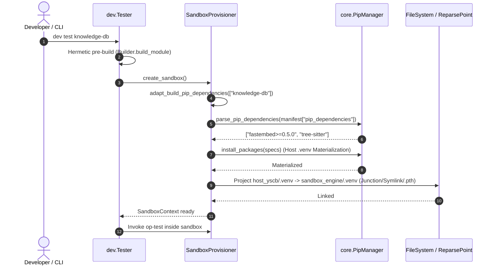

# 架構設計說明書 (Architecture Design)

> 功能名稱：dev_toolchain_pip_adaptation_and_sandbox_integration  
> 建立日期：2026-09-05  
> 所屬主計畫：2026_09_05_1300_core_dev_toolchain_upgrade  
> 狀態：Confirmed  
> 模板版本：v1.2  

---

## 1. 模組架構分層與職責邊界 (Layered Architecture)

```text
+-------------------------------------------------------------------------+
|                  Dev CLI Dispatcher (tester.py, releaser.py)            |
|       - dev test [mod] / dev op-mksb / dev check / dev release-check    |
+------------------------------------+------------------------------------+
                                     |
                                     v
+-------------------------------------------------------------------------+
|                  Sandbox Provisioner (testing/sandbox.py)               |
|    - adapt_build_pip_dependencies(target_modules=...)                   |
|        + Scans module.build://<mod>/*.zip & source/<mod>/manifest.json  |
|        + Calls core.PipManager.parse_pip_dependencies(pip_deps)         |
|        + Calls core.PipManager(host_yscb).install_packages(specs)       |
|    - create_sandbox():                                                  |
|        + Calls adapt_build_pip_dependencies()                           |
|        + Projects host .venv -> sandbox engine/.venv                    |
|            * Windows: _winapi.CreateJunction (NTFS)                     |
|            * POSIX: os.symlink                                          |
|            * Fallback: .pth file / PYTHONPATH                           |
|    - cleanup_sandbox():                                                 |
|        + Unlinks sandbox engine/.venv safely before rmtree              |
+------------------------------------+------------------------------------+
                                     |
                                     v
+-------------------------------------------------------------------------+
|                     Compliance Checker (checker.py)                     |
|    - _check_manifest():                                                 |
|        + _check_pip_dependencies(name, real_dir, report)                |
|            * Validates dict structure, non-empty pkg name, valid string |
+-------------------------------------------------------------------------+
```

---

## 2. 核心資料流與循序圖 (Data Flow & Sequence Diagram)



---

## 3. 受影響檔案與新建檔案清單 (Impacted & New Files Inventory)

| 檔案路徑 | 類型 | 職責與變更說明 |
| :--- | :---: | :--- |
| `source/dev/dev/testing/sandbox.py` | Modify | 實作 `adapt_build_pip_dependencies`、微環境跨平台雙軌投影與安全斷開銷毀防護。 |
| `source/dev/dev/checker.py` | Modify | 於 `_check_manifest` 新增 `_check_pip_dependencies` 結構與語法合規校驗。 |
| `source/dev/tests/test_pip_adaptation.py` | New | 建立 build 版 pip 相依性適配、微環境投影與合規檢核單元測試。 |
| `docs/dev/testing_guide.md` | Modify | 補充微環境投影、Junction 機制與 build 版 pip 適配架構說明。 |

---

## 4. 架構決策記錄 (Architecture Decision Records)

- **[P02:DR-01]** 適配架構：`adapt_build_pip_dependencies` 支援傳入 `target_modules`，未指定時掃描全數 `module.build://` 與待測模組，並調用 `core.PipManager` 完成宿主物化。
- **[P02:DR-02]** 跨平台投影與容錯：實作內部函式，封裝 Windows `_winapi.CreateJunction`、POSIX `os.symlink` 與 `.pth` 降級兜底，達成分層防禦。
