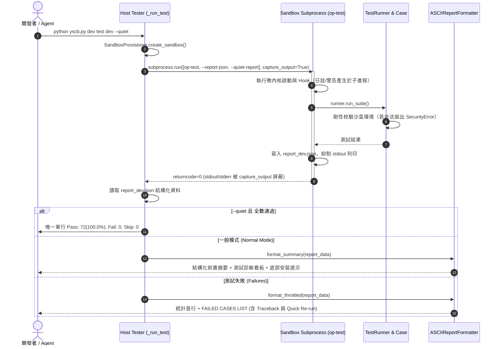

# 架構設計說明書 (Architecture Design)

> 功能名稱：dev_test_output_purification_and_info_aggregation  
> 建立日期：2026-09-05  
> 所屬主計畫：2026_09_05_1300_core_dev_toolchain_upgrade  
> 狀態：Confirmed  
> 模板版本：v1.2  

---

## 1. 模組架構分層與職責邊界 (Layered Architecture)

```text
+-----------------------------------------------------------------------+
|                       Host Command Line (CLI)                         |
|   python yscb.py dev test <module> [--quiet] [--verbose] [--all]     |
+-----------------------------------------------------------------------+
                                  │
                                  ▼
+-----------------------------------------------------------------------+
|        Host Test Orchestrator (source/dev/dev/tester.py: Tester)       |
|  - Hermetic Pre-build & Virtual Sandbox Provisioning                  |
|  - Unified JSON IPC Invocation:                                       |
|      subprocess.run([sandbox_yscb, "dev", "op-test",                   |
|                      "--report-json=<path>", "--quiet-report"],       |
|                     capture_output=True)                              |
|  - Output Shielding & Aggregation Engine:                             |
|      * Zero-Leak on Pass for --quiet (Pure Single Line)               |
|      * Collapsed Warnings & Structured Lifecycle for Normal Mode      |
|      * Formatter Rendering from JSON IPC (Throttled vs. Summary)      |
+-----------------------------------------------------------------------+
                                  │ (JSON IPC via Virtual VFS)
                                  ▼
+-----------------------------------------------------------------------+
|      Sandbox In-Place Runner (source/dev/dev/tester.py: _run_op_test) |
|  - Host Execution Guard (Verifies authentic sandbox context)          |
|  - High-Fidelity Execution (Runs microkernel & all hooks naturally)   |
|  - TestDiscovery & Suite Composition                                  |
|  - Dumps Execution Results exclusively to --report-json               |
+-----------------------------------------------------------------------+
                                  │
                                  ▼
+-----------------------------------------------------------------------+
|         Execution Harness & Guardrails (runner.py & case.py)          |
|  - runner.py: TestRunner (Removes fake YSCB_TEST_SANDBOX spoofing)    |
|  - case.py: YSCBTestCase.setUp (Strict sandbox directory validation;  |
|               Raises SecurityError on mismatch, ZERO fallback to cwd) |
+-----------------------------------------------------------------------+
```

---

## 2. 核心資料流與循序圖 (Data Flow & Sequence Diagram)



---

## 3. 受影響檔案與新建檔案清單 (Impacted & New Files Inventory)

| 檔案路徑 | 類型 | 職責與變更說明 |
| :--- | :---: | :--- |
| `source/dev/dev/tester.py` | Modify | 統一單模組與平行測試之 JSON IPC 傳輸；封堵 `_run_test` 無條件 dump stderr 漏洞；增加 `op-test` 宿主執行守門；實作雙模式信息聚合。 |
| `source/dev/dev/testing/runner.py` | Modify | 移除 `TestRunner.run_suite` 內部私設 `YSCB_TEST_SANDBOX="1"` 的偽造行為；升級 `ASCIIReportFormatter` 支援子進程警告計數折疊與乾淨底部提示。 |
| `source/dev/dev/testing/case.py` | Modify | `YSCBTestCase.setUp` 強化沙盒路徑校驗，若解析失敗強制拋出 `SecurityError`，徹底移除回退至 `os.getcwd()` 的穿透隱患。 |
| `source/dev/tests/test_output_purification.py` | New | 建立信息純化與防穿透單元/整合測試套件（覆蓋 FT-01~04, ET-01~02）。 |
| `docs/dev/testing_guide.md` | Modify | 更新第 7 節輸出節流與信息聚合規範。 |
| `docs/dev/DESIGN_NOTES.md` | Modify | 登記 `[DN-DEV-07]` 沙盒終端輸出完整屏蔽與防穿透守門設計決策。 |

---

## 4. 架構決策記錄 (Architecture Decision Records)

- **[P02:DR-01] 統一以 JSON IPC 作為唯一測試資料通訊協議**：
  - 不再依賴子進程向 stdout 列印格式化文字，消除日誌與報表混淆問題；所有渲染邏輯統一收斂於宿主進程的 `ASCIIReportFormatter`。
- **[P02:DR-02] 三階沙盒輸出屏蔽與分級過濾矩陣 (3-Tier Output Shielding Matrix)**：
  - *Tier 1 (`--quiet` + Passed)*：100% 深度靜默，阻斷所有 stdout/stderr，維持極致單行。
  - *Tier 2 (`--quiet` + Failed)*：統計首行 + 結構化錯誤清單，若沙盒崩潰輸出 stderr 尾部 20 行切片。
  - *Tier 3 (Normal Mode)*：結構化生命週期，折疊收斂子進程非致命警告（`[!] Warnings: N notices (suppressed, run with --verbose to view)`），僅 `--verbose` 展開原始輸出。
- **[P02:DR-03] 雙向沙盒穿透阻斷防線 (Bidirectional Leakage Prevention)**：
  - *入口阻斷*：`dev op-test` 啟動時檢測是否位於合法沙盒目錄，否則拒絕執行。
  - *身分偽造消除*：`TestRunner` 移除偽造 `YSCB_TEST_SANDBOX` 標識。
  - *路徑剛性校驗*：`YSCBTestCase.setUp` 嚴格限制 `sandbox_dir` 必須為含 `sandbox_` 與 `host_env` 之合法路徑，嚴禁 Fallback 至當前工作目錄。
