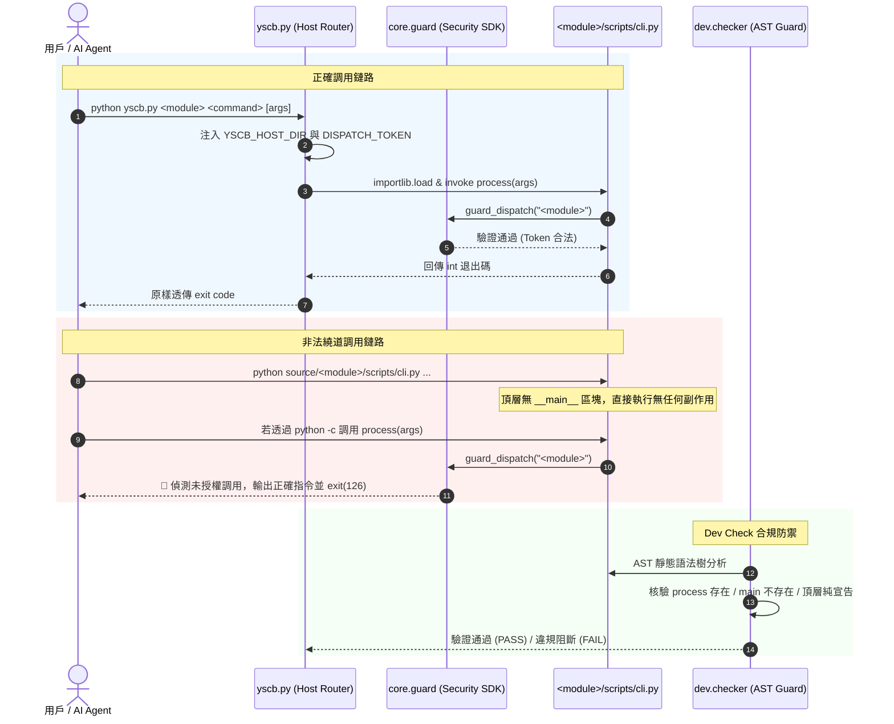

# 架構設計說明書 (Architecture Design)

> 功能名稱：cli_dispatch_and_core_guard_sdk  
> 建立日期：2026-09-06  
> 所屬主計畫：2026_09_06_1927_knowledge_db_architecture_consolidation  
> 狀態：Confirmed  
> 模板版本：v1.2  

---

## 1. 模組架構分層與職責邊界 (Layered Architecture)

```text
+-------------------------------------------------------------------------+
|                  用戶 / Agent 統一宿主入口: yscb.py                     |
|  - 注入私有微虛擬環境 (sys.path)                                        |
|  - 注入安全認證 Token (YSCB_HOST_DISPATCH_TOKEN)                        |
|  - 動態以 importlib 載入目標模組 scripts/cli.py 並調用 process(args)   |
+-------------------------------------------------------------------------+
                                    |
                                    v
+-------------------------------------------------------------------------+
|                   生態系模組入口: scripts/cli.py                        |
|  - 必須宣告且僅允許: def process(args: List[str]) -> int                |
|  - 進入點首行調用: from core.guard import guard_dispatch               |
|  - 頂層嚴禁未包覆於 func/class 內之任何可執行陳述式                     |
|  - 嚴禁包含 def main(...) 與 if __name__ == '__main__':                 |
+-------------------------------------------------------------------------+
          |                                              |
          v                                              v
+-----------------------------+        +----------------------------------+
|   Core 守門 SDK: core.guard |        | Dev 工具鏈雙向守門: dev 模組     |
| - 檢驗宿主目錄與 Token      |        | - dev.scaffold: 預置標準範本     |
| - 支援 YSCB_TESTING 豁免    |        | - dev.checker: AST 靜態語意掃描  |
| - 違規 1ms 熔斷 (Exit 126)  |        |   (強制 process, 禁 main/裸語句) |
+-----------------------------+        +----------------------------------+
```

---

## 2. 核心資料流與循序圖 (Data Flow & Sequence Diagram)



---

## 3. 受影響檔案與新建檔案清單 (Impacted & New Files Inventory)

| 檔案路徑 | 類型 | 職責與變更說明 |
| :--- | :---: | :--- |
| `ys_codebase/source/core/core/guard.py` | New | 實作 `guard_dispatch` 函式，提供宿主環境與 Token 核驗、引導日誌與 126 熔斷 |
| `ys_codebase/source/core/core/__init__.py` | Modify | 導出 `guard_dispatch` 公開 API |
| `ys_codebase/source/core/tests/test_guard.py` | New | 針對 Core 守門 SDK 之合法性、繞道阻斷、測試豁免進行單元測試 |
| `ys_codebase/source/dev/dev/scaffold.py` | Modify | 升級 `create_module` 範本，產出宣告 `process(args)`、首行調用守門 SDK 之 `scripts/cli.py` |
| `ys_codebase/source/dev/dev/checker.py` | Modify | 升級 `_check_file_structure`，以 AST 檢查必須有 `process`、嚴禁 `main`、嚴禁頂層裸語句 |
| `ys_codebase/source/dev/tests/test_cli_compliance.py` | New | 針對 `dev.checker` 的 AST 靜態檢驗功能編寫正反向驗證測試案例 |
| `yscb.py` | Modify | 改造 `dispatch_module`，注入 `YSCB_HOST_DISPATCH_TOKEN` 並動態調用 `process(args)` |
| `ys_codebase/source/core/scripts/cli.py` | Modify | 介面遷移：改為導出 `process(args)`，移除 `main` 與頂層裸語句，掛載守門 SDK |
| `ys_codebase/source/dev/scripts/cli.py` | Modify | 介面遷移：改為導出 `process(args)`，移除 `main` 與頂層裸語句，掛載守門 SDK |
| `ys_codebase/source/agents-workflow/scripts/cli.py` | Modify | 介面遷移：改為導出 `process(args)`，移除 `main` 與頂層裸語句，掛載守門 SDK |
| `ys_codebase/source/knowledge-db/scripts/cli.py` | Modify | 介面遷移：改為導出 `process(args)`，移除 `main` 與頂層裸語句，掛載守門 SDK |

---

## 4. 架構決策記錄 (Architecture Decision Records)

- **[P02:DR-01] 守門 SDK 物理歸屬**：`guard_dispatch` 作為底層基礎設施，收斂於 `core.guard`，保持 `core` 作為唯一微內核之定位。
- **[P02:DR-02] AST 靜態分析與頂層白名單機制**：在 `dev.checker` 實作模組級 AST 節點比對，嚴格白名單限定頂層節點型態為 `(ast.Expr, ast.Import, ast.ImportFrom, ast.FunctionDef, ast.AsyncFunctionDef, ast.ClassDef)`，且 `ast.Expr` 必須為 Docstring 常數，任何其餘表達式（如函式調用）皆觸發 `FAIL`。
- **[P02:DR-03] yscb.py 調用協議平滑切換**：`yscb.py` 分派時優先調用 `cli_module.process(args)`；若遭遇尚未遷移之過渡代碼則優雅報錯，確保強型別約束。
