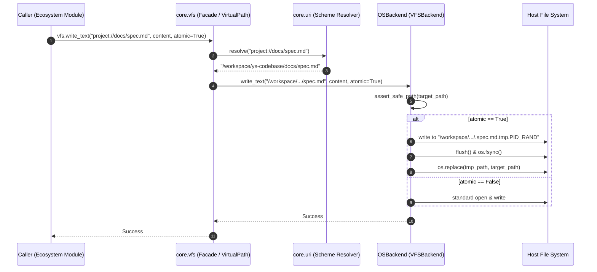

# 架構設計說明書 (Architecture Design)

> 功能名稱：core_vfs_unified_virtual_file_system  
> 建立日期：2026-09-06  
> 所屬主計畫：2026_09_06_1927_knowledge_db_architecture_consolidation  
> 狀態：Confirmed  
> 模板版本：v1.2  

---

## 1. 模組架構分層與職責邊界 (Layered Architecture)

```text
+-----------------------------------------------------------------------------------+
|                        Ecosystem Modules (Consumers)                             |
|       core, dev, agents-workflow, knowledge-db (and future server)                |
+-----------------------------------------------------------------------------------+
                                      |
                                      v
+-----------------------------------------------------------------------------------+
|                      core.vfs (Unified VFS Microkernel)                           |
|  +-----------------------------------------------------------------------------+  |
|  | Facade & High-Level APIs (vfs.*, VirtualPath)                               |  |
|  | - read_text, write_text, read_bytes, write_bytes, read_json, write_json       |  |
|  | - exists, is_file, is_dir, listdir, makedirs, remove, copy, move, rmtree     |  |
|  | - atomic_write(path, ...), open_file(path, ...)                             |  |
|  +-----------------------------------------------------------------------------+  |
|         |                                           |                             |
|         | (Unidirectional Dependency)               | (Delegates IO)              |
|         v                                           v                             |
|  +-----------------------------+       +---------------------------------------+  |
|  | core.uri (Pure Scheme SSOT) |       | VFSBackend (Abstract Interface)       |  |
|  | - resolve(uri) -> str       |       | - read, write, exists, remove, copy   |  |
|  | - to_uri(abs_path) -> str   |       +---------------------------------------+  |
|  | - module_scope, host_scope  |                           |                      |
|  | - Backward-compatible stubs |                           v                      |
|  +-----------------------------+       +---------------------------------------+  |
|                                        | OSBackend (Concrete Host IO)          |  |
|                                        | - Normalized cross-platform paths     |  |
|                                        | - Same-directory atomic_write (sync)  |  |
|                                        | - Safe boundary sandbox (anti-escape) |  |
|                                        | - Future slot: MemoryBackend (stub)   |  |
|                                        +---------------------------------------+  |
+-----------------------------------------------------------------------------------+
```

- **單向無環依賴原則**：`core.uri` 保持為純語意協議定址器，完全不依賴 `core.vfs`；`core.vfs` 單向調用 `core.uri.resolve` 解算輸入之語意 URI。`core.uri` 中既有的 IO 輔助函式（如 `read_text`）改為相容性輕量代理轉發至 `core.vfs`。
- **後端插槽化**：`VFSBackend` 定義抽象原語操作；`OSBackend` 負責具體實體檔案系統存取；未來 `MemoryBackend` 可透過註冊機制無痛插拔，當前保持插槽介面純淨。
- **同分區原子寫入**：`atomic_write` 在目標檔案所在目錄生成暫存檔，寫入並呼叫 `os.fsync` 後調用 `os.replace`，杜絕斷電損毀與跨磁區 `EXDEV` 異常。

---

## 2. 核心資料流與循序圖 (Data Flow & Sequence Diagram)



---

## 3. 受影響檔案與新建檔案清單 (Impacted & New Files Inventory)

| 檔案路徑 | 類型 | 職責與變更說明 |
| :--- | :---: | :--- |
| `ys_codebase/source/core/core/vfs/__init__.py` | New | VFS 套件入口，導出 `vfs` 單例、`VirtualPath`、`VFS` 與全域便捷函式 |
| `ys_codebase/source/core/core/vfs/base.py` | New | 定義 `VFSBackend` 抽象基類與標準 IO 原語契約 |
| `ys_codebase/source/core/core/vfs/os_backend.py` | New | 實作 `OSBackend`，涵蓋路徑正規化、同目錄原子寫入、沙盒防逃逸 |
| `ys_codebase/source/core/core/vfs/path.py` | New | 實作物件導向 `VirtualPath` 抽象類別（支援 `/` 串接與鏈式操作） |
| `ys_codebase/source/core/core/vfs/vfs.py` | New | 實作 `VFS` 中樞引擎，管理 backend 派遣與 URI 解耦解析 |
| `ys_codebase/source/core/core/uri.py` | Modify | 解耦舊有直接檔案 IO 實作，保留相容轉發至 `core.vfs`，維持純字串協議 SSOT |
| `ys_codebase/source/core/core/__init__.py` | Modify | 導出 `vfs` 與 `VirtualPath` 至 `core` 模組頂層公有命名空間 |
| `ys_codebase/source/core/tests/test_vfs.py` | New | `core.vfs` 完整單元測試（原子寫入、邊界防逃逸、URI 解析、OSBackend） |
| `ys_codebase/source/core/core/contributes.py` | Modify | 遷移原生 `open()` 至 `core.vfs` |
| `ys_codebase/source/core/core/config.py` | Modify | 遷移原生 `open()` 至 `core.vfs` |
| `scripts/scan_native_io.py` | New | 全生態系模組原生檔案讀寫 AST 掃描檢測工具 |

---

## 4. 架構決策記錄 (Architecture Decision Records)

- **[P02:DR-01] VFS 唯一微內核封裝**：VFS 不獨立為外部模組，完整落地於 `core/core/vfs/`，維持生態系唯一微內核架構。
- **[P02:DR-02] 單向依賴與向下相容保證**：`core.uri` 不 import `core.vfs`（除函式內部延遲引用或 `core.uri` 保留相容轉發），`core.vfs` 依賴 `core.uri.resolve`。
- **[P02:DR-03] 同目錄同分區原子覆蓋**：`OSBackend.atomic_write` 產生的暫存檔強制與目標檔案置於同一目錄，使用 `os.replace` 保證 POSIX / Windows 下的原子性且杜絕 `EXDEV` 跨分區錯誤。
- **[P02:DR-04] 平滑漸進遷移路線**：先在 `core` 模組內部完成自舉測試，再建立全生態系掃描工具全面檢測，逐步遷移 `dev`, `agents-workflow`, `knowledge-db`。
