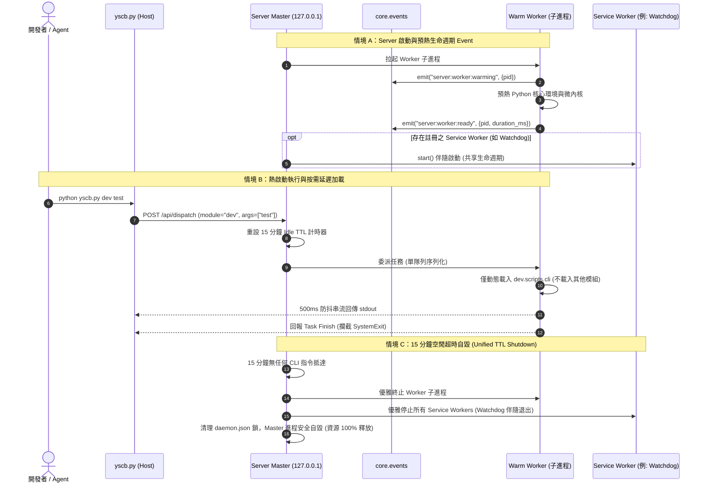

# 架構設計說明書 (Architecture Design)

> 功能名稱：server_module_daemon_supervisor  
> 建立日期：2026-09-06  
> 所屬主計畫：2026_09_06_1927_knowledge_db_architecture_consolidation  
> 狀態：Confirmed  

> 模板版本：v1.2  

---

## 1. 模組架構分層與職責邊界 (Layered Architecture)

```text
+-----------------------------------------------------------------------------------+
| Layer 0: 微內核跨平台底層 SDK (source/core/core/platform/)                        |
|   ├── process.py: spawn_detached, kill_process_tree, is_process_alive             |
|   └── lock.py: InterProcessLock (POSIX flock / Windows msvcrt.locking)            |
+-----------------------------------------------------------------------------------+
                                          ^
                                          | 消費跨平台原語
+-----------------------------------------------------------------------------------+
| 宿主入口極簡調度層 (yscb.py - Host Router)                                        |
|   ├── 軟依賴探測: 檢查 cache://server/daemon.json 存活狀態                         |
|   ├── 自循環旁路: module == "server" 剛性直接走本地冷啟動                         |
|   ├── 非同步按需拉起: config.local.json 開啟時背景脫鉤拉起 Master，本次冷啟動執行 |
|   ├── 熱分發分支: 內嵌 ~60 行標準庫客戶端發送 HTTP POST /api/dispatch 掛起串流   |
|   └── 冷降級分支: 本機直接加載 .modules/<mod>/scripts/cli.py 執行                |
+-----------------------------------------+-----------------------------------------+
                                          | Localhost HTTP (Bearer Token)
                                          v
+-----------------------------------------------------------------------------------+
| Layer 1: Server 平台服務模組 (source/server/) - 方案 C 延伸雙軌架構               |
|                                                                                   |
| 1. CLI 管理門面 (scripts/cli.py)                                                  |
|    └── process(args) 首行守門 core.guard.guard_dispatch("server")                 |
|    └── 指令集: start [--daemon/--console], stop [--force], status, reload         |
|                                                                                   |
| 2. Master 守護進程與生命週期中樞 (master.py / daemon.py)                          |
|    ├── 本地回環 HTTP 服務 (127.0.0.1:0 動態隨機 Port)                             |
|    ├── 狀態鎖 SSOT: cache://server/daemon.json (pid, port, token, root, time)    |
|    ├── 全局 15 分鐘空閒自毀定時器 (Idle TTL)                                      |
|    ├── 守護常駐 1 個預熱 Worker 子進程 (崩潰自愈重啟)                             |
|    ├── 託管業務 Service Workers (如 Watchdog，共享 15 分鐘自毀，不永久長駐)       |
|    └── .modules/ 變更監控 (watcher.py) -> 直接殺死舊 Worker 並重啟新 Worker       |
|                                                                                   |
| 3. 常駐預熱 Worker 子進程 (worker.py)                                             |
|    ├── 預熱階段透過 core.events 廣播 server:worker:warming / ready                 |
|    ├── 採「按需延遲加載 (Lazy Load)」業務模組，調用 A 絕不載入 B                   |
|    ├── 攔截 SystemExit 轉為返回碼，杜絕退出 Worker 進程                           |
|    └── 單隊列序列化依序執行 process(args)                                         |
|                                                                                   |
| 4. 500ms 防抖分流串流器 (streamer.py)                                             |
|    ├── 攔截 Worker 之 sys.stdout / sys.stderr                                    |
|    ├── 500ms 防抖緩衝閥值或無串流時立即 flush                                     |
|    └── 分流封包協議: {"type": "terminal_stream"} vs {"type": "task_finish"}       |
|                                                                                   |
| 5. 業務 Service Worker 抽象基底 (service.py)                                      |
|    └── BaseServiceWorker 介面: start(), stop(), health_check() (共享 Server TTL)  |
+-----------------------------------------------------------------------------------+
```

---

## 2. 核心資料流與循序圖 (Data Flow & Sequence Diagram)



---

## 3. 受影響檔案與新建檔案清單 (Impacted & New Files Inventory)

| 檔案路徑 | 類型 | 職責與變更說明 |
| :--- | :---: | :--- |
| `source/core/core/platform/__init__.py` | New | 導出跨平台進程與鎖公開 API |
| `source/core/core/platform/process.py` | New | 跨平台進程原語 (`spawn_detached`, `kill_process_tree`, `is_process_alive`) |
| `source/core/core/platform/lock.py` | New | 跨平台跨進程檔案鎖 (`InterProcessLock`) |
| `source/core/tests/test_platform.py` | New | `core.platform` 進程與檔案鎖跨平台單元測試 |
| `source/server/__init__.py` | New | Server 模組導出宣告 |
| `source/server/scripts/cli.py` | New | Server CLI 入口，首行 `guard_dispatch("server")`，支援 start/stop/status/reload |
| `source/server/master.py` | New | Master 守護進程、HTTP 服務、15 分鐘 TTL、Token、Worker 守護與 Service Worker 納管 |
| `source/server/worker.py` | New | 常駐預熱 Worker 子進程、預熱 Event 廣播、延遲加載、SystemExit 攔截與單隊列執行 |
| `source/server/service.py` | New | `BaseServiceWorker` 擴充基底介面與統一生命週期治理 |
| `source/server/streamer.py` | New | 標準輸出攔截與 500ms 防抖分流協議封裝 (`terminal_stream` / `task_finish`) |
| `source/server/watcher.py` | New | `.modules/` 目錄變更感知器，變更時通知 Master 重啟 Worker |
| `ys_codebase/yscb.py` | Modify | 整合四大耦合邊界：軟依賴探測、自循環旁路、非同步按需拉起與極簡轉發客戶端 |
| `source/server/tests/test_server.py` | New | Server 模組 Master-Worker、預熱 Event、防抖串流、TTL 與熱重載沙盒整合測試 |

---

## 4. 架構決策記錄 (Architecture Decision Records)

- **[P02:DR-01] core.platform 底層先行原則**：跨平台原語收斂於微內核 `core.platform`，`server` 與宿主均單向依賴 `core`。
- **[P02:DR-02] 方案 C: Master + Warm Worker 雙進程架構**：Master 掌理網路與排程，Worker 執行業務模組，兼具 <30ms 瞬發效能與 100% 模組隔離性。
- **[P02:DR-03] 500ms 防抖分塊串流協議**：輸出端以 500ms 無串流為閥值進行即時 flush，封包精確劃分 `terminal_stream` 與 `task_finish`。
- **[P02:DR-04] 按需延遲加載與 Worker 重啟熱更新**：Worker 僅在派發時載入目標模組，調用 A 絕不加載 B。`.modules/` 變更時直接殺死舊 Worker 並重啟新 Worker，杜絕 Python reload 幽靈 Bug。
- **[P02:DR-05] yscb 與 Server 四大耦合邊界**：軟依賴探測、自循環旁路、按需非同步拉起、極簡客戶端，保持宿主輕量與極致穩健。
- **[P02:DR-06] 預熱事件廣播與 Service Worker 統一生命週期治理**：Worker 預熱過程發布 `core.events` 事件；Service Worker（如 Watchdog）嚴格共享 Server 15 分鐘空閒自毀機制，絕不脫離 Server 永久長駐。
